---
## Front matter
lang: ru-RU
title: Лабораторная работа №1
author:
  - Петлин А. Д.
institute:
  - Российский университет дружбы народов, Москва, Россия
date: 05 марта 2025

## i18n babel
babel-lang: russian
babel-otherlangs: english

## Formatting pdf
toc: false
toc-title: Содержание
slide_level: 2
aspectratio: 169
section-titles: true
theme: metropolis
header-includes:
 - \metroset{progressbar=frametitle,sectionpage=progressbar,numbering=fraction}
---

# Информация

## Докладчик

:::::::::::::: {.columns align=center}
::: {.column width="70%"}

  * Петлин Артём Дмитриевич
  * студент
  * группа НПИбд-02-24
  * Российский университет дружбы народов
  * [1132246846@pfur.ru](mailto:1132246846@pfur.ru)
  * <https://github.com/travesa/study_2024-2025_os-intro>

:::
::: {.column width="30%"}

:::
::::::::::::::

# Цель работы

Целью данной работы является приобретение практических навыков установки операционной системы на виртуальную машину, настройки минимально необходимых для дальнейшей работы сервисов.

# Задание

1. Установка ОС fedora sway spin 41.
2. Настройка системы после утановки.
3. Отключение SELinux.
4. Настройка расскалдки клавиатуры.
5. Установка программного обеспечения для создания документации.
6. Домашнее задание.

# Выполнение лабораторной работы

## Установка fedora sway spin 41

:::::::::::::: {.columns align=center}
::: {.column width="40%"}

Устанавливаем образ ОС с официального сайта, производим настройку в virtualbox, запускаем вместе с образом, для установки самой ОС. После удаляем оптический диск и запускаем ОС.

:::
::: {.column width="30%"}

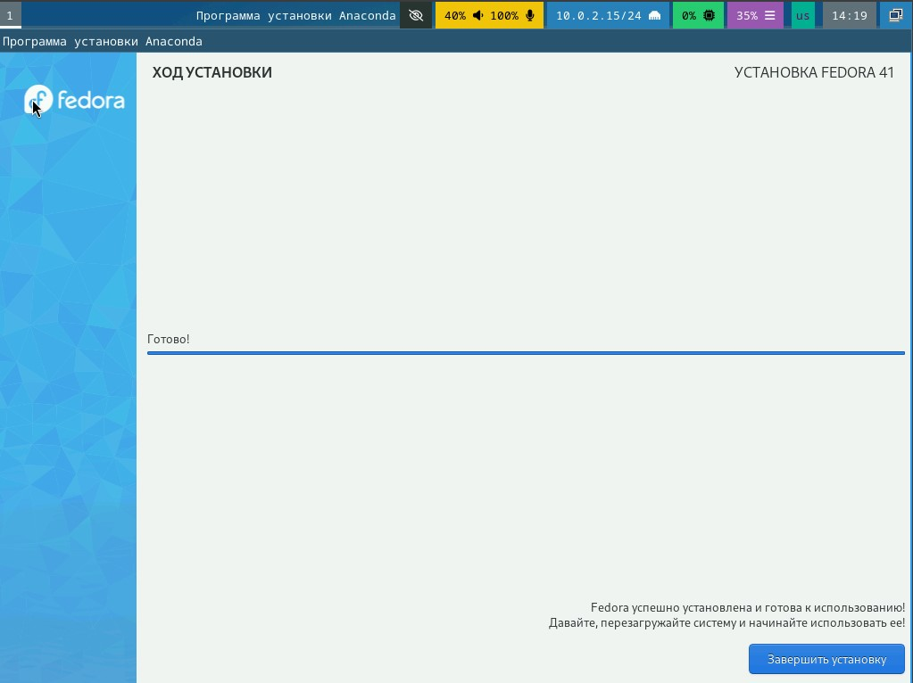

:::
::: {.column width="30%"}

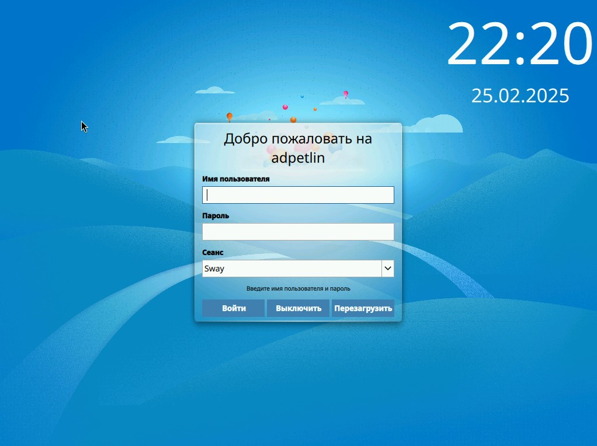

:::
::::::::::::::

## Настройка системы после утановки.

:::::::::::::: {.columns align=center}
::: {.column width="40%"}

Переходим на роль супер-пользователя, после чего устанавливаем средства разработки.

:::
::: {.column width="30%"}

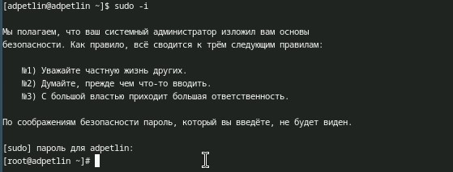

:::
::: {.column width="30%"}

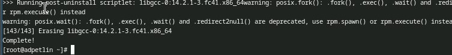

:::
::::::::::::::

## Настройка системы после утановки.

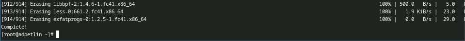

Обновление всех пакетов

## Настройка системы после утановки.

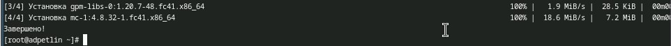

Установка программ для удобства работы в консоли.

## Настройка системы после утановки.

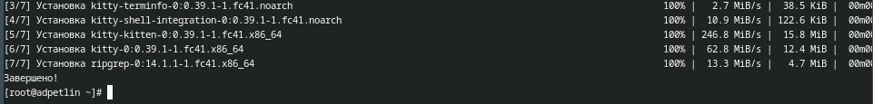

Установка другого варианта консоли.

## Отключение SELinux.

:::::::::::::: {.columns align=center}
::: {.column width="50%"}

В файле /etc/selinux/config заменяем значение "enforcing" на "permissive".

:::
::: {.column width="50%"}

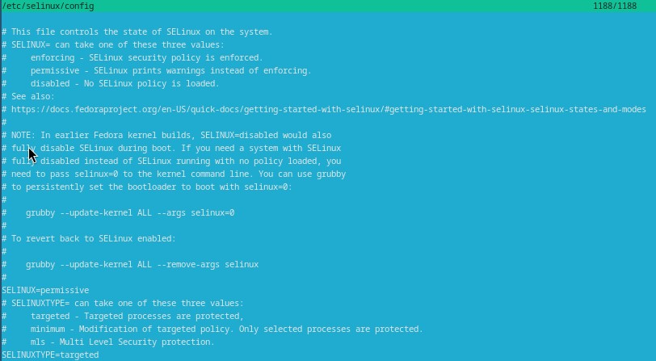
:::
::::::::::::::

## Настройка раскладки клавиатуры.

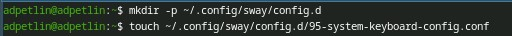

Создайте конфигурационный файл ~/.config/sway/config.d/95-system-keyboard-config.conf.

## Настройка раскладки клавиатуры.

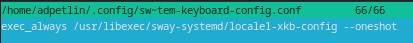

Редактируем конфигурационный файл ~/.config/sway/config.d/95-system-keyboard-config.conf

## Настройка раскладки клавиатуры.

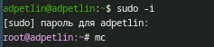

Переходим на роль супер-пользователя и открываем mc.

## Настройка раскладки клавиатуры.

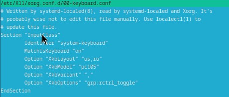

Редактируем конфигурационный файл /etc/X11/xorg.conf.d/00-keyboard.conf и перезагружаем систему.

## Установка программного обеспечения для создания документации.

:::::::::::::: {.columns align=center}
::: {.column width="40%"}

Устанавливаем pandoc через терминал.

:::
::: {.column width="30%"}

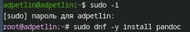

:::
::: {.column width="30%"}

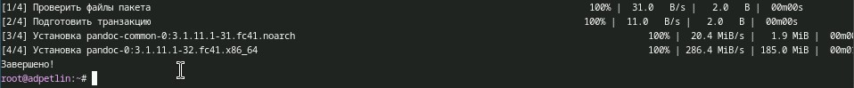

:::
::::::::::::::

## Установка программного обеспечения для создания документации.

:::::::::::::: {.columns align=center}
::: {.column width="50%"}

Устанавливаем pandoc-crossref через git под нашу версию pandoc'a. Распаковываем ".tar" файл и перемещаем в каталог /usr/local/bin.

:::
::: {.column width="50%"}

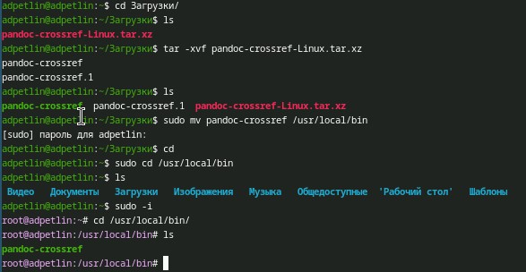

:::
::::::::::::::

## Установка программного обеспечения для создания документации.

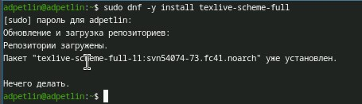

Устанавливаем TexLive через терминал.

# Домашнее задание

## Домашнее задание

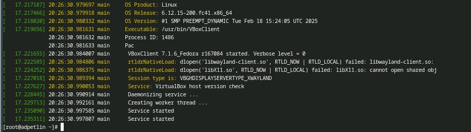

Анализируем последовательность загрузки системы, выполнив команду dmesg: информация об ОС; загрузка BIOS'a; загрузка процессора, портов, служб; загрузка системы и SELinux; подгрузка virtualbox.

## Домашнее задание

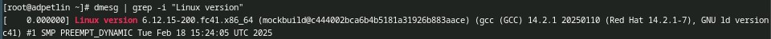

Можно использовать поиск с помощью grep: dmesg | grep -i "то, что ищем". Узнаем версию ядра Linux.

## Домашнее задание

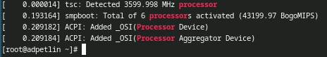

Узнаем частоту процессора.

## Домашнее задание

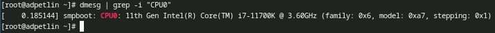

Узнаем модель процессора.

## Домашнее задание

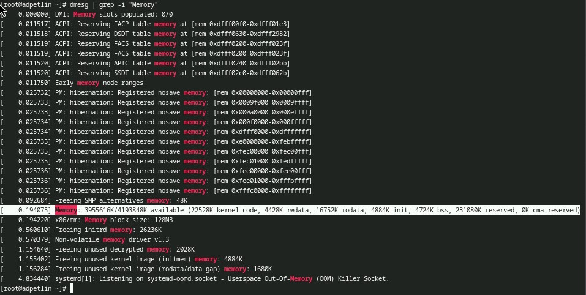

Узнаем объём доступной оперативной памяти.

## Домашнее задание

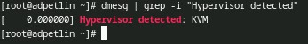

Узнаем тип обнаруженного гипервизора.

## Домашнее задание

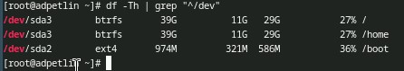

Узнаем тип файловой системы корневого раздела.

## Домашнее задание

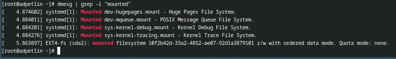

Узнаем последовательность монтирования файловых систем.

# Выводы

Мы приобрели практические навыки установки операционной системы на виртуальную машину, настройки минимально необходимых для дальнейшей работы сервисов.

# Список литературы

::: {.refs}
1. Dash, P. Getting Started with Oracle VM VirtualBox / P. Dash. – Packt Publishing Ltd, 2013. – 86 сс.
2. Colvin, H. VirtualBox: An Ultimate Guide Book on Virtualization with VirtualBox. VirtualBox / H. Colvin. – CreateSpace Independent Publishing Platform, 2015. – 70 сс.
3. Vugt, S. van. Red Hat RHCSA/RHCE 7 cert guide : Red Hat Enterprise Linux 7 (EX200 and EX300) : Certification Guide. Red Hat RHCSA/RHCE 7 cert guide / S. van Vugt. – Pearson IT Certification, 2016. – 1008 сс.
4. Робачевский, А. Операционная система UNIX / А. Робачевский, С. Немнюгин, О. Стесик. – 2-е изд. – Санкт-Петербург : БХВ-Петербург, 2010. – 656 сс.
5. Немет, Э. Unix и Linux: руководство системного администратора. Unix и Linux / Э. Немет, Г. Снайдер, Т.Р. Хейн, Б. Уэйли. – 4-е изд. – Вильямс, 2014. – 1312 сс.
6. Колисниченко, Д.Н. Самоучитель системного администратора Linux : Системный администратор / Д.Н. Колисниченко. – Санкт-Петербург : БХВ-Петербург, 2011. – 544 сс.
7. Robbins, A. Bash Pocket Reference / A. Robbins. – O’Reilly Media, 2016. – 156 сс.
:::

