---
## Front matter
title: "Отчёт по лабораторной работе №1"
author: "Петлин Артём Дмитриевич"

## Generic otions
lang: ru-RU
toc-title: "Содержание"

## Bibliography
bibliography: bib/cite.bib
csl: pandoc/csl/gost-r-7-0-5-2008-numeric.csl

## Pdf output format
toc: true # Table of contents
toc-depth: 2
lof: true # List of figures
lot: true # List of tables
fontsize: 12pt
linestretch: 1.5
papersize: a4
documentclass: scrreprt
## I18n polyglossia
polyglossia-lang:
  name: russian
  options:
	- spelling=modern
	- babelshorthands=true
polyglossia-otherlangs:
  name: english
## I18n babel
babel-lang: russian
babel-otherlangs: english
## Fonts
mainfont: IBM Plex Serif
romanfont: IBM Plex Serif
sansfont: IBM Plex Sans
monofont: IBM Plex Mono
mathfont: STIX Two Math
mainfontoptions: Ligatures=Common,Ligatures=TeX,Scale=0.94
romanfontoptions: Ligatures=Common,Ligatures=TeX,Scale=0.94
sansfontoptions: Ligatures=Common,Ligatures=TeX,Scale=MatchLowercase,Scale=0.94
monofontoptions: Scale=MatchLowercase,Scale=0.94,FakeStretch=0.9
mathfontoptions:
## Biblatex
biblatex: true
biblio-style: "gost-numeric"
biblatexoptions:
  - parentracker=true
  - backend=biber
  - hyperref=auto
  - language=auto
  - autolang=other*
  - citestyle=gost-numeric
## Pandoc-crossref LaTeX customization
figureTitle: "Рис."
tableTitle: "Таблица"
listingTitle: "Листинг"
lofTitle: "Список иллюстраций"
lotTitle: "Список таблиц"
lolTitle: "Листинги"
## Misc options
indent: true
header-includes:
  - \usepackage{indentfirst}
  - \usepackage{float} # keep figures where there are in the text
  - \floatplacement{figure}{H} # keep figures where there are in the text
---

# Цель работы

Целью данной работы является приобретение практических навыков установки операционной системы на виртуальную машину, настройки минимально необходимых для дальнейшей работы сервисов.

# Задание

1. Установка ОС fedora sway spin 41.
2. Настройка системы после утановки.
3. Отключение SELinux.
4. Настройка расскалдки клавиатуры.
5. Установка программного обеспечения для создания документации.
6. Домашнее задание.

# Теоретическое введение

Здесь описываются теоретические аспекты, связанные с выполнением работы.

Например, в табл. [-@tbl:std-dir] приведено краткое описание стандартных каталогов Unix.

: Описание некоторых каталогов файловой системы GNU Linux {#tbl:std-dir}

| Имя каталога | Описание каталога                                                                                                          |
|--------------|----------------------------------------------------------------------------------------------------------------------------|
| `/`          | Корневая директория, содержащая всю файловую                                                                               |
| `/bin `      | Основные системные утилиты, необходимые как в однопользовательском режиме, так и при обычной работе всем пользователям     |
| `/etc`       | Общесистемные конфигурационные файлы и файлы конфигурации установленных программ                                           |
| `/home`      | Содержит домашние директории пользователей, которые, в свою очередь, содержат персональные настройки и данные пользователя |
| `/media`     | Точки монтирования для сменных носителей                                                                                   |
| `/root`      | Домашняя директория пользователя  `root`                                                                                   |
| `/tmp`       | Временные файлы                                                                                                            |
| `/usr`       | Вторичная иерархия для данных пользователя                                                                                 |

Более подробно про Unix см. в [@tanenbaum_book_modern-os_ru; @robbins_book_bash_en; @zarrelli_book_mastering-bash_en; @newham_book_learning-bash_en].

# Выполнение лабораторной работы

## Установка fedora sway spin 41

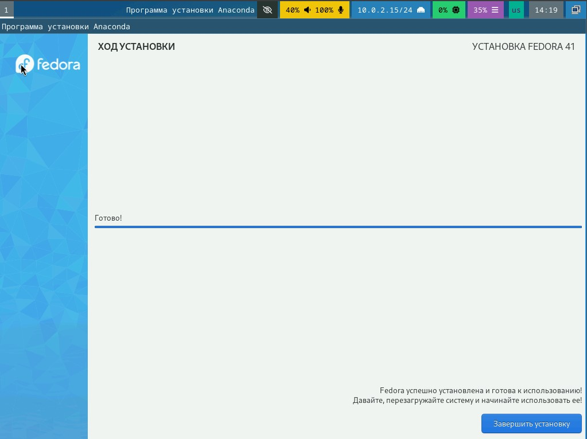{#fig:001 width=100%}

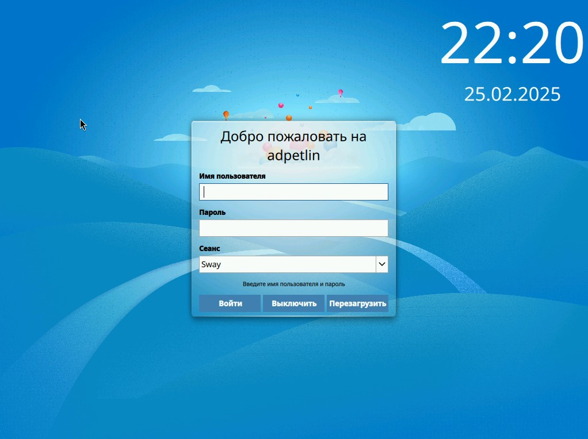{#fig:002 width=100%}

Устанавливаем образ ОС с официального сайта, производим настройку в virtualbox, запускаем вместе с образом, для установки самой ОС. После удаляем оптический диск и запускаем ОС.

## Настройка системы после утановки.

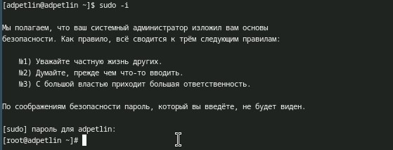{#fig:003 width=100%}

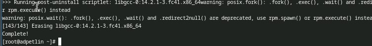{#fig:004 width=100%}

Переходим на роль супер-пользователя, после чего устанавливаем средства разработки.

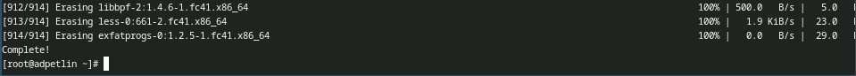{#fig:005 width=100%}

Обновление всех пакетов

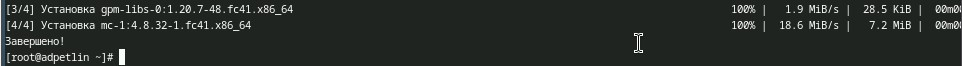{#fig:006 width=100%}

Установка программ для удобства работы в консоли.

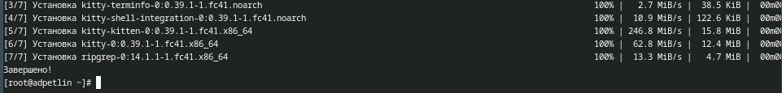{#fig:007 width=100%}

Установка другого варианта консоли.

## Отключение SELinux

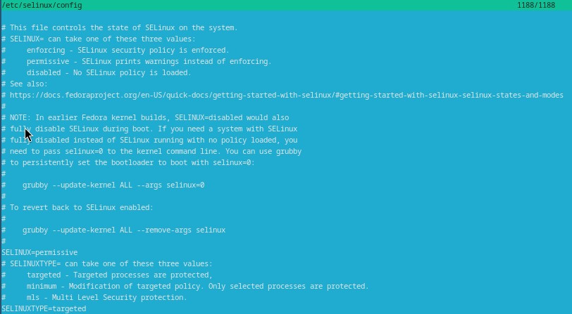{#fig:008 width=100%}

В файле /etc/selinux/config заменяем значение "enforcing" на "permissive".

## Настройка раскладки клавиатуры

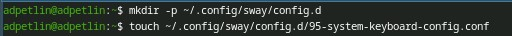{#fig:009 width=100%}

Создайте конфигурационный файл ~/.config/sway/config.d/95-system-keyboard-config.conf.

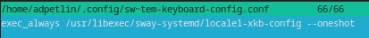{#fig:010 width=100%}

Редактируем конфигурационный файл ~/.config/sway/config.d/95-system-keyboard-config.conf

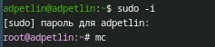{#fig:011 width=100%}

Переходим на роль супер-пользователя и открываем mc.

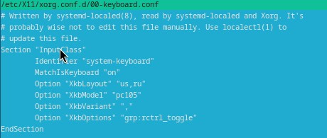{#fig:012 width=100%}

Редактируем конфигурационный файл /etc/X11/xorg.conf.d/00-keyboard.conf и перезагружаем систему.

## Установка программного обеспечения для создания документации

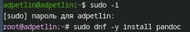{#fig:013 width=100%}

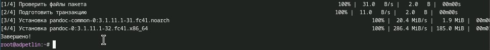{#fig:014 width=100%}

Устанавливаем pandoc через терминал.

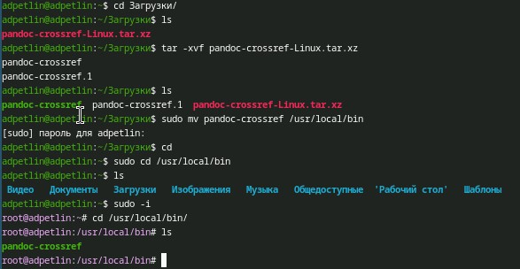{#fig:015 width=100%}

Устанавливаем pandoc-crossref через git под нашу версию pandoc'a. Распаковываем ".tar" файл и перемещаем в каталог /usr/local/bin.

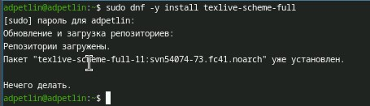{#fig:016 width=100%}

Устанавливаем TexLive через терминал

# Домашнее задание

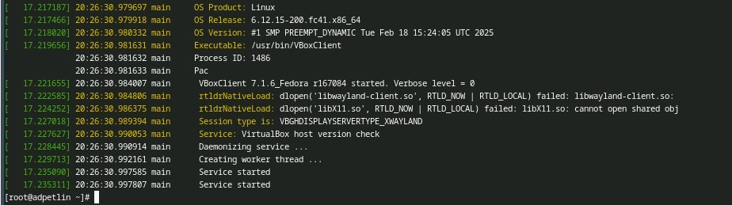{#fig:017 width=100%}

Анализируем последовательность загрузки системы, выполнив команду dmesg: информация об ОС; загрузка BIOS'a; загрузка процессора, портов, служб; загрузка системы и SELinux; подгрузка virtualbox.

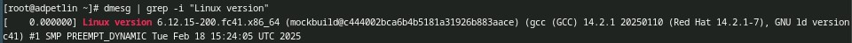{#fig:018 width=100%}

Можно использовать поиск с помощью grep: dmesg | grep -i "то, что ищем". Узнаем версию ядра Linux.

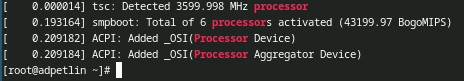{#fig:019 width=100%}

Узнаем частоту процессора.

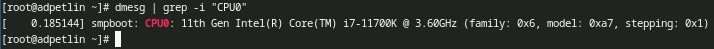{#fig:020 width=100%}

Узнаем модель процессора.

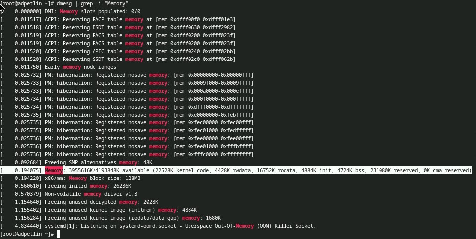{#fig:021 width=100%}

Узнаем объём доступной оперативной памяти.

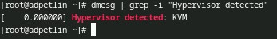{#fig:022 width=100%}

Узнаем тип обнаруженного гипервизора.

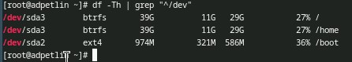{#fig:023 width=100%}

Узнаем тип файловой системы корневого раздела.

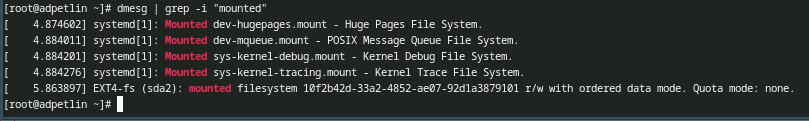{#fig:024 width=100%}

Узнаем последовательность монтирования файловых систем.

# Выводы

Мы приобрели практические навыки установки операционной системы на виртуальную машину, настройки минимально необходимых для дальнейшей работы сервисов.

# Список литературы{.unnumbered}

::: {.refs}
1. Dash, P. Getting Started with Oracle VM VirtualBox / P. Dash. – Packt Publishing Ltd, 2013. – 86 сс.
2. Colvin, H. VirtualBox: An Ultimate Guide Book on Virtualization with VirtualBox. VirtualBox / H. Colvin. – CreateSpace Independent Publishing Platform, 2015. – 70 сс.
3. Vugt, S. van. Red Hat RHCSA/RHCE 7 cert guide : Red Hat Enterprise Linux 7 (EX200 and EX300) : Certification Guide. Red Hat RHCSA/RHCE 7 cert guide / S. van Vugt. – Pearson IT Certification, 2016. – 1008 сс.
4. Робачевский, А. Операционная система UNIX / А. Робачевский, С. Немнюгин, О. Стесик. – 2-е изд. – Санкт-Петербург : БХВ-Петербург, 2010. – 656 сс.
5. Немет, Э. Unix и Linux: руководство системного администратора. Unix и Linux / Э. Немет, Г. Снайдер, Т.Р. Хейн, Б. Уэйли. – 4-е изд. – Вильямс, 2014. – 1312 сс.
6. Колисниченко, Д.Н. Самоучитель системного администратора Linux : Системный администратор / Д.Н. Колисниченко. – Санкт-Петербург : БХВ-Петербург, 2011. – 544 сс.
7. Robbins, A. Bash Pocket Reference / A. Robbins. – O’Reilly Media, 2016. – 156 сс.
:::
