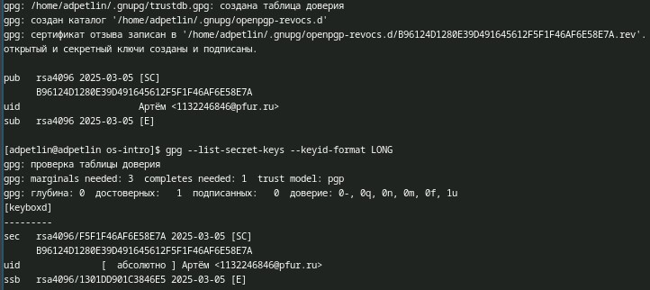
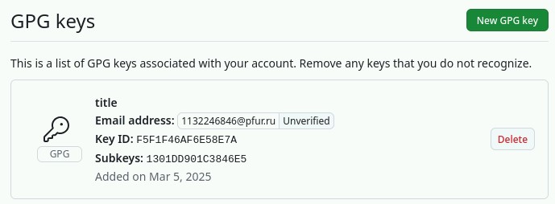
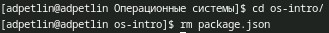

---
## Front matter
lang: ru-RU
title: Лабораторная работа №2
author:
  - Петлин А. Д.
institute:
  - Российский университет дружбы народов, Москва, Россия
date: 06 марта 2025

## i18n babel
babel-lang: russian
babel-otherlangs: english

## Formatting pdf
toc: false
toc-title: Содержание
slide_level: 2
aspectratio: 169
section-titles: true
theme: metropolis
header-includes:
 - \metroset{progressbar=frametitle,sectionpage=progressbar,numbering=fraction}
---

# Информация

## Докладчик

:::::::::::::: {.columns align=center}
::: {.column width="70%"}

  * Петлин Артём Дмитриевич
  * студент
  * группа НПИбд-02-24
  * Российский университет дружбы народов
  * [1132246846@pfur.ru](mailto:1132246846@pfur.ru)
  * <https://github.com/hikrim/study_2024-2025_os-intro>

:::
::: {.column width="30%"}

:::
::::::::::::::

# Цель работы

- Изучить идеологию и применение средств контроля версий.
- Освоить умения по работе с git.

# Задание

- Создать базовую конфигурацию для работы с git.
- Создать ключ SSH.
- Создать ключ PGP.
- Настроить подписи git.
- Зарегистрироваться на Github.
- Создать локальный каталог для выполнения заданий по предмету.

# Теоретическое введение

## Системы контроля версий. Общие понятия

Системы контроля версий (Version Control System, VCS) применяются при работе нескольких человек над одним проектом. Обычно основное дерево проекта хранится в локальном или удалённом репозитории, к которому настроен доступ для участников проекта. При внесении изменений в содержание проекта система контроля версий позволяет их фиксировать, совмещать изменения, произведённые разными участниками проекта, производить откат к любой более ранней версии проекта, если это требуется.

## Примеры использования git

- Система контроля версий Git представляет собой набор программ командной строки. Доступ к ним можно получить из терминала посредством ввода команды git с различными опциями.
- Благодаря тому, что Git является распределённой системой контроля версий, резервную копию локального хранилища можно сделать простым копированием или архивацией.

# Выполнение лабораторной работы

## Базовая настройка git

:::::::::::::: {.columns align=center}
::: {.column width="20%"}

Задаём имя и email владельца репозитория.

:::
::: {.column width="40%"}

{#fig:001 width=100%}

:::
::: {.column width="40%"}

{#fig:002 width=100%}

:::
::::::::::::::

## Базовая настройка git

{#fig:003 width=100%}

Настроиваем utf-8 в выводе сообщений git.

## Базовая настройка git

{#fig:004 width=100%}

Задаём имя начальной ветки (назовём её master).

## Базовая настройка git

{#fig:005 width=100%}

Параметры autocrlf и safecrlf.

# Создание ключей ssh

## Создаём ключи ssh

:::::::::::::: {.columns align=center}
::: {.column width="40%"}

Создаём ssh ключ по алгоритму ed25519.

:::
::: {.column width="60%"}

{#fig:006 width=100%}

:::
::::::::::::::

## Создаём ключи ssh

{#fig:007 width=100%}

Выводим ключ и копируем.

## Создаём ключи ssh

{#fig:009 width=100%}

Вставляем скопированное на github.

# Создание ключей PGP

## Создаём ключи pgp

:::::::::::::: {.columns align=center}
::: {.column width="10%"}

Генерируем ключ

:::
::: {.column width="30%"}

:::
::: {.column width="30%"}

:::
::: {.column width="30%"}

:::
::::::::::::::

## Создаём ключи pgp

:::::::::::::: {.columns align=center}
::: {.column width="40%"}

Выводим ключ и копируем.

:::
::: {.column width="60%"}

:::
::::::::::::::

## Создаём ключи pgp

{#fig:014 width=100%}

Переходим в настройки GitHub, нажимаем на кнопку New GPG key и вставляем полученный ключ в поле ввода.

# Настрайка автоматических подписей коммитов git

## Настраиваем автоматические подписи коммитов git

{#fig:015 width=100%}

Используя введёный email, указываем Git применять его при подписи коммитов.

# Регистрация на GitHub

:::::::::::::: {.columns align=center}
::: {.column width="40%"}

Регестрируемся на GitHub и заполняем основные данные.

:::
::: {.column width="40%"}

{#fig:016 width=100%}

:::
::::::::::::::

# Настройка gh

## Настраиваем gh

:::::::::::::: {.columns align=center}
::: {.column width="20%"}

Авторизовываемся используя gh auth login.

:::
::: {.column width="40%"}

{#fig:017 width=100%}

:::
::: {.column width="40%"}

{#fig:018 width=100%}

:::
::::::::::::::

# Создание и настройка репозитория на GitHub

## Создаём репозиторий на GitHub

:::::::::::::: {.columns align=center}
::: {.column width="40%"}

Создаём репозиторий по шаблону.

:::
::: {.column width="60%"}

{#fig:019 width=100%}

:::
::::::::::::::

## Настраиваем репозиторий на GitHub

{#fig:020 width=100%}

Клонируем репозиторий.

## Настраиваем репозиторий на GitHub

{#fig:021 width=100%}

Переходим в каталог курса и удаляем лишние файлы.

## Настраиваем репозиторий на GitHub

{#fig:022 width=100%}

Создаём необходимые каталоги.

## Настраиваем репозиторий на GitHub

:::::::::::::: {.columns align=center}
::: {.column width="20%"}

Отправляем файлы на сервер.

:::
::: {.column width="40%"}

{#fig:023 width=100%}

:::
::: {.column width="40%"}

{#fig:024 width=100%}

:::
::::::::::::::

# Выводы

Мы изучили идеологию и применение средств контроля версий и освоили умения по работе с git.

# Список литературы{.unnumbered}

::: {.refs}
1. Dash, P. Getting Started with Oracle VM VirtualBox / P. Dash. – Packt Publishing Ltd, 2013. – 86 сс.
2. Colvin, H. VirtualBox: An Ultimate Guide Book on Virtualization with VirtualBox. VirtualBox / H. Colvin. – CreateSpace Independent Publishing Platform, 2015. – 70 сс.
3. Vugt, S. van. Red Hat RHCSA/RHCE 7 cert guide : Red Hat Enterprise Linux 7 (EX200 and EX300) : Certification Guide. Red Hat RHCSA/RHCE 7 cert guide / S. van Vugt. – Pearson IT Certification, 2016. – 1008 сс.
4. Робачевский, А. Операционная система UNIX / А. Робачевский, С. Немнюгин, О. Стесик. – 2-е изд. – Санкт-Петербург : БХВ-Петербург, 2010. – 656 сс.
5. Немет, Э. Unix и Linux: руководство системного администратора. Unix и Linux / Э. Немет, Г. Снайдер, Т.Р. Хейн, Б. Уэйли. – 4-е изд. – Вильямс, 2014. – 1312 сс.
6. Колисниченко, Д.Н. Самоучитель системного администратора Linux : Системный администратор / Д.Н. Колисниченко. – Санкт-Петербург : БХВ-Петербург, 2011. – 544 сс.
7. Robbins, A. Bash Pocket Reference / A. Robbins. – O’Reilly Media, 2016. – 156 сс.
:::
