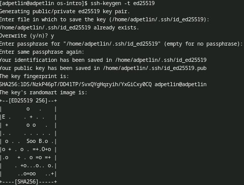

---
## Front matter
title: "Отчёт по лабораторной работе №2"
author: "Петлин Артём Дмитриевич"

## Generic otions
lang: ru-RU
toc-title: "Содержание"

## Bibliography
bibliography: bib/cite.bib
csl: pandoc/csl/gost-r-7-0-5-2008-numeric.csl

## Pdf output format
toc: true # Table of contents
toc-depth: 2
lof: true # List of figures
lot: true # List of tables
fontsize: 12pt
linestretch: 1.5
papersize: a4
documentclass: scrreprt
## I18n polyglossia
polyglossia-lang:
  name: russian
  options:
	- spelling=modern
	- babelshorthands=true
polyglossia-otherlangs:
  name: english
## I18n babel
babel-lang: russian
babel-otherlangs: english
## Fonts
mainfont: IBM Plex Serif
romanfont: IBM Plex Serif
sansfont: IBM Plex Sans
monofont: IBM Plex Mono
mathfont: STIX Two Math
mainfontoptions: Ligatures=Common,Ligatures=TeX,Scale=0.94
romanfontoptions: Ligatures=Common,Ligatures=TeX,Scale=0.94
sansfontoptions: Ligatures=Common,Ligatures=TeX,Scale=MatchLowercase,Scale=0.94
monofontoptions: Scale=MatchLowercase,Scale=0.94,FakeStretch=0.9
mathfontoptions:
## Biblatex
biblatex: true
biblio-style: "gost-numeric"
biblatexoptions:
  - parentracker=true
  - backend=biber
  - hyperref=auto
  - language=auto
  - autolang=other*
  - citestyle=gost-numeric
## Pandoc-crossref LaTeX customization
figureTitle: "Рис."
tableTitle: "Таблица"
listingTitle: "Листинг"
lofTitle: "Список иллюстраций"
lotTitle: "Список таблиц"
lolTitle: "Листинги"
## Misc options
indent: true
header-includes:
  - \usepackage{indentfirst}
  - \usepackage{float} # keep figures where there are in the text
  - \floatplacement{figure}{H} # keep figures where there are in the text
---

# Цель работы

- Изучить идеологию и применение средств контроля версий.
- Освоить умения по работе с git.

# Задание

- Создать базовую конфигурацию для работы с git.
- Создать ключ SSH.
- Создать ключ PGP.
- Настроить подписи git.
- Зарегистрироваться на Github.
- Создать локальный каталог для выполнения заданий по предмету.

# Теоретическое введение

## Системы контроля версий. Общие понятия

Системы контроля версий (Version Control System, VCS) применяются при работе нескольких человек над одним проектом. Обычно основное дерево проекта хранится в локальном или удалённом репозитории, к которому настроен доступ для участников проекта. При внесении изменений в содержание проекта система контроля версий позволяет их фиксировать, совмещать изменения, произведённые разными участниками проекта, производить откат к любой более ранней версии проекта, если это требуется.

## Примеры использования git

- Система контроля версий Git представляет собой набор программ командной строки. Доступ к ним можно получить из терминала посредством ввода команды git с различными опциями.
- Благодаря тому, что Git является распределённой системой контроля версий, резервную копию локального хранилища можно сделать простым копированием или архивацией.

# Выполнение лабораторной работы

## Установка программного обеспечения

{#fig:001 width=100%}

{#fig:002 width=100%}

Задаём имя и email владельца репозитория.

{#fig:003 width=100%}

Настроиваем utf-8 в выводе сообщений git.

{#fig:004 width=100%}

Задаём имя начальной ветки (назовём её master).

{#fig:005 width=100%}

Параметры autocrlf и safecrlf.

## Создаём ключи ssh

{#fig:006 width=100%}

Создаём ssh ключ по алгоритму ed25519.

{#fig:007 width=100%}

Выводим ключ и копируем.

{#fig:009 width=100%}

Вставляем скопированное на github.

## Создаём ключи pgp

{#fig:010 width=100%}

{#fig:011 width=100%}

{#fig:012 width=100%}

Генерируем ключ

{#fig:013 width=100%}

Выводим ключ и копируем.

{#fig:014 width=100%}

Переходим в настройки GitHub, нажимаем на кнопку New GPG key и вставляем полученный ключ в поле ввода.

## Настраиваем автоматические подписи коммитов git

{#fig:015 width=100%}

Используя введёный email, указываем Git применять его при подписи коммитов.

## Регистрация на GitHub

{#fig:016 width=100%}

Регестрируемся на GitHub и заполняем основные данные.

## Настройка gh

{#fig:017 width=100%}

{#fig:018 width=100%}

Авторизовываемся используя gh auth login.

{#fig:019 width=100%}

Создаём репозиторий по шаблону.

{#fig:020 width=100%}

Клонируем репозиторий.

{#fig:021 width=100%}

Переходим в каталог курса и удаляем лишние файлы.

{#fig:022 width=100%}

Создаём необходимые каталоги.

{#fig:023 width=100%}

{#fig:024 width=100%}

Отправляем файлы на сервер.

# Выводы

Мы изучили идеологию и применение средств контроля версий и освоили умения по работе с git.

# Список литературы{.unnumbered}

::: {.refs}
1. Dash, P. Getting Started with Oracle VM VirtualBox / P. Dash. – Packt Publishing Ltd, 2013. – 86 сс.
2. Colvin, H. VirtualBox: An Ultimate Guide Book on Virtualization with VirtualBox. VirtualBox / H. Colvin. – CreateSpace Independent Publishing Platform, 2015. – 70 сс.
3. Vugt, S. van. Red Hat RHCSA/RHCE 7 cert guide : Red Hat Enterprise Linux 7 (EX200 and EX300) : Certification Guide. Red Hat RHCSA/RHCE 7 cert guide / S. van Vugt. – Pearson IT Certification, 2016. – 1008 сс.
4. Робачевский, А. Операционная система UNIX / А. Робачевский, С. Немнюгин, О. Стесик. – 2-е изд. – Санкт-Петербург : БХВ-Петербург, 2010. – 656 сс.
5. Немет, Э. Unix и Linux: руководство системного администратора. Unix и Linux / Э. Немет, Г. Снайдер, Т.Р. Хейн, Б. Уэйли. – 4-е изд. – Вильямс, 2014. – 1312 сс.
6. Колисниченко, Д.Н. Самоучитель системного администратора Linux : Системный администратор / Д.Н. Колисниченко. – Санкт-Петербург : БХВ-Петербург, 2011. – 544 сс.
7. Robbins, A. Bash Pocket Reference / A. Robbins. – O’Reilly Media, 2016. – 156 сс.
:::
