---
## Front matter
lang: ru-RU
title: Лабораторная работа №4
author:
  - Петлин А. Д.
institute:
  - Российский университет дружбы народов, Москва, Россия
date: 08 марта 2025

## i18n babel
babel-lang: russian
babel-otherlangs: english

## Formatting pdf
toc: false
toc-title: Содержание
slide_level: 2
aspectratio: 169
section-titles: true
theme: metropolis
header-includes:
 - \metroset{progressbar=frametitle,sectionpage=progressbar,numbering=fraction}
---

# Информация

## Докладчик

:::::::::::::: {.columns align=center}
::: {.column width="70%"}

  * Петлин Артём Дмитриевич
  * студент
  * группа НПИбд-02-24
  * Российский университет дружбы народов
  * [1132246846@pfur.ru](mailto:1132246846@pfur.ru)
  * <https://github.com/hikrim/study_2024-2025_os-intro>

:::
::: {.column width="30%"}

:::
::::::::::::::

# Цель работы

- Получение навыков правильной работы с репозиториями git.

# Задание

   - Выполнить работу для тестового репозитория.
   - Преобразовать рабочий репозиторий в репозиторий с git-flow и conventional commits.

# Теоретическое введение

## Рабочий процесс Gitflow

Рабочий процесс Gitflow Workflow. Будем описывать его с использованием пакета git-flow.

## Общая информация

1. Gitflow Workflow опубликована и популяризована Винсентом Дриссеном.
2. Gitflow Workflow предполагает выстраивание строгой модели ветвления с учётом выпуска проекта.
3. Данная модель отлично подходит для организации рабочего процесса на основе релизов.
4. Работа по модели Gitflow включает создание отдельной ветки для исправлений ошибок в рабочей среде.
5. Последовательность действий при работе по модели Gitflow:
   - Из ветки master создаётся ветка develop.
   - Из ветки develop создаётся ветка release.
   - Из ветки develop создаются ветки feature.
   - Когда работа над веткой feature завершена, она сливается с веткой develop.
   - Когда работа над веткой релиза release завершена, она сливается в ветки develop и master.
   - Если в master обнаружена проблема, из master создаётся ветка hotfix.
   - Когда работа над веткой исправления hotfix завершена, она сливается в ветки develop и master.

# Выполнение лабораторной работы

# Установка программного обеспечения

## Установка git-flow

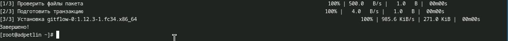

Устанавливаем git-flow.

## Установка Node.js

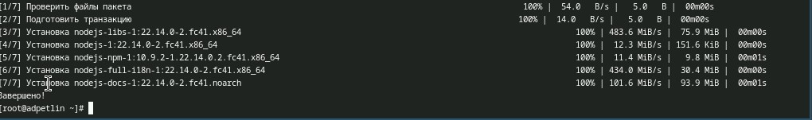

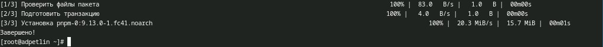

Устанавливаем Node.js.

## Настройка Node.js

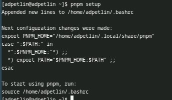

Для работы с Node.js добавим каталог с исполняемыми файлами, устанавливаемыми yarn, в переменную PATH.

## Общепринятые коммиты

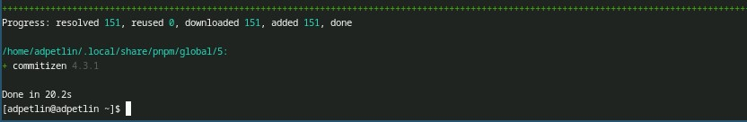

Данная программа используется для помощи в форматировании коммитов. При этом устанавливается скрипт git-cz, который мы и будем использовать для коммитов.

## Общепринятые коммиты

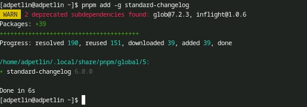

Данная программа используется для помощи в создании логов.

## Создание репозитория git

:::::::::::::: {.columns align=center}
::: {.column width="20%"}

Создаём репозиторий на GitHub, назовём его git-extended. Делаем первый коммит и выкладываем на github.

:::
::: {.column width="30%"}
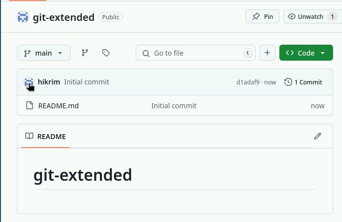

:::
::: {.column width="30%"}

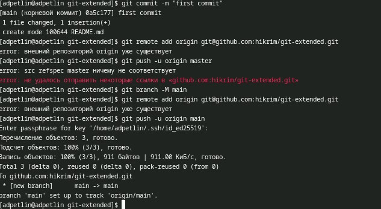

:::
::: {.column width="20%"}

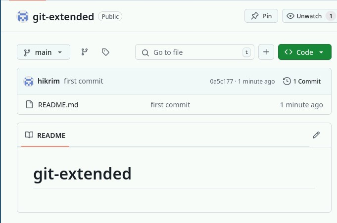

:::
::::::::::::::

## Преобразование репозитория в репозиторий с git-flow

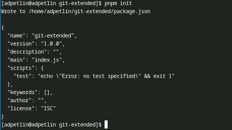

Конфигурация для пакетов Node.js

## Преобразование репозитория в репозиторий с git-flow

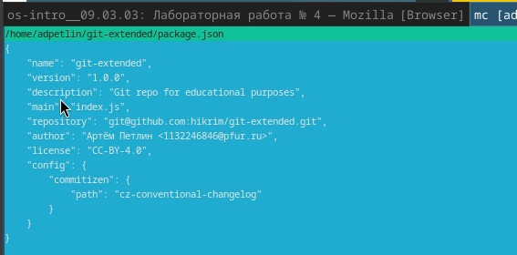

Сконфигурим формат коммитов.

## Преобразование репозитория в репозиторий с git-flow

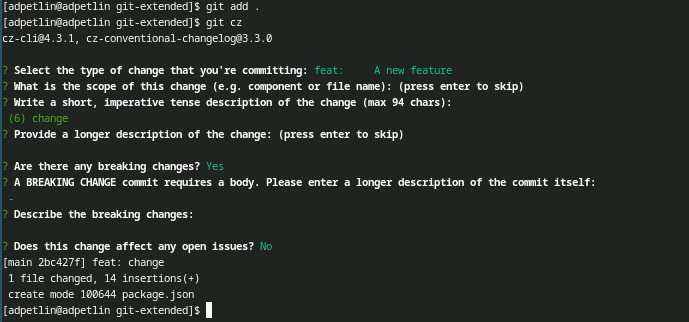

Добавим новые файлы, и выполним коммит.

## Преобразование репозитория в репозиторий с git-flow

:::::::::::::: {.columns align=center}
::: {.column width="10%"}

Отправим на github.

:::
::: {.column width="45%"}

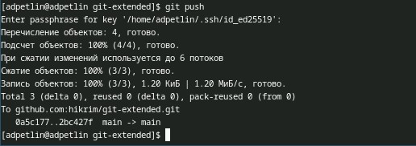

:::
::: {.column width="45%"}

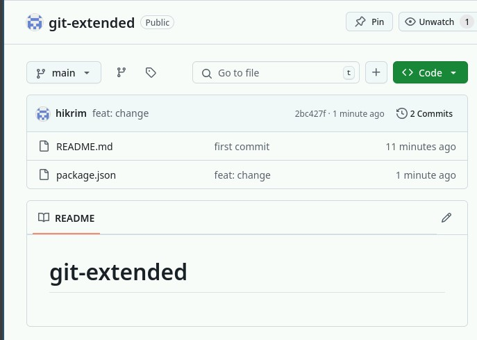

:::
::::::::::::::

## Преобразование репозитория в репозиторий с git-flow

:::::::::::::: {.columns align=center}
::: {.column width="20%"}

Инициализируем git-flow. Префикс для ярлыков установим в v.

:::
::: {.column width="80%"}

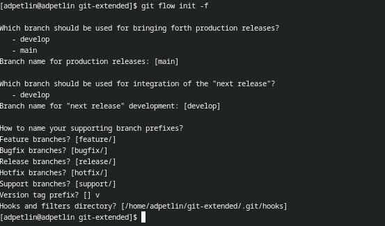

:::
::::::::::::::

## Преобразование репозитория в репозиторий с git-flow

Проверяем, что мы на ветке develop.

## Преобразование репозитория в репозиторий с git-flow

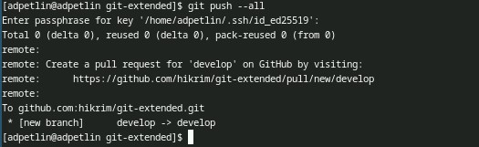

Загружаем весь репозиторий в хранилище.

## Преобразование репозитория в репозиторий с git-flow

Устанавливаем внешнюю ветку как вышестоящую для этой ветки.

## Преобразование репозитория в репозиторий с git-flow

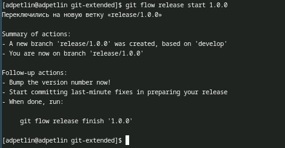

Создаём релиз с версией 1.0.0

## Преобразование репозитория в репозиторий с git-flow

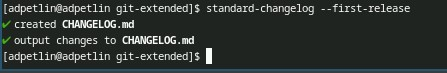

Создаём журнал изменений.

Добавим журнал изменений в индекс.

## Преобразование репозитория в репозиторий с git-flow

:::::::::::::: {.columns align=center}
::: {.column width="20%"}

Зальём релизную ветку в основную ветку

:::
::: {.column width="80%"}

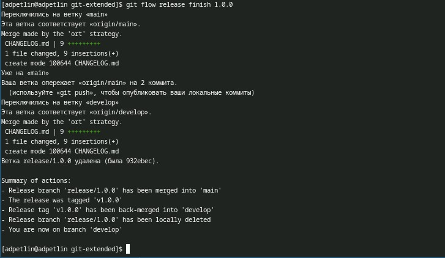

:::
::::::::::::::

## Преобразование репозитория в репозиторий с git-flow

:::::::::::::: {.columns align=center}
::: {.column width="20%"}

Отправляем данные на github.

:::
::: {.column width="80%"}

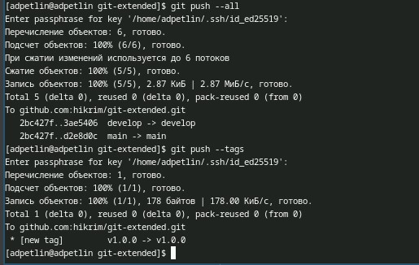

:::
::::::::::::::

## Преобразование репозитория в репозиторий с git-flow

Создаём релиз на github. Для этого используем утилиты работы с github.

## Преобразование репозитория в репозиторий с git-flow

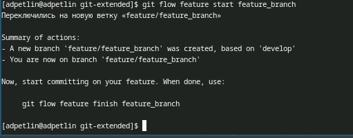

Создаём ветку для новой функциональности.

## Преобразование репозитория в репозиторий с git-flow

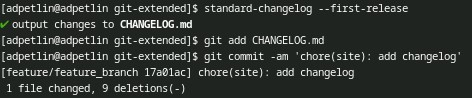

Продолжаем работу c git как обычно.

## Преобразование репозитория в репозиторий с git-flow

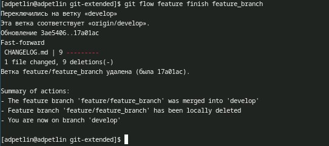

По окончании разработки новой функциональности следующим шагом следует объединить ветку feature_branch c develop.

## Преобразование репозитория в репозиторий с git-flow

:::::::::::::: {.columns align=center}
::: {.column width="20%"}

Создаём релиз с версией 1.2.3.

:::
::: {.column width="80%"}

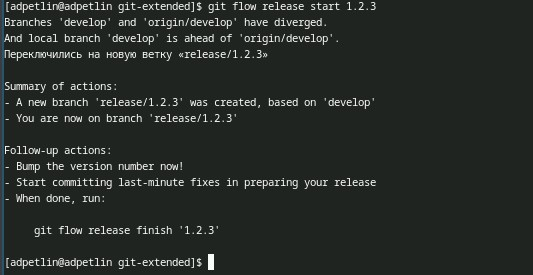

:::
::::::::::::::

## Преобразование репозитория в репозиторий с git-flow

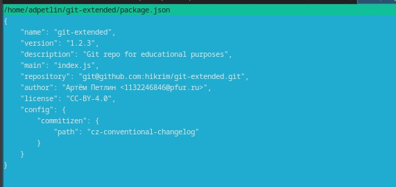

Обновляем номер версии в файле package.json. Устанавливаем её в 1.2.3.

## Преобразование репозитория в репозиторий с git-flow

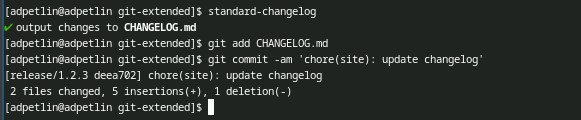

Продолжаем работу c git как обычно.

## Преобразование репозитория в репозиторий с git-flow

:::::::::::::: {.columns align=center}
::: {.column width="30%"}

Зальём релизную ветку в основную ветку.

:::
::: {.column width="70%"}

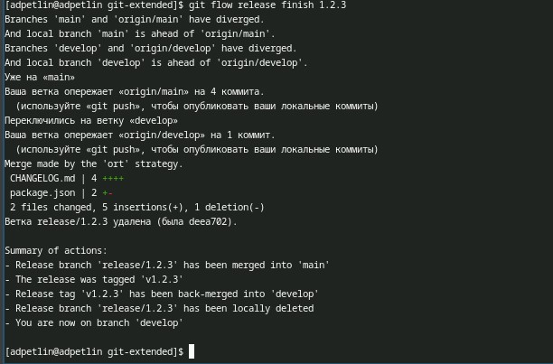

:::
::::::::::::::

## Преобразование репозитория в репозиторий с git-flow

:::::::::::::: {.columns align=center}
::: {.column width="30%"}

Отправляем данные на github.

:::
::: {.column width="70%"}

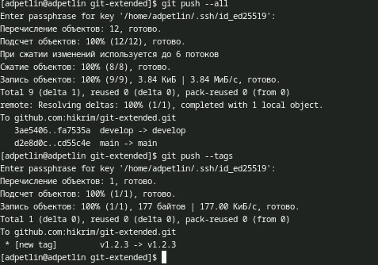

:::
::::::::::::::

## Преобразование репозитория в репозиторий с git-flow

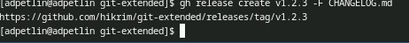

Создаём релиз на github с комментарием из журнала изменений.

# Преобразование рабочего репозитория в репозиторий с git-flow и conventional commits.

## Преобразование рабочего репозитория в репозиторий с git-flow и conventional commits.

:::::::::::::: {.columns align=center}
::: {.column width="20%"}

Сконфигурим формат коммитов, добавим новые файлы, выполним коммит.

:::
::: {.column width="40%"}

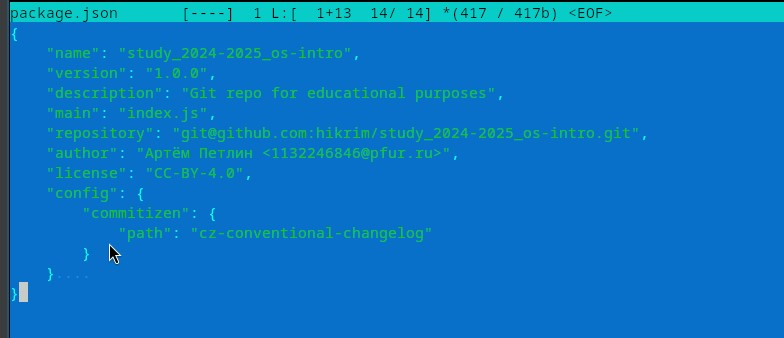

:::
::: {.column width="40%"}

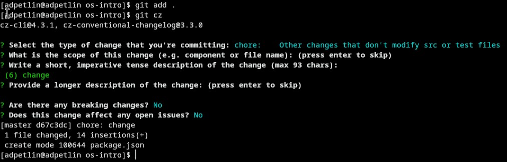

:::
::::::::::::::

## Преобразование рабочего репозитория в репозиторий с git-flow и conventional commits.

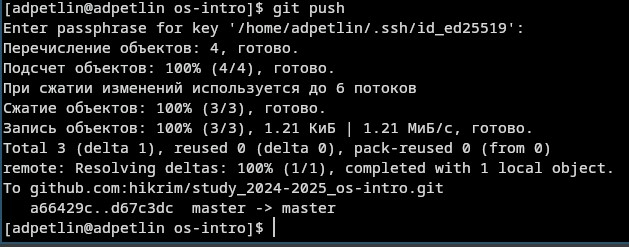

Отправляем на github.

## Преобразование рабочего репозитория в репозиторий с git-flow и conventional commits.

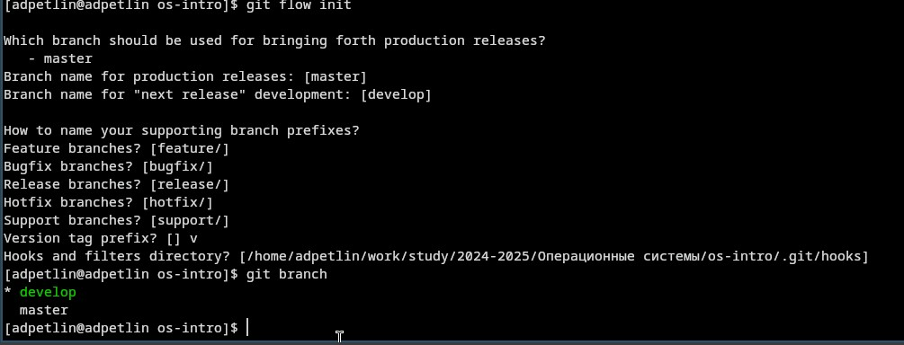

Инициализируем git-flow. Префикс для ярлыков установим в v. Проверяем, что мы на ветке develop.

## Преобразование рабочего репозитория в репозиторий с git-flow и conventional commits.

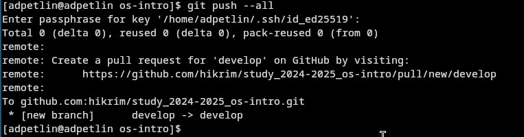

Загружаем весь репозиторий в хранилище.

## Преобразование рабочего репозитория в репозиторий с git-flow и conventional commits.

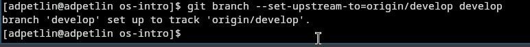

Устанавливаем внешнюю ветку как вышестоящую для этой ветки.

## Преобразование рабочего репозитория в репозиторий с git-flow и conventional commits.

Создаём релиз с версией 1.0.0. Работа с git как обычно.

## Преобразование рабочего репозитория в репозиторий с git-flow и conventional commits.

:::::::::::::: {.columns align=center}
::: {.column width="30%"}

Зальём релизную ветку в основную ветку

:::
::: {.column width="70%"}

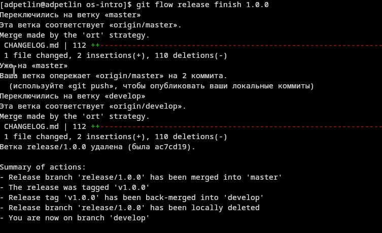

:::
::::::::::::::

## Преобразование рабочего репозитория в репозиторий с git-flow и conventional commits.

:::::::::::::: {.columns align=center}
::: {.column width="30%"}

Отправляем данные на github.

:::
::: {.column width="70%"}

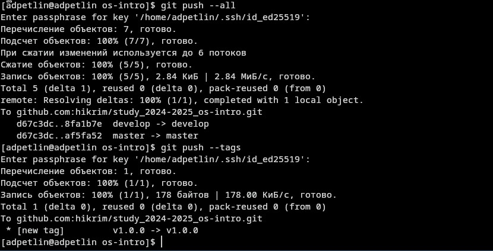

:::
::::::::::::::

## Преобразование рабочего репозитория в репозиторий с git-flow и conventional commits.

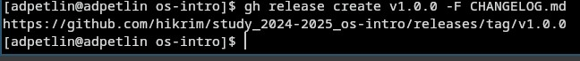

Создаём релиз на github. Для этого используем утилиты работы с github.

## Преобразование рабочего репозитория в репозиторий с git-flow и conventional commits.

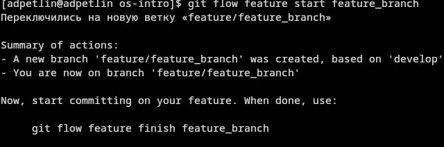

Создаём ветку для новой функциональности.

## Преобразование рабочего репозитория в репозиторий с git-flow и conventional commits.

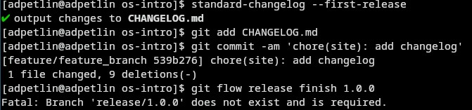

Продолжаем работу c git как обычно.

## Преобразование рабочего репозитория в репозиторий с git-flow и conventional commits.

По окончании разработки новой функциональности следующим шагом следует объединить ветку feature_branch c develop.

## Преобразование рабочего репозитория в репозиторий с git-flow и conventional commits.

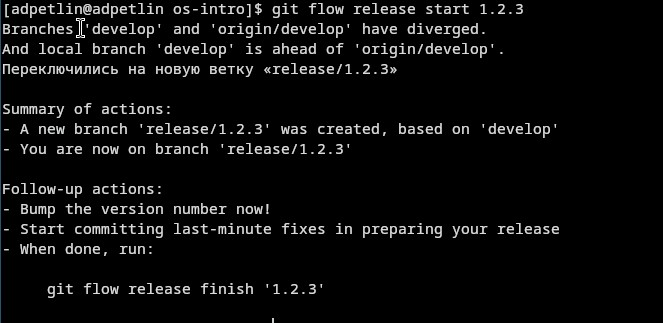

Обновляем номер версии в файле package.json. Устанавливаем её в 1.2.3. Создаём релиз с версией 1.2.3.

## Преобразование рабочего репозитория в репозиторий с git-flow и conventional commits.

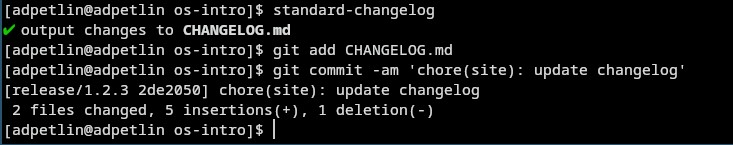

Продолжаем работу c git как обычно.

## Преобразование рабочего репозитория в репозиторий с git-flow и conventional commits.

:::::::::::::: {.columns align=center}
::: {.column width="30%"}

Зальём релизную ветку в основную ветку

:::
::: {.column width="70%"}

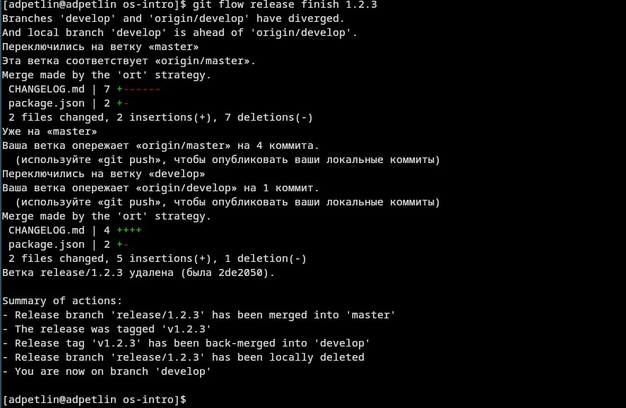

:::
::::::::::::::

## Преобразование рабочего репозитория в репозиторий с git-flow и conventional commits.

:::::::::::::: {.columns align=center}
::: {.column width="30%"}

Отправляем данные на github.

:::
::: {.column width="70%"}

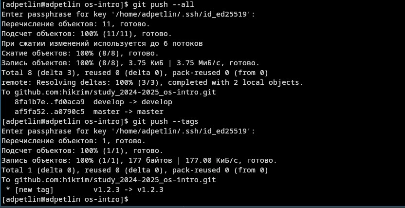

:::
::::::::::::::

## Преобразование рабочего репозитория в репозиторий с git-flow и conventional commits.

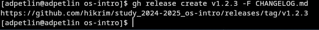

Создаём релиз на github с комментарием из журнала изменений.

## Преобразование рабочего репозитория в репозиторий с git-flow и conventional commits.

:::::::::::::: {.columns align=center}
::: {.column width="30%"}

Получившееся релизы на github.

:::
::: {.column width="70%"}

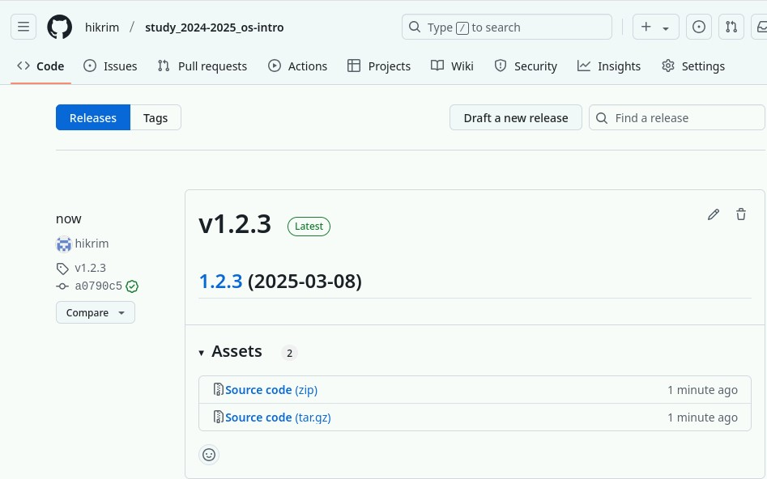

:::
::::::::::::::

# Выводы

Мы получили навыки правильной работы с репозиториями git.

# Список литературы{.unnumbered}

::: {.refs}
1. Dash, P. Getting Started with Oracle VM VirtualBox / P. Dash. – Packt Publishing Ltd, 2013. – 86 сс.
2. Colvin, H. VirtualBox: An Ultimate Guide Book on Virtualization with VirtualBox. VirtualBox / H. Colvin. – CreateSpace Independent Publishing Platform, 2015. – 70 сс.
3. Vugt, S. van. Red Hat RHCSA/RHCE 7 cert guide : Red Hat Enterprise Linux 7 (EX200 and EX300) : Certification Guide. Red Hat RHCSA/RHCE 7 cert guide / S. van Vugt. – Pearson IT Certification, 2016. – 1008 сс.
4. Робачевский, А. Операционная система UNIX / А. Робачевский, С. Немнюгин, О. Стесик. – 2-е изд. – Санкт-Петербург : БХВ-Петербург, 2010. – 656 сс.
5. Немет, Э. Unix и Linux: руководство системного администратора. Unix и Linux / Э. Немет, Г. Снайдер, Т.Р. Хейн, Б. Уэйли. – 4-е изд. – Вильямс, 2014. – 1312 сс.
6. Колисниченко, Д.Н. Самоучитель системного администратора Linux : Системный администратор / Д.Н. Колисниченко. – Санкт-Петербург : БХВ-Петербург, 2011. – 544 сс.
7. Robbins, A. Bash Pocket Reference / A. Robbins. – O’Reilly Media, 2016. – 156 сс.
:::
