---
## Front matter
title: "Отчёт по лабораторной работе №4"
author: "Петлин Артём Дмитриевич"

## Generic otions
lang: ru-RU
toc-title: "Содержание"

## Bibliography
bibliography: bib/cite.bib
csl: pandoc/csl/gost-r-7-0-5-2008-numeric.csl

## Pdf output format
toc: true # Table of contents
toc-depth: 2
lof: true # List of figures
lot: true # List of tables
fontsize: 12pt
linestretch: 1.5
papersize: a4
documentclass: scrreprt
## I18n polyglossia
polyglossia-lang:
  name: russian
  options:
	- spelling=modern
	- babelshorthands=true
polyglossia-otherlangs:
  name: english
## I18n babel
babel-lang: russian
babel-otherlangs: english
## Fonts
mainfont: IBM Plex Serif
romanfont: IBM Plex Serif
sansfont: IBM Plex Sans
monofont: IBM Plex Mono
mathfont: STIX Two Math
mainfontoptions: Ligatures=Common,Ligatures=TeX,Scale=0.94
romanfontoptions: Ligatures=Common,Ligatures=TeX,Scale=0.94
sansfontoptions: Ligatures=Common,Ligatures=TeX,Scale=MatchLowercase,Scale=0.94
monofontoptions: Scale=MatchLowercase,Scale=0.94,FakeStretch=0.9
mathfontoptions:
## Biblatex
biblatex: true
biblio-style: "gost-numeric"
biblatexoptions:
  - parentracker=true
  - backend=biber
  - hyperref=auto
  - language=auto
  - autolang=other*
  - citestyle=gost-numeric
## Pandoc-crossref LaTeX customization
figureTitle: "Рис."
tableTitle: "Таблица"
listingTitle: "Листинг"
lofTitle: "Список иллюстраций"
lotTitle: "Список таблиц"
lolTitle: "Листинги"
## Misc options
indent: true
header-includes:
  - \usepackage{indentfirst}
  - \usepackage{float} # keep figures where there are in the text
  - \floatplacement{figure}{H} # keep figures where there are in the text
---

# Цель работы

- Получение навыков правильной работы с репозиториями git.

# Задание

   - Выполнить работу для тестового репозитория.
   - Преобразовать рабочий репозиторий в репозиторий с git-flow и conventional commits.

# Теоретическое введение

## Рабочий процесс Gitflow

Рабочий процесс Gitflow Workflow. Будем описывать его с использованием пакета git-flow.

## Общая информация

1. Gitflow Workflow опубликована и популяризована Винсентом Дриссеном.
2. Gitflow Workflow предполагает выстраивание строгой модели ветвления с учётом выпуска проекта.
3. Данная модель отлично подходит для организации рабочего процесса на основе релизов.
4. Работа по модели Gitflow включает создание отдельной ветки для исправлений ошибок в рабочей среде.
5. Последовательность действий при работе по модели Gitflow:
   - Из ветки master создаётся ветка develop.
   - Из ветки develop создаётся ветка release.
   - Из ветки develop создаются ветки feature.
   - Когда работа над веткой feature завершена, она сливается с веткой develop.
   - Когда работа над веткой релиза release завершена, она сливается в ветки develop и master.
   - Если в master обнаружена проблема, из master создаётся ветка hotfix.
   - Когда работа над веткой исправления hotfix завершена, она сливается в ветки develop и master.

# Выполнение лабораторной работы

## Установка программного обеспечения

### Установка git-flow

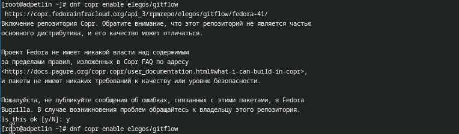{#fig:001 width=100%}

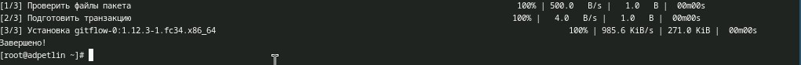{#fig:002 width=100%}

Устанавливаем git-flow.

## Установка Node.js

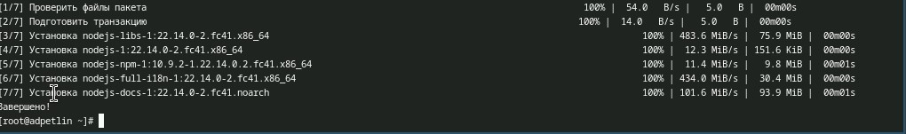{#fig:003 width=100%}

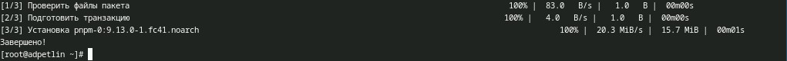{#fig:004 width=100%}

Устанавливаем Node.js.

## Настройка Node.js

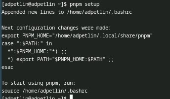{#fig:005 width=100%}

{#fig:006 width=100%}

Для работы с Node.js добавим каталог с исполняемыми файлами, устанавливаемыми yarn, в переменную PATH.

## Общепринятые коммиты

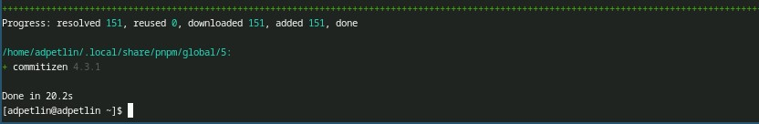{#fig:007 width=100%}

Данная программа используется для помощи в форматировании коммитов. При этом устанавливается скрипт git-cz, который мы и будем использовать для коммитов.

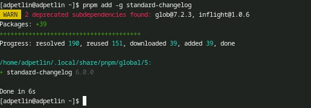{#fig:008 width=100%}

Данная программа используется для помощи в создании логов.

## Создание репозитория git

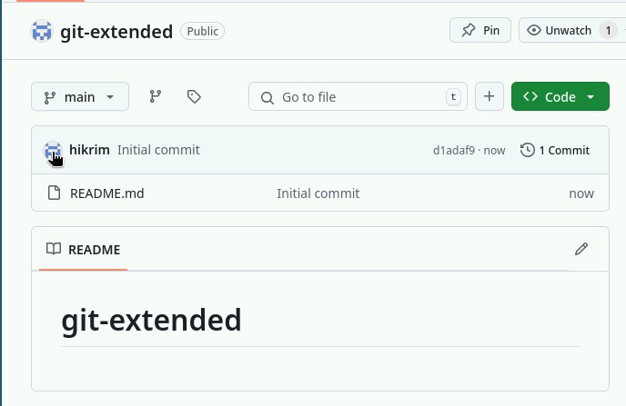{#fig:009 width=100%}

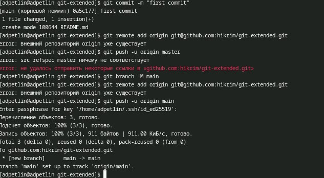{#fig:010 width=100%}

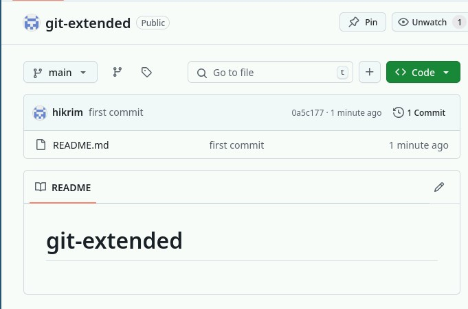{#fig:011 width=100%}

Создаём репозиторий на GitHub, назовём его git-extended. Делаем первый коммит и выкладываем на github.

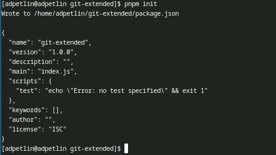{#fig:012 width=100%}

Конфигурация для пакетов Node.js

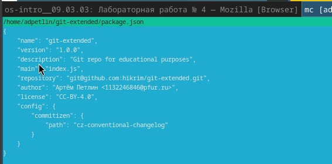{#fig:013 width=100%}

Сконфигурим формат коммитов.

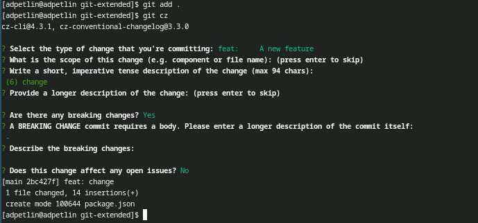{#fig:014 width=100%}

Добавим новые файлы, и выполним коммит.

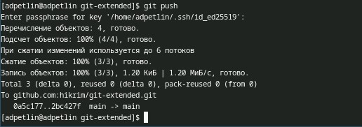{#fig:015 width=100%}

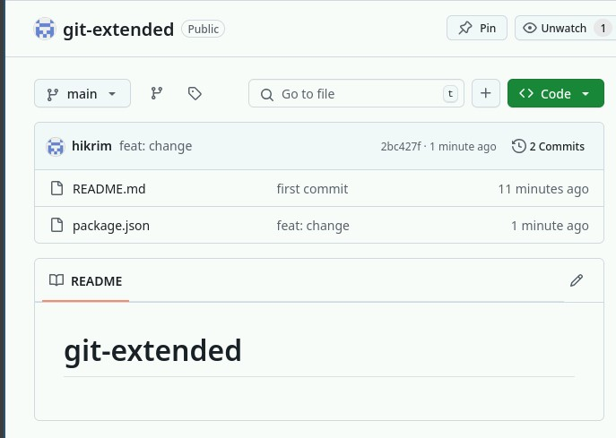{#fig:016 width=100%}

Отправим на github.

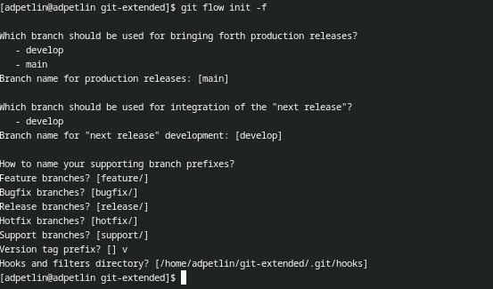{#fig:017 width=100%}

Инициализируем git-flow. Префикс для ярлыков установим в v.

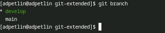{#fig:018 width=100%}

Проверяем, что мы на ветке develop.

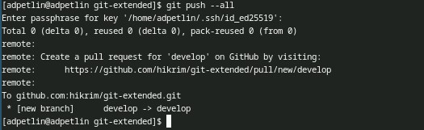{#fig:019 width=100%}

Загружаем весь репозиторий в хранилище.

{#fig:020 width=100%}

Устанавливаем внешнюю ветку как вышестоящую для этой ветки.

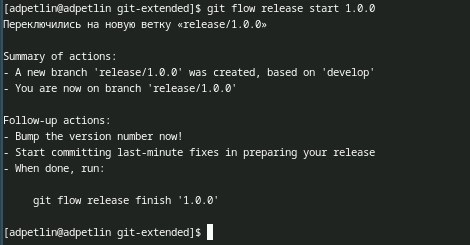{#fig:021 width=100%}

Создаём релиз с версией 1.0.0

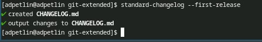{#fig:022 width=100%}

Создаём журнал изменений.

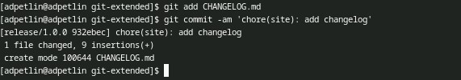{#fig:023 width=100%}

Добавим журнал изменений в индекс.

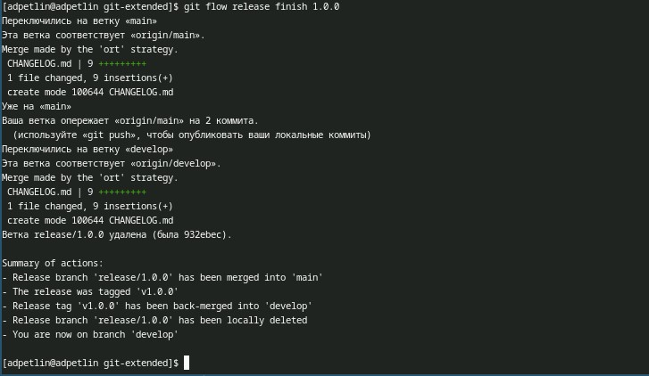{#fig:024 width=100%}

Зальём релизную ветку в основную ветку

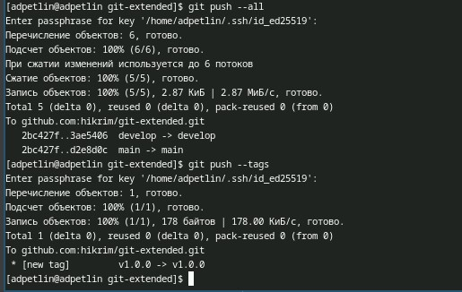{#fig:025 width=100%}

Отправляем данные на github.

{#fig:026 width=100%}

Создаём релиз на github. Для этого используем утилиты работы с github.

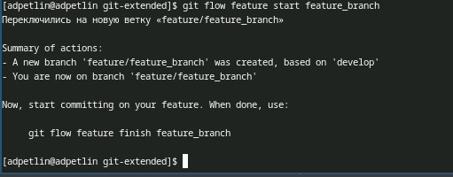{#fig:027 width=100%}

Создаём ветку для новой функциональности.

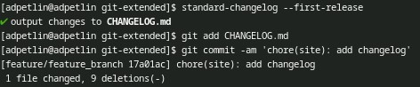{#fig:028 width=100%}

Продолжаем работу c git как обычно.

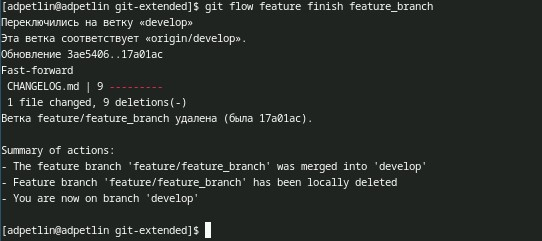{#fig:029 width=100%}

По окончании разработки новой функциональности следующим шагом следует объединить ветку feature_branch c develop.

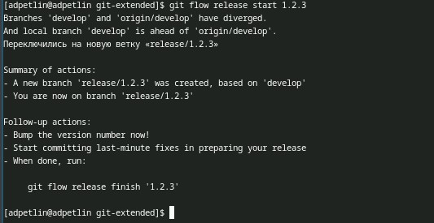{#fig:030 width=100%}

Создаём релиз с версией 1.2.3.

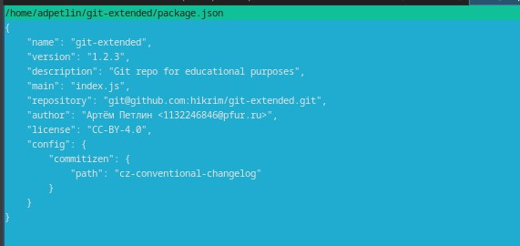{#fig:031 width=100%}

Обновляем номер версии в файле package.json. Устанавливаем её в 1.2.3.

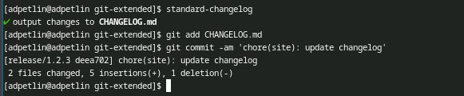{#fig:032 width=100%}

Продолжаем работу c git как обычно.

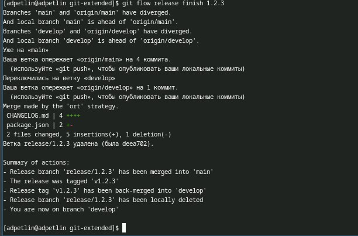{#fig:033 width=100%}

Зальём релизную ветку в основную ветку.

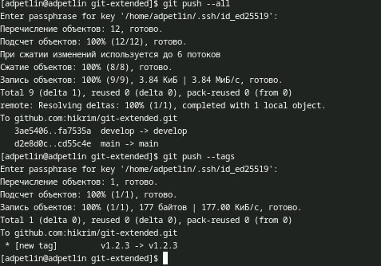{#fig:034 width=100%}

Отправим данные на github.

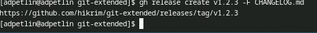{#fig:035 width=100%}

Создаём релиз на github с комментарием из журнала изменений.

# Преобразование рабочего репозитория в репозиторий с git-flow и conventional commits.

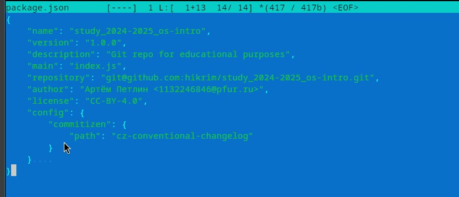{#fig:037 width=100%}

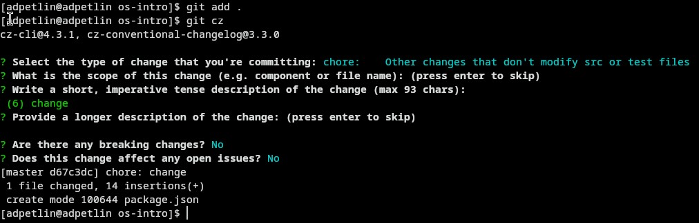{#fig:038 width=100%}

Сконфигурим формат коммитов, добавим новые файлы, выполним коммит.

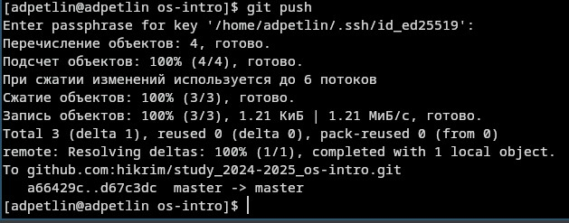{#fig:039 width=100%}

Отправляем на github.

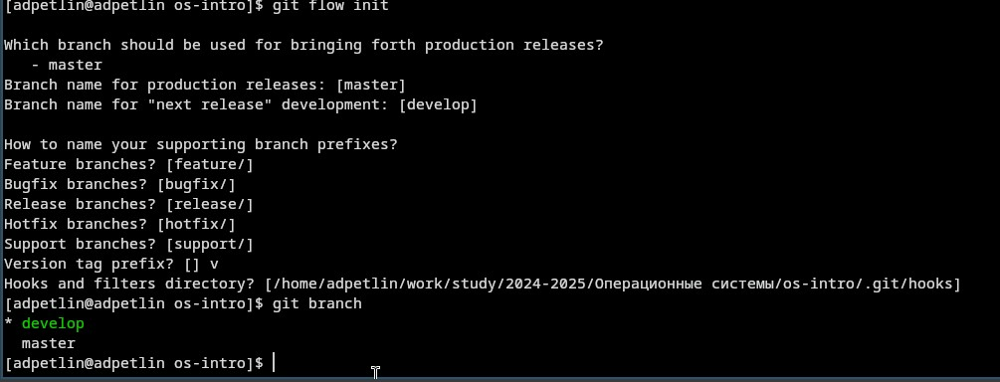{#fig:040 width=100%}

Инициализируем git-flow. Префикс для ярлыков установим в v. Проверяем, что мы на ветке develop.

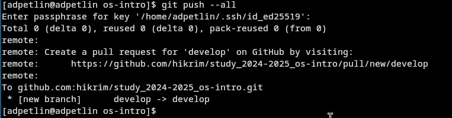{#fig:041 width=100%}

Загружаем весь репозиторий в хранилище.

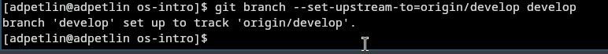{#fig:042 width=100%}

Устанавливаем внешнюю ветку как вышестоящую для этой ветки.

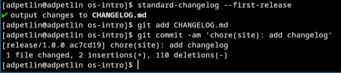{#fig:043 width=100%}

Создаём релиз с версией 1.0.0. Работа с git как обычно.

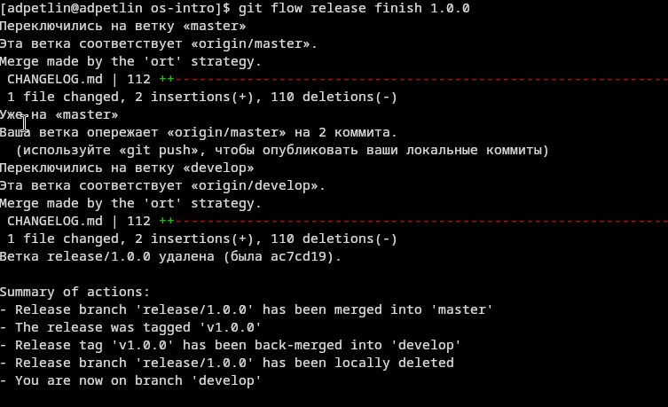{#fig:044 width=100%}

Зальём релизную ветку в основную ветку

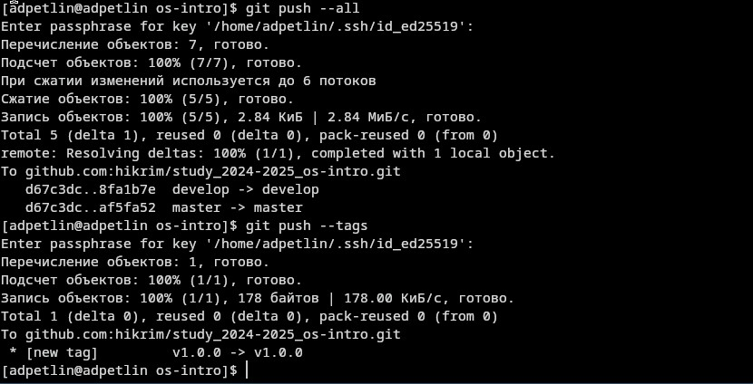{#fig:045 width=100%}

Отправляем данные на github.

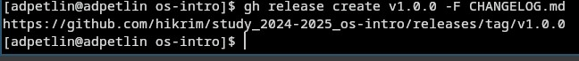{#fig:046 width=100%}

Создаём релиз на github. Для этого используем утилиты работы с github.

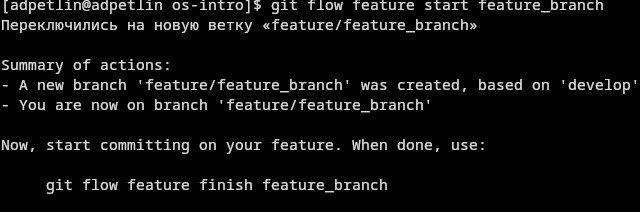{#fig:047 width=100%}

Создаём ветку для новой функциональности.

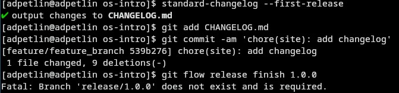{#fig:048 width=100%}

Продолжаем работу c git как обычно.

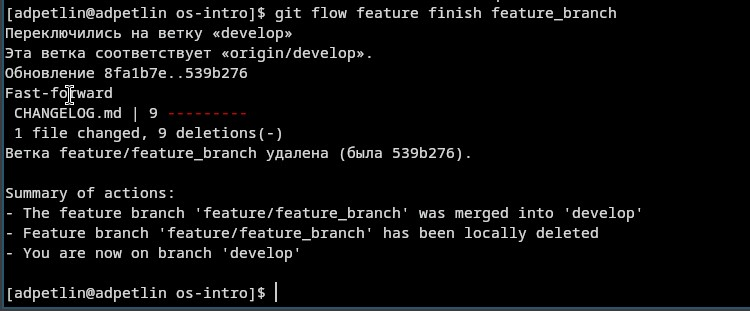{#fig:049 width=100%}

По окончании разработки новой функциональности следующим шагом следует объединить ветку feature_branch c develop.

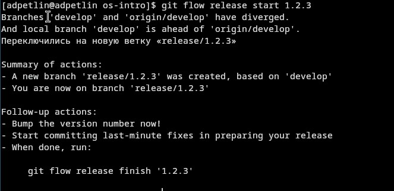{#fig:050 width=100%}

Обновляем номер версии в файле package.json. Устанавливаем её в 1.2.3. Создаём релиз с версией 1.2.3.

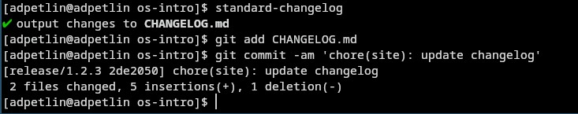{#fig:051 width=100%}

Продолжаем работу c git как обычно.

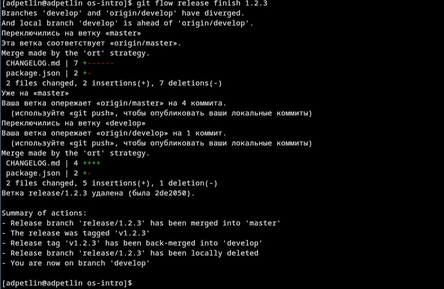{#fig:052 width=100%}

Зальём релизную ветку в основную ветку.

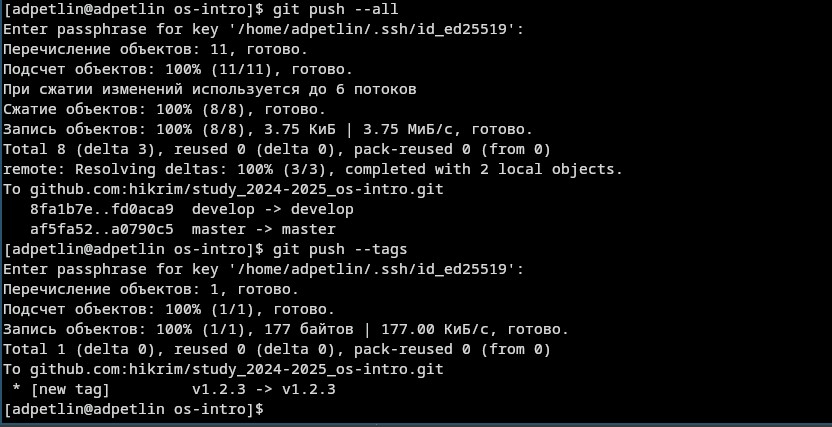{#fig:053 width=100%}

Отправим данные на github.

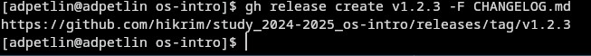{#fig:054 width=100%}

Создаём релиз на github с комментарием из журнала изменений.

{#fig:055 width=100%}

Получившееся релизы на github.

# Выводы

Мы получили навыки правильной работы с репозиториями git.

# Список литературы{.unnumbered}

::: {.refs}
1. Dash, P. Getting Started with Oracle VM VirtualBox / P. Dash. – Packt Publishing Ltd, 2013. – 86 сс.
2. Colvin, H. VirtualBox: An Ultimate Guide Book on Virtualization with VirtualBox. VirtualBox / H. Colvin. – CreateSpace Independent Publishing Platform, 2015. – 70 сс.
3. Vugt, S. van. Red Hat RHCSA/RHCE 7 cert guide : Red Hat Enterprise Linux 7 (EX200 and EX300) : Certification Guide. Red Hat RHCSA/RHCE 7 cert guide / S. van Vugt. – Pearson IT Certification, 2016. – 1008 сс.
4. Робачевский, А. Операционная система UNIX / А. Робачевский, С. Немнюгин, О. Стесик. – 2-е изд. – Санкт-Петербург : БХВ-Петербург, 2010. – 656 сс.
5. Немет, Э. Unix и Linux: руководство системного администратора. Unix и Linux / Э. Немет, Г. Снайдер, Т.Р. Хейн, Б. Уэйли. – 4-е изд. – Вильямс, 2014. – 1312 сс.
6. Колисниченко, Д.Н. Самоучитель системного администратора Linux : Системный администратор / Д.Н. Колисниченко. – Санкт-Петербург : БХВ-Петербург, 2011. – 544 сс.
7. Robbins, A. Bash Pocket Reference / A. Robbins. – O’Reilly Media, 2016. – 156 сс.
:::
