---
## Front matter
lang: ru-RU
title: Лабораторная работа №5
author:
  - Петлин А. Д.
institute:
  - Российский университет дружбы народов, Москва, Россия
date: 14 марта 2025

## i18n babel
babel-lang: russian
babel-otherlangs: english

## Formatting pdf
toc: false
toc-title: Содержание
slide_level: 2
aspectratio: 169
section-titles: true
theme: metropolis
header-includes:
 - \metroset{progressbar=frametitle,sectionpage=progressbar,numbering=fraction}
---

# Информация

## Докладчик

:::::::::::::: {.columns align=center}
::: {.column width="70%"}

  * Петлин Артём Дмитриевич
  * студент
  * группа НПИбд-02-24
  * Российский университет дружбы народов
  * [1132246846@pfur.ru](mailto:1132246846@pfur.ru)
  * <https://github.com/hikrim/study_2024-2025_os-intro>

:::
::: {.column width="30%"}

:::
::::::::::::::

# Цель работы

Научиться производить настройку рабочей среды.

# Задание

1) Настройка менеджера паролей pass.
2) Управление файлами конфигурации.

# Теоретическое введение

## Менеджер паролей pass

   - Менеджер паролей pass — программа, сделанная в рамках идеологии Unix.
   - Также носит название стандартного менеджера паролей для Unix (The standard Unix password manager).

## Основные свойства

   - Данные хранятся в файловой системе в виде каталогов и файлов.
   - Файлы шифруются с помощью GPG-ключа.

## Управление файлами конфигурации (chezmoi)

   - Использование chezmoi для управления файлами конфигурации домашнего каталога пользователя.

## Шаблоны. Общая информация 

- Шаблоны используются для изменения содержимого файла в зависимости от среды.
- Используется синтаксис шаблонов Go.
- Файл интерпретируется как шаблон, если выполняется одно из следующих условий: 

   - имя файла имеет суффикс .tmpl;
   - файл находится в каталоге .chezmoitemplates.	

# Выполнение лабораторной работы

## Менеджер паролей pass

:::::::::::::: {.columns align=center}
::: {.column width="20%"}

Устанавливаем pass и gopass.

:::
::: {.column width="40%"}

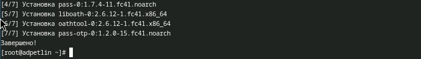

:::
::: {.column width="40%"}

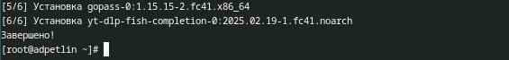

:::
::::::::::::::

## Менеджер паролей pass

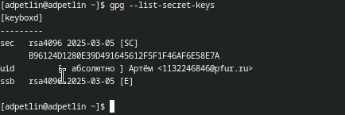

Просмотриваем список ключей gpg, проверяем, что он есть

## Менеджер паролей pass

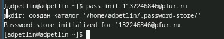

Инициализируем хранилище.

## Менеджер паролей pass

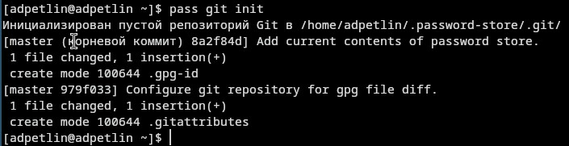

Создаём структуру git.

## Менеджер паролей pass

Задём адрес репозитория на хостинге (репозиторий предварительно создаём).

## Менеджер паролей pass

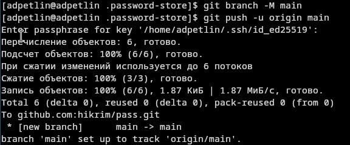

Синхронизируем. 

## Менеджер паролей pass

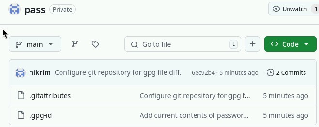

Вид репозитория на хостинге.

## Менеджер паролей pass

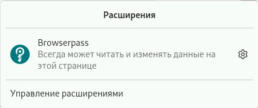

Устанавливаем плагин browserpass для firefox.

## Менеджер паролей pass

:::::::::::::: {.columns align=center}
::: {.column width="20%"}

Устанваливаем интерфейс для взаимодействия с броузером (native messaging).

:::
::: {.column width="40%"}

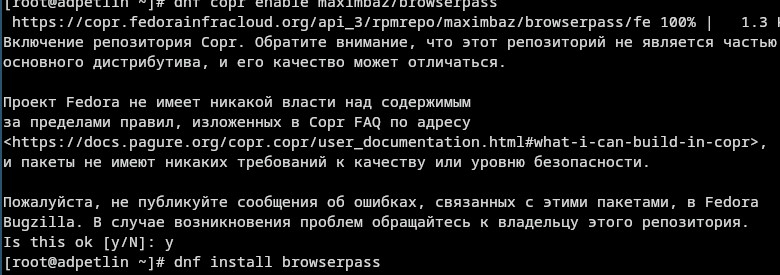

:::
::: {.column width="40%"}

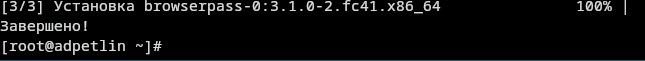

:::
::::::::::::::

## Менеджер паролей pass

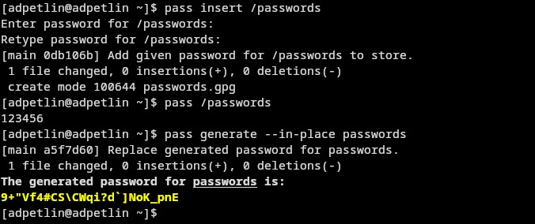

Добавляем новый пароль. Отображаем пароль для указанного имени файла. Заменяем существующий пароль.

## Управление файлами конфигурации

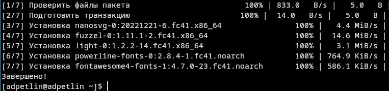

Устанавливаем дополнительное программное обеспечение.

## Управление файлами конфигурации

:::::::::::::: {.columns align=center}
::: {.column width="10%"}

Устанавливаем шрифты.

:::
::: {.column width="30%"}

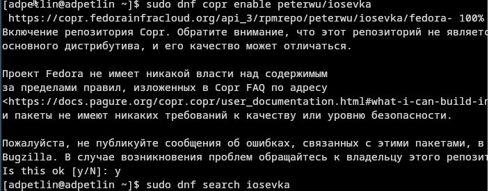

:::
::: {.column width="30%"}

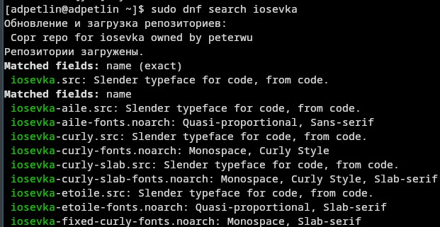

:::
::: {.column width="30%"}

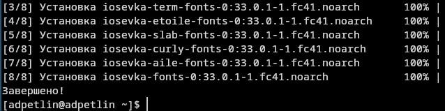

:::
::::::::::::::

## Управление файлами конфигурации

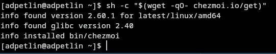

Устанавливаем бинарный файл (chezmoi).

## Управление файлами конфигурации

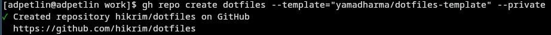

Создаём свой репозиторий для конфигурационных файлов на основе шаблона.

## Управление файлами конфигурации

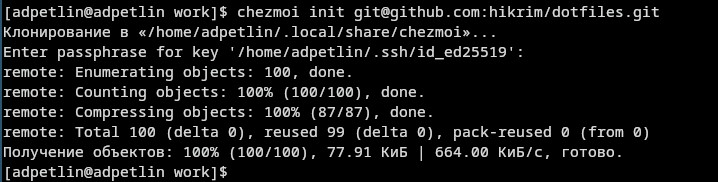

Инициализируем chezmoi с нашим репозиторием dotfiles.

## Управление файлами конфигурации

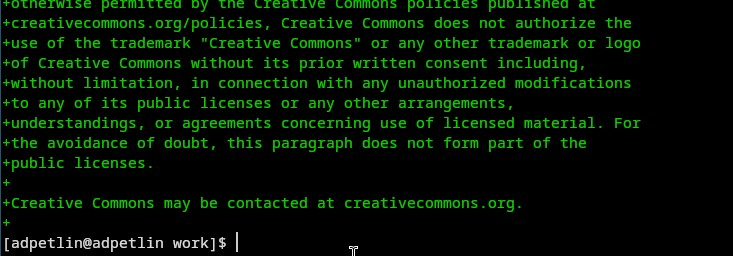

Проверяем, какие изменения внесёт chezmoi в домашний каталог, и соглашаемся на них.

## Управление файлами конфигурации
 
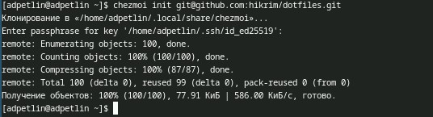

На второй машине инициализируем chezmoi с нашим репозиторием dotfiles.

## Управление файлами конфигурации

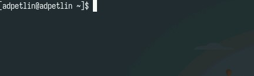

Проверяем, какие изменения внесёт chezmoi в домашний каталог, и соглашаемся на них, результат на скриншоте.

## Управление файлами конфигурации

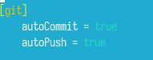

Включаем функцию автоматической фиксации и отправления изменений в исходный каталог в репозиторий

# Выводы

Мы научились производить настройку рабочей среды.

# Список литературы{.unnumbered}

::: {.refs}
1. Dash, P. Getting Started with Oracle VM VirtualBox / P. Dash. – Packt Publishing Ltd, 2013. – 86 сс.
2. Colvin, H. VirtualBox: An Ultimate Guide Book on Virtualization with VirtualBox. VirtualBox / H. Colvin. – CreateSpace Independent Publishing Platform, 2015. – 70 сс.
3. Vugt, S. van. Red Hat RHCSA/RHCE 7 cert guide : Red Hat Enterprise Linux 7 (EX200 and EX300) : Certification Guide. Red Hat RHCSA/RHCE 7 cert guide / S. van Vugt. – Pearson IT Certification, 2016. – 1008 сс.
4. Робачевский, А. Операционная система UNIX / А. Робачевский, С. Немнюгин, О. Стесик. – 2-е изд. – Санкт-Петербург : БХВ-Петербург, 2010. – 656 сс.
5. Немет, Э. Unix и Linux: руководство системного администратора. Unix и Linux / Э. Немет, Г. Снайдер, Т.Р. Хейн, Б. Уэйли. – 4-е изд. – Вильямс, 2014. – 1312 сс.
6. Колисниченко, Д.Н. Самоучитель системного администратора Linux : Системный администратор / Д.Н. Колисниченко. – Санкт-Петербург : БХВ-Петербург, 2011. – 544 сс.
7. Robbins, A. Bash Pocket Reference / A. Robbins. – O’Reilly Media, 2016. – 156 сс.
:::
