---
## Front matter
title: "Отчёт по лабораторной работе №5"
author: "Петлин Артём Дмитриевич"

## Generic otions
lang: ru-RU
toc-title: "Содержание"

## Bibliography
bibliography: bib/cite.bib
csl: pandoc/csl/gost-r-7-0-5-2008-numeric.csl

## Pdf output format
toc: true # Table of contents
toc-depth: 2
lof: true # List of figures
lot: true # List of tables
fontsize: 12pt
linestretch: 1.5
papersize: a4
documentclass: scrreprt
## I18n polyglossia
polyglossia-lang:
  name: russian
  options:
	- spelling=modern
	- babelshorthands=true
polyglossia-otherlangs:
  name: english
## I18n babel
babel-lang: russian
babel-otherlangs: english
## Fonts
mainfont: IBM Plex Serif
romanfont: IBM Plex Serif
sansfont: IBM Plex Sans
monofont: IBM Plex Mono
mathfont: STIX Two Math
mainfontoptions: Ligatures=Common,Ligatures=TeX,Scale=0.94
romanfontoptions: Ligatures=Common,Ligatures=TeX,Scale=0.94
sansfontoptions: Ligatures=Common,Ligatures=TeX,Scale=MatchLowercase,Scale=0.94
monofontoptions: Scale=MatchLowercase,Scale=0.94,FakeStretch=0.9
mathfontoptions:
## Biblatex
biblatex: true
biblio-style: "gost-numeric"
biblatexoptions:
  - parentracker=true
  - backend=biber
  - hyperref=auto
  - language=auto
  - autolang=other*
  - citestyle=gost-numeric
## Pandoc-crossref LaTeX customization
figureTitle: "Рис."
tableTitle: "Таблица"
listingTitle: "Листинг"
lofTitle: "Список иллюстраций"
lotTitle: "Список таблиц"
lolTitle: "Листинги"
## Misc options
indent: true
header-includes:
  - \usepackage{indentfirst}
  - \usepackage{float} # keep figures where there are in the text
  - \floatplacement{figure}{H} # keep figures where there are in the text
---

# Цель работы

Научиться производить настройку рабочей среды.

# Задание

1) Настройка менеджера паролей pass.
2) Управление файлами конфигурации.

# Теоретическое введение

## Менеджер паролей pass

   - Менеджер паролей pass — программа, сделанная в рамках идеологии Unix.
   - Также носит название стандартного менеджера паролей для Unix (The standard Unix password manager).

### Основные свойства

   - Данные хранятся в файловой системе в виде каталогов и файлов.
   - Файлы шифруются с помощью GPG-ключа.

## chezmoi

### Управление файлами конфигурации

   - Использование chezmoi для управления файлами конфигурации домашнего каталога пользователя.

### Шаблоны. Общая информация 

- Шаблоны используются для изменения содержимого файла в зависимости от среды.
- Используется синтаксис шаблонов Go.
- Файл интерпретируется как шаблон, если выполняется одно из следующих условий: 

   - имя файла имеет суффикс .tmpl;
   - файл находится в каталоге .chezmoitemplates.	

# Выполнение лабораторной работы

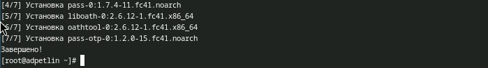{#fig:001 width=100%}

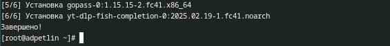{#fig:002 width=100%}

Устанавливаем pass и gopass.

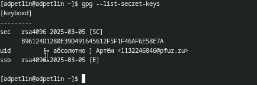{#fig:003 width=100%}

Просмотриваем список ключей gpg, проверяем, что он есть

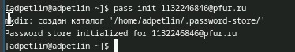{#fig:004 width=100%}

Инициализируем хранилище.

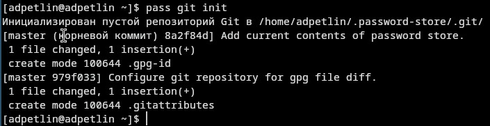{#fig:005 width=100%}

Создаём структуру git.

{#fig:006 width=100%}

Задём адрес репозитория на хостинге (репозиторий предварительно создаём).

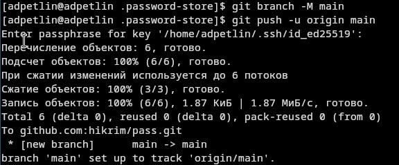{#fig:007 width=100%}

Синхронизируем. 

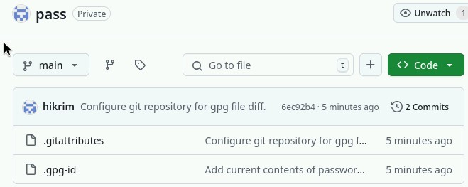{#fig:008 width=100%}

Вид репозитория на хостинге.

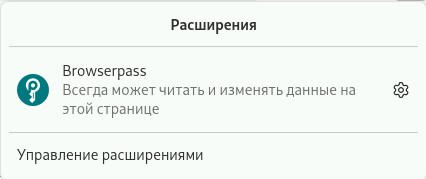{#fig:009 width=100%}

Устанавливаем плагин browserpass для firefox.

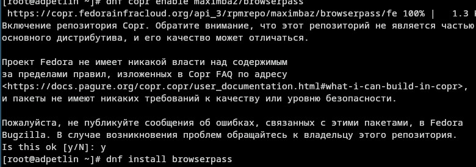{#fig:010 width=100%}

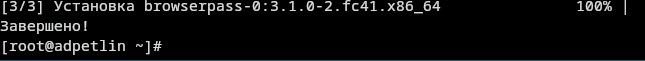{#fig:011 width=100%}

Устанваливаем интерфейс для взаимодействия с броузером (native messaging).

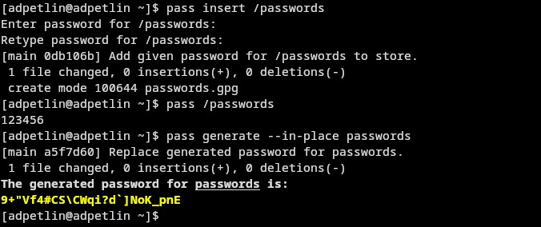{#fig:012 width=100%}

Добавляем новый пароль. Отображаем пароль для указанного имени файла. Заменяем существующий пароль.

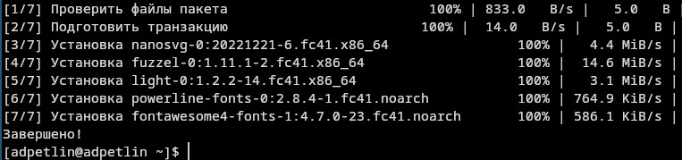{#fig:013 width=100%}

Устанавливаем дополнительное программное обеспечение.

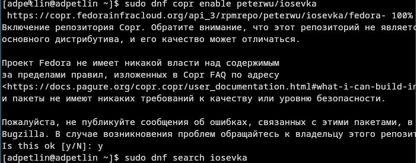{#fig:014 width=100%}

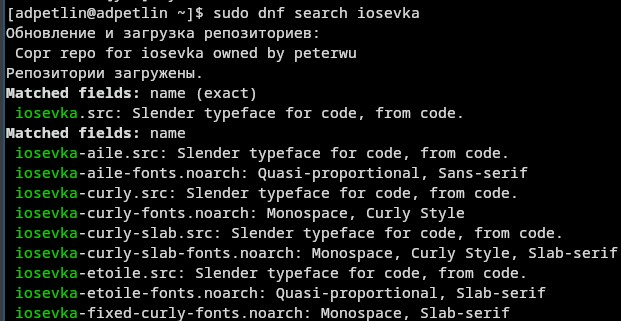{#fig:015 width=100%}

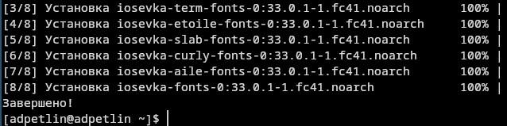{#fig:016 width=100%}

Устанавливаем шрифты.

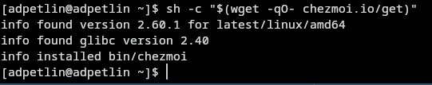{#fig:017 width=100%}

Устанавливаем бинарный файл (chezmoi).

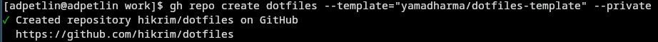{#fig:018 width=100%}

Создаём свой репозиторий для конфигурационных файлов на основе шаблона.

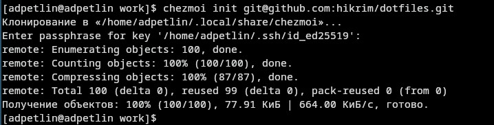{#fig:019 width=100%}

Инициализируем chezmoi с нашим репозиторием dotfiles.

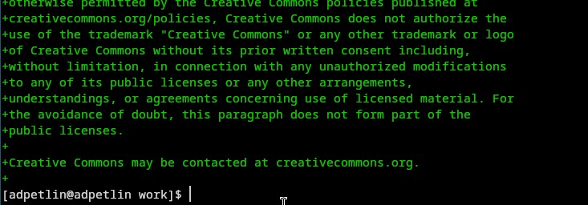{#fig:020 width=100%}

Проверяем, какие изменения внесёт chezmoi в домашний каталог, и соглашаемся на них.
 
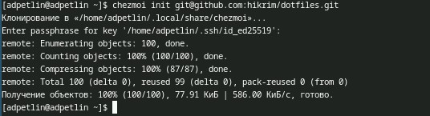{#fig:021 width=100%}

На второй машине инициализируем chezmoi с нашим репозиторием dotfiles.

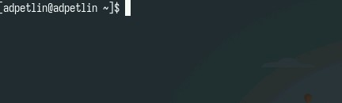{#fig:022 width=100%}

Проверяем, какие изменения внесёт chezmoi в домашний каталог, и соглашаемся на них, результат на скриншоте

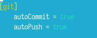{#fig:023 width=100%}

Включаем функцию автоматической фиксации и отправления изменений в исходный каталог в репозиторий

# Выводы

Мы научились производить настройку рабочей среды.

# Список литературы{.unnumbered}

::: {.refs}
1. Dash, P. Getting Started with Oracle VM VirtualBox / P. Dash. – Packt Publishing Ltd, 2013. – 86 сс.
2. Colvin, H. VirtualBox: An Ultimate Guide Book on Virtualization with VirtualBox. VirtualBox / H. Colvin. – CreateSpace Independent Publishing Platform, 2015. – 70 сс.
3. Vugt, S. van. Red Hat RHCSA/RHCE 7 cert guide : Red Hat Enterprise Linux 7 (EX200 and EX300) : Certification Guide. Red Hat RHCSA/RHCE 7 cert guide / S. van Vugt. – Pearson IT Certification, 2016. – 1008 сс.
4. Робачевский, А. Операционная система UNIX / А. Робачевский, С. Немнюгин, О. Стесик. – 2-е изд. – Санкт-Петербург : БХВ-Петербург, 2010. – 656 сс.
5. Немет, Э. Unix и Linux: руководство системного администратора. Unix и Linux / Э. Немет, Г. Снайдер, Т.Р. Хейн, Б. Уэйли. – 4-е изд. – Вильямс, 2014. – 1312 сс.
6. Колисниченко, Д.Н. Самоучитель системного администратора Linux : Системный администратор / Д.Н. Колисниченко. – Санкт-Петербург : БХВ-Петербург, 2011. – 544 сс.
7. Robbins, A. Bash Pocket Reference / A. Robbins. – O’Reilly Media, 2016. – 156 сс.
:::
