---
## Front matter
title: "Отчёт по лабораторной работе №6"
author: "Петлин Артём Дмитриевич"

## Generic otions
lang: ru-RU
toc-title: "Содержание"

## Bibliography
bibliography: bib/cite.bib
csl: pandoc/csl/gost-r-7-0-5-2008-numeric.csl

## Pdf output format
toc: true # Table of contents
toc-depth: 2
lof: true # List of figures
lot: true # List of tables
fontsize: 12pt
linestretch: 1.5
papersize: a4
documentclass: scrreprt
## I18n polyglossia
polyglossia-lang:
  name: russian
  options:
	- spelling=modern
	- babelshorthands=true
polyglossia-otherlangs:
  name: english
## I18n babel
babel-lang: russian
babel-otherlangs: english
## Fonts
mainfont: IBM Plex Serif
romanfont: IBM Plex Serif
sansfont: IBM Plex Sans
monofont: IBM Plex Mono
mathfont: STIX Two Math
mainfontoptions: Ligatures=Common,Ligatures=TeX,Scale=0.94
romanfontoptions: Ligatures=Common,Ligatures=TeX,Scale=0.94
sansfontoptions: Ligatures=Common,Ligatures=TeX,Scale=MatchLowercase,Scale=0.94
monofontoptions: Scale=MatchLowercase,Scale=0.94,FakeStretch=0.9
mathfontoptions:
## Biblatex
biblatex: true
biblio-style: "gost-numeric"
biblatexoptions:
  - parentracker=true
  - backend=biber
  - hyperref=auto
  - language=auto
  - autolang=other*
  - citestyle=gost-numeric
## Pandoc-crossref LaTeX customization
figureTitle: "Рис."
tableTitle: "Таблица"
listingTitle: "Листинг"
lofTitle: "Список иллюстраций"
lotTitle: "Список таблиц"
lolTitle: "Листинги"
## Misc options
indent: true
header-includes:
  - \usepackage{indentfirst}
  - \usepackage{float} # keep figures where there are in the text
  - \floatplacement{figure}{H} # keep figures where there are in the text
---

# Цель работы

Приобретение практических навыков взаимодействия пользователя с системой посредством командной строки.

# Задание

1. Определите полное имя вашего домашнего каталога. Далее относительно этого ката-
лога будут выполняться последующие упражнения.
2. Выполните следующие действия:
   1. Перейдите в каталог /tmp.
   2. Выведите на экран содержимое каталога /tmp. Для этого используйте команду ls с различными опциями. Поясните разниц в выводимой на экран информации.
   3. Определите, есть ли в каталоге /var/spool подкаталог с именем cron?
   4. Перейдите в Ваш домашний каталог и выведите на экран его содержимое. Опре-
делите, кто является владельцем файлов и подкаталогов?
3. Выполните следующие действия:
   1. В домашнем каталоге создайте новый каталог с именем newdir.
   2. В каталоге ~/newdir создайте новый каталог с именем morefun.
   3. В домашнем каталоге создайте одной командой три новых каталога с именами letters, memos, misk. Затем удалите эти каталоги одной командой.
   4. Попробуйте удалить ранее созданный каталог ~/newdir командой rm. Проверьте, был ли каталог удалён.
   5. Удалите каталог ~/newdir/morefun из домашнего каталога. Проверьте, был ли каталог удалён.
4. С помощью команды man определите, какую опцию команды ls нужно использо-
вать для просмотра содержимое не только указанного каталога, но и подкаталогов,
входящих в него.
5. С помощью команды man определите набор опций команды ls, позволяющий отсорти-
ровать по времени последнего изменения выводимый список содержимого каталога
с развёрнутым описанием файлов.
6. Используйте команду man для просмотра описания следующих команд: cd, pwd, mkdir,
rmdir, rm. Поясните основные опции этих команд.
7. Используя информацию, полученную при помощи команды history, выполните мо-
дификацию и исполнение нескольких команд из буфера команд.

# Теоретическое введение

В операционной системе типа Linux взаимодействие пользователя с системой обычно
осуществляется с помощью командной строки посредством построчного ввода ко-
манд. При этом обычно используется командные интерпретаторы языка shell: /bin/sh;
/bin/csh; /bin/ksh.

Формат команды. Командой в операционной системе называется записанный по
специальным правилам текст (возможно с аргументами), представляющий собой ука-
зание на выполнение какой-либо функций (или действий) в операционной системе.
Обычно первым словом идёт имя команды, остальной текст — аргументы или опции,
конкретизирующие действие.
Общий формат команд можно представить следующим образом:  

       <имя_команды><разделитель><аргументы>

# Выполнение лабораторной работы

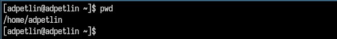{#fig:001 width=100%}

Определяем полное имя нашего домашнего каталога. 

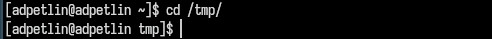{#fig:002 width=100%}

Переходим в каталог /tmp.

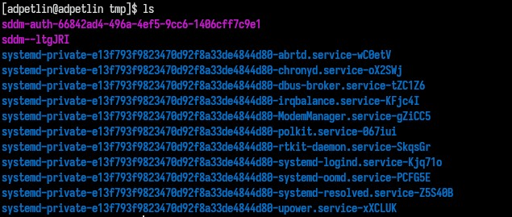{#fig:003 width=100%}

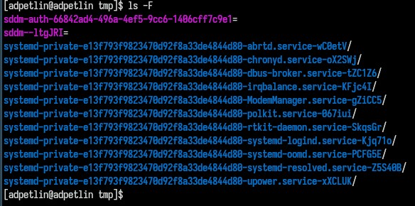{#fig:004 width=100%}

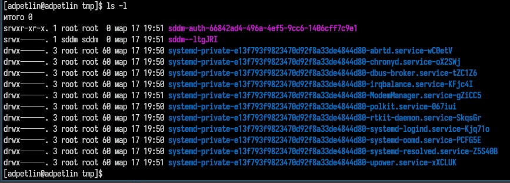{#fig:005 width=100%}

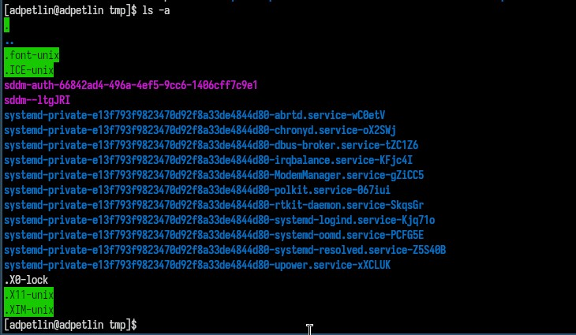{#fig:006 width=100%}

Выводим на экран содержимое каталога /tmp. Для этого используем команду ls
с различными опциями. ls: стандартный вывод элементов директории (файлы и подкаталоги). ls -F: позволяет помимо стандратного вывода ls получить еще и информацию о типах файлов. ls -l: выводит подробную информацию и файлах и каталогах. ls -a: выводит дополнительно имена скрытых файлов.

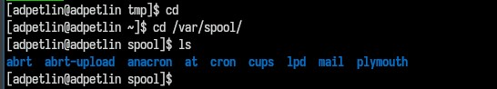{#fig:007 width=100%}

Определите, есть ли в каталоге /var/spool подкаталог с именем cron

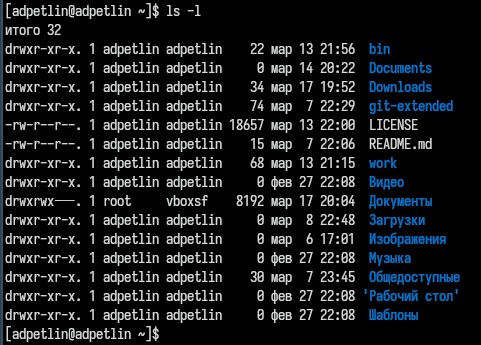{#fig:008 width=100%}

Переходим в наш домашний каталог и выводим на экран его содержимое. Владельцом файлов и подкаталогов является пользователь adpetlin.

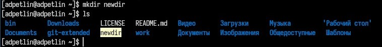{#fig:009 width=100%}

В домашнем каталоге создаём новый каталог с именем newdir.

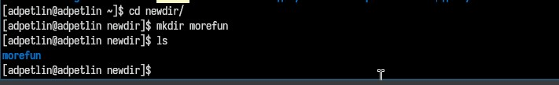{#fig:010 width=100%}

В каталоге ~/newdir создаём новый каталог с именем morefun.

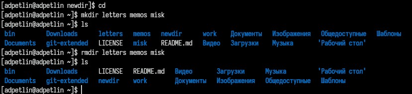{#fig:011 width=100%}

В домашнем каталоге создаём одной командой три новых каталога с именами
letters, memos, misk. Затем удаляем эти каталоги одной командой.

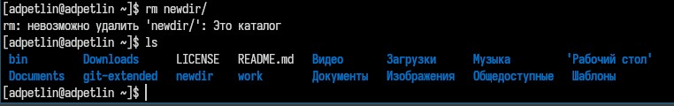{#fig:012 width=100%}

Пробуем удалить ранее созданный каталог ~/newdir командой rm. Удаление не произошло.

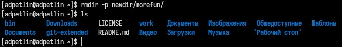{#fig:013 width=100%}

Удаляем каталог ~/newdir/morefun из домашнего каталога. Проверяем, что удаление произошло.

{#fig:014 width=100%}

С помощью команды man определяем, какую опцию команды ls нужно использо-
вать для просмотра содержимое не только указанного каталога, но и подкаталогов,
входящих в него. Такой опцией служит -R.

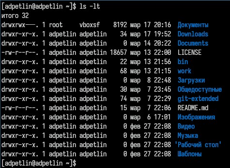{#fig:015 width=100%}

С помощью команды man определите набор опций команды ls, позволяющий отсорти-
ровать по времени последнего изменения выводимый список содержимого каталога
с развёрнутым описанием файлов. Такой опцией служит -t.

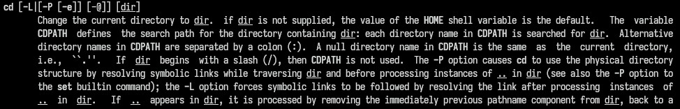{#fig:016 width=100%}

Позволяет перемещаться по каталогам.

{#fig:017 width=100%}

Выводит полное имя директории, в которой вы находитесь

{#fig:018 width=100%}

Позволяет создовать директории, если они еще не существуют.

{#fig:019 width=100%}

Позволяет удалить директории, если они пустые.

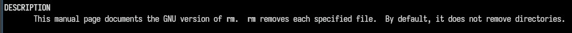{#fig:020 width=100%}

Позволяет удалить конкретный файл. По умолчанию не удаляет директории.

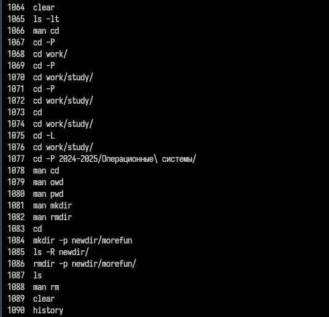{#fig:021 width=100%}

Выполняем команду history, оно отображает историю вводов команд, которые мы вводили.

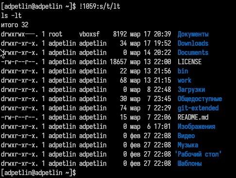{#fig:022 width=100%}

Производим модификацию команды под номером 1059 (ls -t), заменяя в ней t на lt, таким образом получаем вывод команды ls -lt.

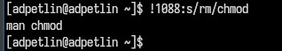{#fig:023 width=100%}

Производим модификацию команды под номером 1088 (man rm), заменяя в ней rm на chmod, таким образом получаем вывод команды man chmod. (инструкция для команды chmod)

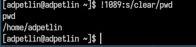{#fig:024 width=100%}

Производим модификацию команды под номером 1089 (clear), заменяя в ней всю команду clear на pwd, таким образом получаем вывод команды pwd.

# Выводы

Мы приобрели практические навыки взаимодействия с системой посредством командной строки.

# Список литературы{.unnumbered}

::: {.refs}
1. Dash, P. Getting Started with Oracle VM VirtualBox / P. Dash. – Packt Publishing Ltd, 2013. – 86 сс.
2. Colvin, H. VirtualBox: An Ultimate Guide Book on Virtualization with VirtualBox. VirtualBox / H. Colvin. – CreateSpace Independent Publishing Platform, 2015. – 70 сс.
3. Vugt, S. van. Red Hat RHCSA/RHCE 7 cert guide : Red Hat Enterprise Linux 7 (EX200 and EX300) : Certification Guide. Red Hat RHCSA/RHCE 7 cert guide / S. van Vugt. – Pearson IT Certification, 2016. – 1008 сс.
4. Робачевский, А. Операционная система UNIX / А. Робачевский, С. Немнюгин, О. Стесик. – 2-е изд. – Санкт-Петербург : БХВ-Петербург, 2010. – 656 сс.
5. Немет, Э. Unix и Linux: руководство системного администратора. Unix и Linux / Э. Немет, Г. Снайдер, Т.Р. Хейн, Б. Уэйли. – 4-е изд. – Вильямс, 2014. – 1312 сс.
6. Колисниченко, Д.Н. Самоучитель системного администратора Linux : Системный администратор / Д.Н. Колисниченко. – Санкт-Петербург : БХВ-Петербург, 2011. – 544 сс.
7. Robbins, A. Bash Pocket Reference / A. Robbins. – O’Reilly Media, 2016. – 156 сс.
:::
