---
## Front matter
lang: ru-RU
title: Лабораторная работа №7
author:
  - Петлин А. Д.
institute:
  - Российский университет дружбы народов, Москва, Россия
date: 29 марта 2025

## i18n babel
babel-lang: russian
babel-otherlangs: english

## Formatting pdf
toc: false
toc-title: Содержание
slide_level: 2
aspectratio: 169
section-titles: true
theme: metropolis
header-includes:
 - \metroset{progressbar=frametitle,sectionpage=progressbar,numbering=fraction}
---

# Информация

## Докладчик

:::::::::::::: {.columns align=center}
::: {.column width="70%"}

  * Петлин Артём Дмитриевич
  * студент
  * группа НПИбд-02-24
  * Российский университет дружбы народов
  * [1132246846@pfur.ru](mailto:1132246846@pfur.ru)
  * <https://github.com/hikrim/study_2024-2025_os-intro>

:::
::: {.column width="30%"}

:::
::::::::::::::

# Цель работы

Ознакомление с файловой системой Linux, её структурой, именами и содержанием
каталогов. Приобретение практических навыков по применению команд для работы
с файлами и каталогами, по управлению процессами (и работами), по проверке исполь-
зования диска и обслуживанию файловой системы.

# Задание

1. Выполните все примеры, приведённые в первой части описания лабораторной работы.
2. Выполните следующие действия, зафиксировав в отчёте по лабораторной работе
используемые при этом команды и результаты их выполнения:
   1. Скопируйте файл /usr/include/sys/io.h в домашний каталог и назовите его equipment. Если файла io.h нет, то используйте любой другой файл в каталоге /usr/include/sys/ вместо него.
   2. В домашнем каталоге создайте директорию ~/ski.plases.
   3. Переместите файл equipment в каталог ~/ski.plases.
   4. Переименуйте файл ~/ski.plases/equipment в ~/ski.plases/equiplist.
   5. Создайте в домашнем каталоге файл abc1 и скопируйте его в каталог ~/ski.plases, назовите его equiplist2.
   6. Создайте каталог с именем equipment в каталоге ~/ski.plases.
   7. Переместите файлы ~/ski.plases/equiplist и equiplist2 в каталог ~/ski.plases/equipment.
   8. Создайте и переместите каталог ~/newdir в каталог ~/ski.plases и назовите его plans.
   
## Задание

3. Определите опции команды chmod, необходимые для того, чтобы присвоить перечис- ленным ниже файлам выделенные права доступа, считая, что в начале таких прав нет:
   1. drwxr--r-- ... australia
   2. drwx--x--x ... play
   3. -r-xr--r-- ... my_os
   4. -rw-rw-r-- ... feathers
При необходимости создайте нужные файлы.

## Задание

4. Проделайте приведённые ниже упражнения, записывая в отчёт по лабораторной работе используемые при этом команды:
   1. Просмотрите содержимое файла /etc/password.
   2. Скопируйте файл ~/feathers в файл ~/file.old.
   3. Переместите файл ~/file.old в каталог ~/play.
   4. Скопируйте каталог ~/play в каталог ~/fun.
   5. Переместите каталог ~/fun в каталог ~/play и назовите его games.
   6. Лишите владельца файла ~/feathers права на чтение.
   7. Что произойдёт, если вы попытаетесь просмотреть файл ~/feathers командой cat?
   8. Что произойдёт, если вы попытаетесь скопировать файл ~/feathers?
   9. Дайте владельцу файла ~/feathers право на чтение.
   10. Лишите владельца каталога ~/play права на выполнение.
   11. Перейдите в каталог ~/play. Что произошло?
   12. Дайте владельцу каталога ~/play право на выполнение.
5. Прочитайте man по командам mount, fsck, mkfs, kill и кратко их охарактеризуйте, приведя примеры.

# Теоретическое введение

Для создания текстового файла можно использовать команду touch.  
Формат команды:
       
       1 touch имя-файла

Для просмотра файлов небольшого размера можно использовать команду cat.  
Формат команды:

       1 cat имя-файла

Для просмотра файлов постранично удобнее использовать команду less.  
Формат команды:

       1 less имя-файла
       
## Теоретическое введение
       
Следующие клавиши используются для управления процессом просмотра:  

- Space — переход к следующей странице,
- ENTER — сдвиг вперёд на одну строку,
- b — возврат на предыдущую страницу,
- h — обращение за подсказкой,
- q — выход из режима просмотра файла.

Команда head выводит по умолчанию первые 10 строк файла.  
Формат команды:

       1 head [-n] имя-файла,

где n — количество выводимых строк.  

## Теоретическое введение

Команда tail выводит умолчанию 10 последних строк файла.  
Формат команды:

       1 tail [-n] имя-файла,

где n — количество выводимых строк.

# Выполнение лабораторной работы

## Ход работы

:::::::::::::: {.columns align=center}
::: {.column width="25%"}

Выполняем все примеры, приведённые в первой части описания лабораторной работы.

:::
::: {.column width="25%"}

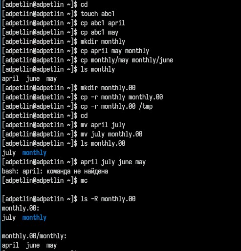

:::
::: {.column width="25%"}

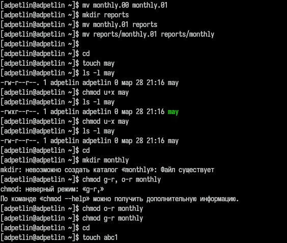

:::
::: {.column width="25%"}

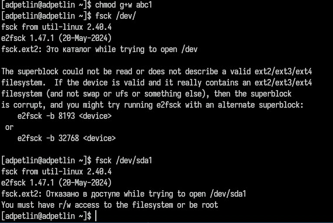

:::
::::::::::::::

## Ход работы

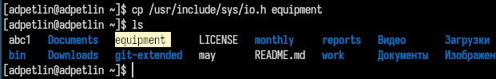

Копируем файл /usr/include/sys/io.h в домашний каталог и назовите его equipment.

## Ход работы

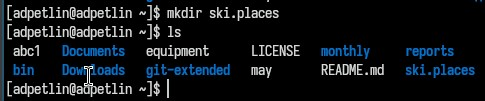

В домашнем каталоге создаём директорию ~/ski.plases.

## Ход работы

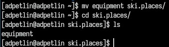

Перемещаем файл equipment в каталог ~/ski.plases.

## Ход работы

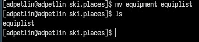

Переименовываем файл ~/ski.plases/equipment в ~/ski.plases/equiplist.

## Ход работы

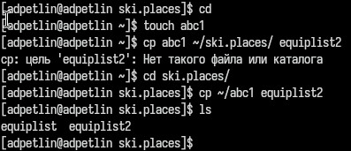

Создаём в домашнем каталоге файл abc1 и копируем его в каталог ~/ski.plases, называем его equiplist2.

## Ход работы

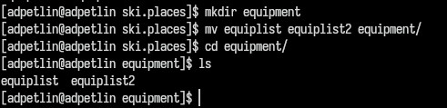

Создаём каталог с именем equipment в каталоге ~/ski.plases. Перемещаем файлы ~/ski.plases/equiplist и equiplist2 в каталог ~/ski.plases/equipment.

## Ход работы

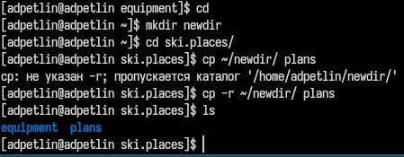

Создаём и перемещаем каталог ~/newdir в каталог ~/ski.plases и называем
его plans.

## Ход работы

:::::::::::::: {.columns align=center}
::: {.column width="50%"}

Определяем опции команды chmod, необходимые для того, чтобы присвоить перечис-
ленным ниже файлам выделенные права доступа, считая, что в начале таких прав
нет.

:::
::: {.column width="50%"}

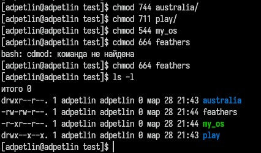

:::
::::::::::::::

## Ход работы

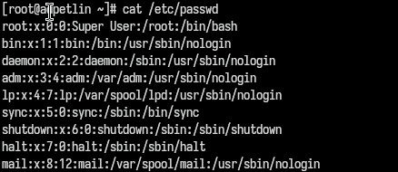

Смотрим содержимое файла /etc/passwd.

## Ход работы

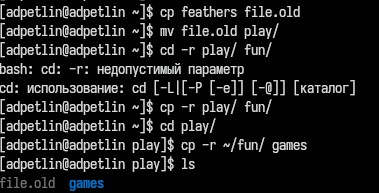

Копируем файл ~/feathers в файл ~/file.old. Перемещаем файл ~/file.old в каталог ~/play. Копируем каталог ~/play в каталог ~/fun. Перемещаем каталог ~/fun в каталог ~/play и называем его games.

## Ход работы

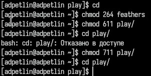

Лишаем владельца файла ~/feathers права на чтение (cat -> отказано в доступе; cp: невозможно открыть 'feathers' для чтения: Отказано в доступе). Даём владельцу файла ~/feathers право на чтение. Лишите владельца каталога ~/play права на выполнение (cd play/ -> отказано в доступе). Дайте владельцу каталога ~/play право на выполнение (cd play выполняется).

## Ход работы

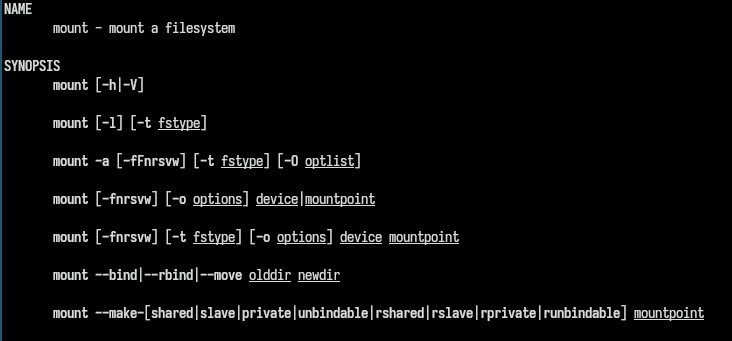

Man по команде mount. Позволет монтировать диски и разделы.

## Ход работы

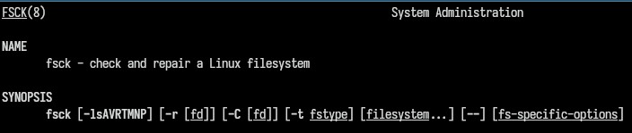

Man по команде fsck. Проверяет файловые систему на дисках и их разделах.

## Ход работы

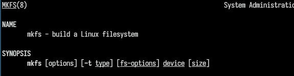

Man по команде mkfs. Позволяет создавать файловые системы на разделах диска.

## Ход работы

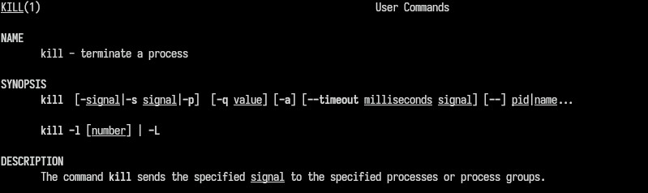

Man по команде kill. Завершает процесс по PID (Process ID), который можно найти с помощью команды ps aux.

# Выводы

Мы ознакомились с файловой системой Linux, её структурой, именами и содержанием
каталогов. Приобрели практические навыки по применению команд для работы
с файлами и каталогами, по управлению процессами (и работами), по проверке использования диска и обслуживанию файловой системы.

# Список литературы{.unnumbered}

::: {.refs}
1. Dash, P. Getting Started with Oracle VM VirtualBox / P. Dash. – Packt Publishing Ltd, 2013. – 86 сс.
2. Colvin, H. VirtualBox: An Ultimate Guide Book on Virtualization with VirtualBox. VirtualBox / H. Colvin. – CreateSpace Independent Publishing Platform, 2015. – 70 сс.
3. Vugt, S. van. Red Hat RHCSA/RHCE 7 cert guide : Red Hat Enterprise Linux 7 (EX200 and EX300) : Certification Guide. Red Hat RHCSA/RHCE 7 cert guide / S. van Vugt. – Pearson IT Certification, 2016. – 1008 сс.
4. Робачевский, А. Операционная система UNIX / А. Робачевский, С. Немнюгин, О. Стесик. – 2-е изд. – Санкт-Петербург : БХВ-Петербург, 2010. – 656 сс.
5. Немет, Э. Unix и Linux: руководство системного администратора. Unix и Linux / Э. Немет, Г. Снайдер, Т.Р. Хейн, Б. Уэйли. – 4-е изд. – Вильямс, 2014. – 1312 сс.
6. Колисниченко, Д.Н. Самоучитель системного администратора Linux : Системный администратор / Д.Н. Колисниченко. – Санкт-Петербург : БХВ-Петербург, 2011. – 544 сс.
7. Robbins, A. Bash Pocket Reference / A. Robbins. – O’Reilly Media, 2016. – 156 сс.
:::
