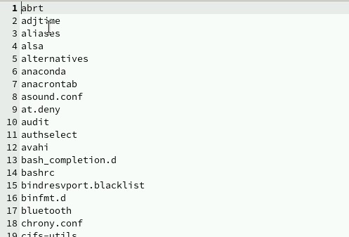

---
## Front matter
lang: ru-RU
title: Лабораторная работа №8
author:
  - Петлин А. Д.
institute:
  - Российский университет дружбы народов, Москва, Россия
date: 5 апреля 2025

## i18n babel
babel-lang: russian
babel-otherlangs: english

## Formatting pdf
toc: false
toc-title: Содержание
slide_level: 2
aspectratio: 169
section-titles: true
theme: metropolis
header-includes:
 - \metroset{progressbar=frametitle,sectionpage=progressbar,numbering=fraction}
---

# Информация

## Докладчик

:::::::::::::: {.columns align=center}
::: {.column width="70%"}

  * Петлин Артём Дмитриевич
  * студент
  * группа НПИбд-02-24
  * Российский университет дружбы народов
  * [1132246846@pfur.ru](mailto:1132246846@pfur.ru)
  * <https://github.com/hikrim/study_2024-2025_os-intro>

:::
::: {.column width="30%"}

:::
::::::::::::::

# Цель работы

Ознакомление с инструментами поиска файлов и фильтрации текстовых данных.
Приобретение практических навыков: по управлению процессами (и заданиями), по
проверке использования диска и обслуживанию файловых систем.

# Задание

1. Осуществите вход в систему, используя соответствующее имя пользователя.
2. Запишите в файл file.txt названия файлов, содержащихся в каталоге /etc. Допи-шите в этот же файл названия файлов, содержащихся в вашем домашнем каталоге.
3. Выведите имена всех файлов из file.txt, имеющих расширение .conf, после чегоз апишите их в новый текстовой файл conf.txt.
4. Определите, какие файлы в вашем домашнем каталоге имеют имена, начинавшиеся с символа c? Предложите несколько вариантов, как это сделать.
5. Выведите на экран (по странично) имена файлов из каталога /etc, начинающиесяс символа h.

## Задание

6. Запустите в фоновом режиме процесс, который будет записывать в файл ~/logfile файлы, имена которых начинаются с log.
7. Удалите файл ~/logfile.
8. Запустите из консоли в фоновом режиме редактор gedit.
9. Определите идентификатор процесса gedit, используя команду ps, конвейер и фильтр grep. Как ещё можно определить идентификатор процесса?
10. Прочтите справку (man) команды kill, после чего используйте её для завершения процесса gedit.
11. Выполните команды df и du, предварительно получив более подробную информацию об этих командах, с помощью команды man.
12. Воспользовавшись справкой команды find, выведите имена всех директорий, имеющихся в вашем домашнем каталоге.

# Теоретическое введение

В системе по умолчанию открыто три специальных потока:  

- stdin — стандартный поток ввода (по умолчанию: клавиатура), файловый дескриптор 0;
- stdout — стандартный поток вывода (по умолчанию: консоль), файловый дескриптор 1;
- stderr — стандартный поток вывод сообщений об ошибках (по умолчанию: консоль), файловый дескриптор 2.

Большинство используемых в консоли команд и программ записывают результаты
своей работы в стандартный поток вывода stdout. Например, команда ls выводит в стан-
дартный поток вывода (консоль) список файлов в текущей директории. Потоки вывода
и ввода можно перенаправлять на другие файлы или устройства. Проще всего это делается
с помощью символов >, >>, <, <<. 

# Выполнение лабораторной работы

## Ход работы

:::::::::::::: {.columns align=center}
::: {.column width="30%"}

Производим запись в файл file.txt названий файлов, содержащихся в каталоге /etc. Затем дописываем в этот же файл названия файлов из домашнего каталога.

:::
::: {.column width="35%"}

:::
::: {.column width="35%"}

:::
::::::::::::::

## Ход работы

:::::::::::::: {.columns align=center}
::: {.column width="10%"}

Выводим имена всех файлов из file.txt, имеющих расширение .conf, и записываем их в новый текстовый файл conf.txt.

:::
::: {.column width="30%"}

:::
::: {.column width="30%"}

:::
::: {.column width="30%"}

:::
::::::::::::::

## Ход работы

:::::::::::::: {.columns align=center}
::: {.column width="20%"}

Определяем, какие файлы в домашнем каталоге имеют имена, начинающиеся с символа c. Рассматриваем несколько вариантов выполнения этого действия.

:::
::: {.column width="40%"}

:::
::: {.column width="40%"}

:::
::::::::::::::

## Ход работы

:::::::::::::: {.columns align=center}
::: {.column width="20%"}

Выводим на экран (постранично) имена файлов из каталога /etc, начинающиеся с символа h.

:::
::: {.column width="40%"}

:::
::: {.column width="40%"}

:::
::::::::::::::

## Ход работы

Запускаем в фоновом режиме процесс, который записывает в файл ~/logfile имена файлов, начинающихся с log.

## Ход работы

Удаляем файл ~/logfile.

## Ход работы

Запускаем из консоли в фоновом режиме редактор gedit.

## Ход работы

Определяем идентификатор процесса gedit, используя команду ps, конвейер и фильтр grep. Также рассматриваем альтернативные способы определения идентификатора процесса.

## Ход работы

Изучаем справку (man) команды kill, после чего применяем её для завершения процесса gedit.

## Ход работы

:::::::::::::: {.columns align=center}
::: {.column width="40%"}

Выполняем команды df и du, предварительно ознакомившись с их подробным описанием через man.

:::
::: {.column width="60%"}

:::
::::::::::::::

## Ход работы

Используя справку команды find, выводим имена всех директорий в домашнем каталоге.

# Выводы

Мы ознакомились с инструментами поиска файлов и фильтрации текстовых данных.
Приобрели практические навыки: по управлению процессами (и заданиями), по
проверке использования диска и обслуживанию файловых систем.

# Список литературы{.unnumbered}

::: {.refs}
1. Dash, P. Getting Started with Oracle VM VirtualBox / P. Dash. – Packt Publishing Ltd, 2013. – 86 сс.
2. Colvin, H. VirtualBox: An Ultimate Guide Book on Virtualization with VirtualBox. VirtualBox / H. Colvin. – CreateSpace Independent Publishing Platform, 2015. – 70 сс.
3. Vugt, S. van. Red Hat RHCSA/RHCE 7 cert guide : Red Hat Enterprise Linux 7 (EX200 and EX300) : Certification Guide. Red Hat RHCSA/RHCE 7 cert guide / S. van Vugt. – Pearson IT Certification, 2016. – 1008 сс.
4. Робачевский, А. Операционная система UNIX / А. Робачевский, С. Немнюгин, О. Стесик. – 2-е изд. – Санкт-Петербург : БХВ-Петербург, 2010. – 656 сс.
5. Немет, Э. Unix и Linux: руководство системного администратора. Unix и Linux / Э. Немет, Г. Снайдер, Т.Р. Хейн, Б. Уэйли. – 4-е изд. – Вильямс, 2014. – 1312 сс.
6. Колисниченко, Д.Н. Самоучитель системного администратора Linux : Системный администратор / Д.Н. Колисниченко. – Санкт-Петербург : БХВ-Петербург, 2011. – 544 сс.
7. Robbins, A. Bash Pocket Reference / A. Robbins. – O’Reilly Media, 2016. – 156 сс.
:::
