---
## Front matter
lang: ru-RU
title: Лабораторная работа №9
author:
  - Петлин А. Д.
institute:
  - Российский университет дружбы народов, Москва, Россия
date: 6 апреля 2025

## i18n babel
babel-lang: russian
babel-otherlangs: english

## Formatting pdf
toc: false
toc-title: Содержание
slide_level: 2
aspectratio: 169
section-titles: true
theme: metropolis
header-includes:
 - \metroset{progressbar=frametitle,sectionpage=progressbar,numbering=fraction}
---

# Информация

## Докладчик

:::::::::::::: {.columns align=center}
::: {.column width="70%"}

  * Петлин Артём Дмитриевич
  * студент
  * группа НПИбд-02-24
  * Российский университет дружбы народов
  * [1132246846@pfur.ru](mailto:1132246846@pfur.ru)
  * <https://github.com/hikrim/study_2024-2025_os-intro>

:::
::: {.column width="30%"}

:::
::::::::::::::

# Цель работы

Освоение основных возможностей командной оболочки Midnight Commander. Приобретение навыков практической работы по просмотру каталогов и файлов; манипуляций с ними.

# Задание

1. Создайте текстовой файл text.txt.
2. Откройте этот файл с помощью встроенного в mc редактора.
3. Вставьте в открытый файл небольшой фрагмент текста, скопированный из любого
другого файла или Интернета.
4. Проделайте с текстом следующие манипуляции, используя горячие клавиши:
  1. Удалите строку текста.
  2. Выделите фрагмент текста и скопируйте его на новую строку.
  3. Выделите фрагмент текста и перенесите его на новую строку.
  4. Сохраните файл.
  5. Отмените последнее действие.
  6. Перейдите в конец файла (нажав комбинацию клавиш) и напишите некоторый текст.
  7. Перейдите в начало файла (нажав комбинацию клавиш) и напишите некоторый текст.
  8. Сохраните и закройте файл.
5. Откройте файл с исходным текстом на некотором языке программирования (напри-
мер C или Java)
6. Используя меню редактора, включите подсветку синтаксиса, если она не включена,
или выключите, если она включена.

# Теоретическое введение

Командная оболочка — интерфейс взаимодействия пользователя с операционной системой и программным обеспечением посредством команд.  

Midnight Commander (или mc) — псевдографическая командная оболочка для UNIX/Linux
систем. Для запуска mc необходимо в командной строке набрать mc и нажать Enter .
Рабочее пространство mc имеет две панели, отображающие по умолчанию списки
файлов двух каталогов.

# Выполнение лабораторной работы

## Ход работы

Изучаем информацию о mc, вызывая в командной строке man mc.

## Ход работы

:::::::::::::: {.columns align=center}
::: {.column width="30%"}

Запускаем mc из командной строки, изучаем его структуру и меню.

:::
::: {.column width="70%"}

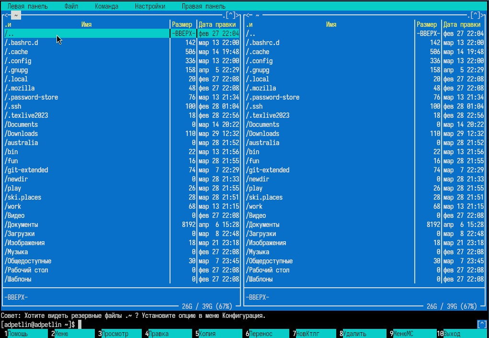

:::
::::::::::::::

## Ход работы

:::::::::::::: {.columns align=center}
::: {.column width="10%"}

Выполняем несколько операций в mc, используя управляющие клавиши.

:::
::: {.column width="18%"}

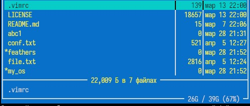

:::
::: {.column width="18%"}

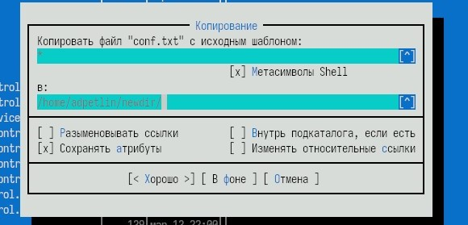

:::
::: {.column width="18%"}

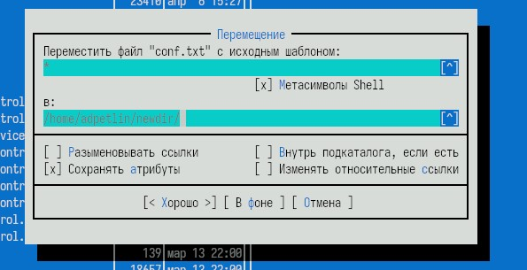

:::
::: {.column width="18%"}

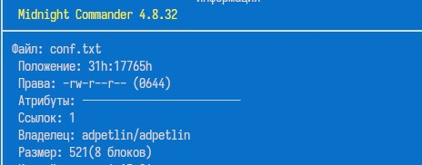

:::
::: {.column width="18%"}

:::
::::::::::::::

## Ход работы

:::::::::::::: {.columns align=center}
::: {.column width="50%"}

Выполняем основные команды меню левой (или правой) панели, оцениваем степень подробности вывода информации.

:::
::: {.column width="50%"}

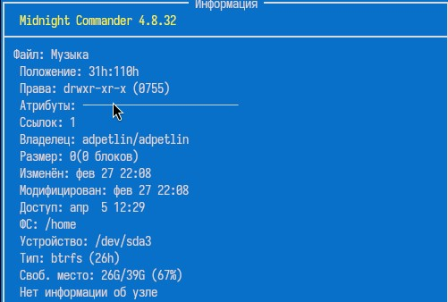

:::
::::::::::::::

## Ход работы

:::::::::::::: {.columns align=center}
::: {.column width="10%"}

Используя подменю Файл, выполняем.

:::
::: {.column width="30%"}

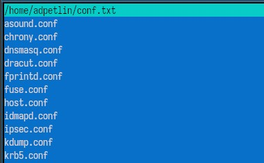

:::
::: {.column width="30%"}

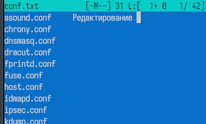

:::
::: {.column width="30%"}

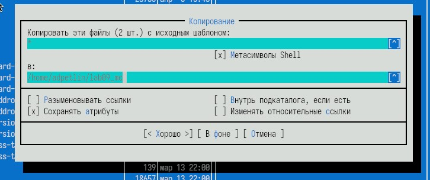

:::
::::::::::::::

## Ход работы

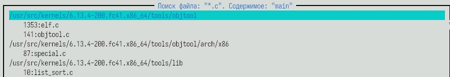

С помощью подменю Команда выполняем поиск в файловой системе файлов с заданными условиями.

## Ход работы

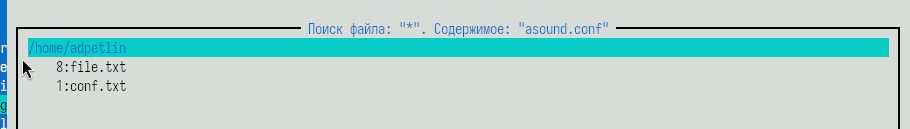

Выбираем и повторяем одну из предыдущих команд.

## Ход работы

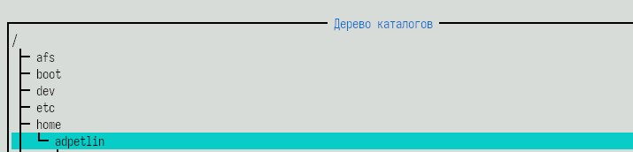

Переходим в домашний каталог. Анализируем файл меню и файл расширений.

## Ход работы

:::::::::::::: {.columns align=center}
::: {.column width="30%"}

Вызываем подменю Настройки, осваиваем операции, определяющие структуру экрана mc.

:::
::: {.column width="70%"}

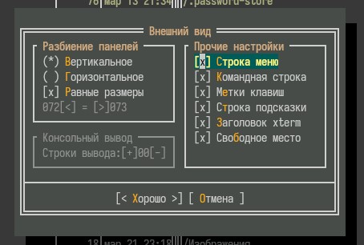

:::
::::::::::::::

## Ход работы

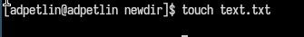

Создаем текстовый файл text.txt.

## Ход работы

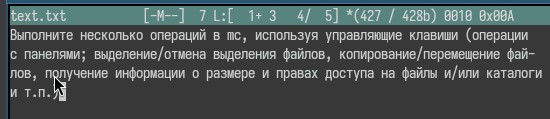

Вставляем в файл небольшой фрагмент текста

## Ход работы

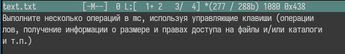

Удаляем строку текста.

## Ход работы

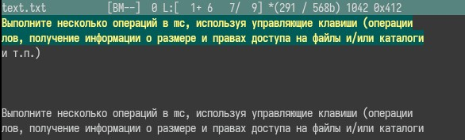

Выделяем фрагмент текста и копируем его на новую строку.

## Ход работы

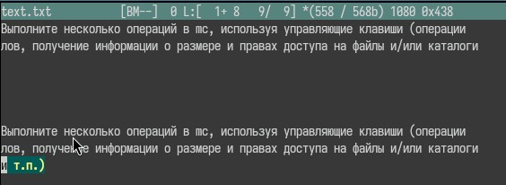

Выделяем фрагмент текста и переносим его на новую строку.

## Ход работы

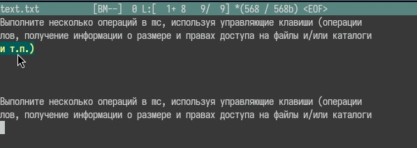

Сохраняем файл. Отменяем последнее действие.

## Ход работы

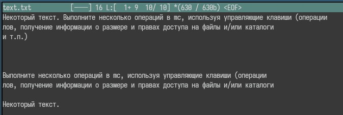

Переходим в конец файла и добавляем текст. Переходим в начало файла и добавляем текст. Сохраняем и закрываем файл.

## Ход работы

:::::::::::::: {.columns align=center}
::: {.column width="20%"}

Открываем файл с исходным кодом на языке программирования.
Используя меню редактора, включаем или выключаем подсветку синтаксиса.

:::
::: {.column width="40%"}

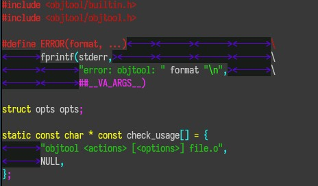

:::
::: {.column width="40%"}

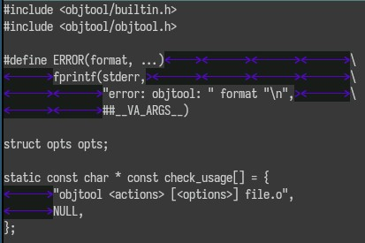

:::
::::::::::::::

# Выводы

Мы освоили основные возможности командной оболочки Midnight Commander. Приобрели навыки практической работы по просмотру каталогов и файлов; манипуляций с ними.

# Список литературы{.unnumbered}

::: {.refs}
1. Dash, P. Getting Started with Oracle VM VirtualBox / P. Dash. – Packt Publishing Ltd, 2013. – 86 сс.
2. Colvin, H. VirtualBox: An Ultimate Guide Book on Virtualization with VirtualBox. VirtualBox / H. Colvin. – CreateSpace Independent Publishing Platform, 2015. – 70 сс.
3. Vugt, S. van. Red Hat RHCSA/RHCE 7 cert guide : Red Hat Enterprise Linux 7 (EX200 and EX300) : Certification Guide. Red Hat RHCSA/RHCE 7 cert guide / S. van Vugt. – Pearson IT Certification, 2016. – 1008 сс.
4. Робачевский, А. Операционная система UNIX / А. Робачевский, С. Немнюгин, О. Стесик. – 2-е изд. – Санкт-Петербург : БХВ-Петербург, 2010. – 656 сс.
5. Немет, Э. Unix и Linux: руководство системного администратора. Unix и Linux / Э. Немет, Г. Снайдер, Т.Р. Хейн, Б. Уэйли. – 4-е изд. – Вильямс, 2014. – 1312 сс.
6. Колисниченко, Д.Н. Самоучитель системного администратора Linux : Системный администратор / Д.Н. Колисниченко. – Санкт-Петербург : БХВ-Петербург, 2011. – 544 сс.
7. Robbins, A. Bash Pocket Reference / A. Robbins. – O’Reilly Media, 2016. – 156 сс.
:::
