---
## Front matter
title: "Отчёт по лабораторной работе №9"
author: "Петлин Артём Дмитриевич"

## Generic otions
lang: ru-RU
toc-title: "Содержание"

## Bibliography
bibliography: bib/cite.bib
csl: pandoc/csl/gost-r-7-0-5-2008-numeric.csl

## Pdf output format
toc: true # Table of contents
toc-depth: 2
lof: true # List of figures
lot: true # List of tables
fontsize: 12pt
linestretch: 1.5
papersize: a4
documentclass: scrreprt
## I18n polyglossia
polyglossia-lang:
  name: russian
  options:
	- spelling=modern
	- babelshorthands=true
polyglossia-otherlangs:
  name: english
## I18n babel
babel-lang: russian
babel-otherlangs: english
## Fonts
mainfont: IBM Plex Serif
romanfont: IBM Plex Serif
sansfont: IBM Plex Sans
monofont: IBM Plex Mono
mathfont: STIX Two Math
mainfontoptions: Ligatures=Common,Ligatures=TeX,Scale=0.94
romanfontoptions: Ligatures=Common,Ligatures=TeX,Scale=0.94
sansfontoptions: Ligatures=Common,Ligatures=TeX,Scale=MatchLowercase,Scale=0.94
monofontoptions: Scale=MatchLowercase,Scale=0.94,FakeStretch=0.9
mathfontoptions:
## Biblatex
biblatex: true
biblio-style: "gost-numeric"
biblatexoptions:
  - parentracker=true
  - backend=biber
  - hyperref=auto
  - language=auto
  - autolang=other*
  - citestyle=gost-numeric
## Pandoc-crossref LaTeX customization
figureTitle: "Рис."
tableTitle: "Таблица"
listingTitle: "Листинг"
lofTitle: "Список иллюстраций"
lotTitle: "Список таблиц"
lolTitle: "Листинги"
## Misc options
indent: true
header-includes:
  - \usepackage{indentfirst}
  - \usepackage{float} # keep figures where there are in the text
  - \floatplacement{figure}{H} # keep figures where there are in the text
---

# Цель работы

Освоение основных возможностей командной оболочки Midnight Commander. Приобретение навыков практической работы по просмотру каталогов и файлов; манипуляций с ними.

# Задание

1. Создайте текстовой файл text.txt.
2. Откройте этот файл с помощью встроенного в mc редактора.
3. Вставьте в открытый файл небольшой фрагмент текста, скопированный из любого
другого файла или Интернета.
4. Проделайте с текстом следующие манипуляции, используя горячие клавиши:
  1. Удалите строку текста.
  2. Выделите фрагмент текста и скопируйте его на новую строку.
  3. Выделите фрагмент текста и перенесите его на новую строку.
  4. Сохраните файл.
  5. Отмените последнее действие.
  6. Перейдите в конец файла (нажав комбинацию клавиш) и напишите некоторый текст.
  7. Перейдите в начало файла (нажав комбинацию клавиш) и напишите некоторый текст.
  8. Сохраните и закройте файл.
5. Откройте файл с исходным текстом на некотором языке программирования (напри-
мер C или Java)
6. Используя меню редактора, включите подсветку синтаксиса, если она не включена,
или выключите, если она включена.

# Теоретическое введение

Командная оболочка — интерфейс взаимодействия пользователя с операционной системой и программным обеспечением посредством команд.  

Midnight Commander (или mc) — псевдографическая командная оболочка для UNIX/Linux
систем. Для запуска mc необходимо в командной строке набрать mc и нажать Enter .
Рабочее пространство mc имеет две панели, отображающие по умолчанию списки
файлов двух каталогов.

# Выполнение лабораторной работы

{#fig:001 width=100%}

Изучаем информацию о mc, вызывая в командной строке man mc.

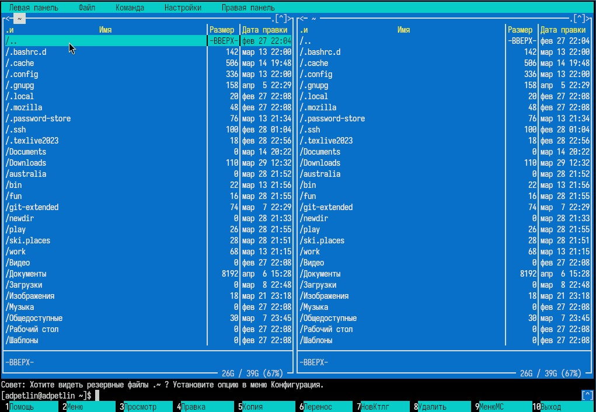{#fig:002 width=100%}

Запускаем mc из командной строки, изучаем его структуру и меню.

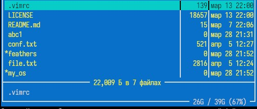{#fig:003 width=100%}

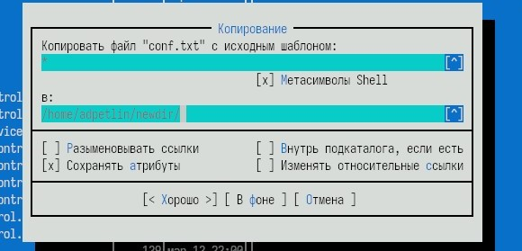{#fig:004 width=100%}

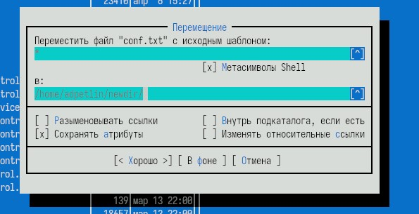{#fig:005 width=100%}

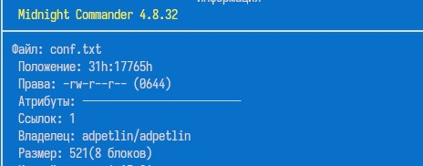{#fig:006 width=100%}

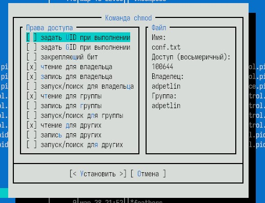{#fig:007 width=100%}

Выполняем несколько операций в mc, используя управляющие клавиши.

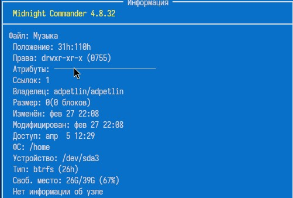{#fig:008 width=100%}

Выполняем основные команды меню левой (или правой) панели, оцениваем степень подробности вывода информации.

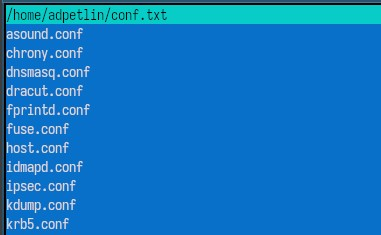{#fig:009 width=100%}

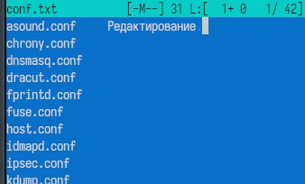{#fig:010 width=100%}

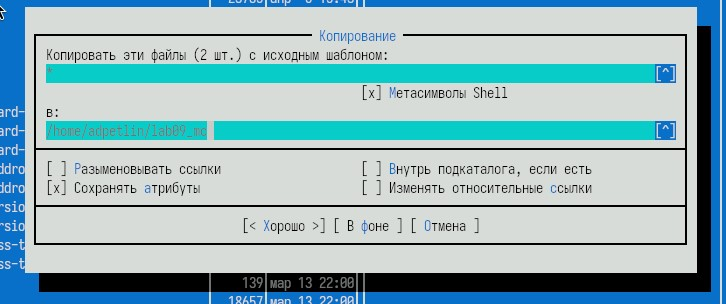{#fig:011 width=100%}

Используя подменю Файл, выполняем.

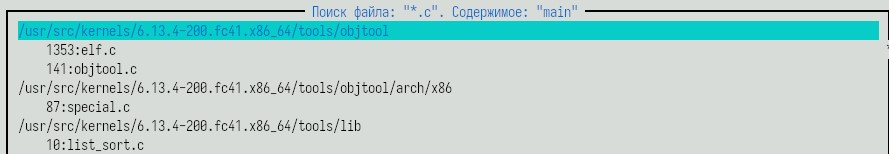{#fig:012 width=100%}

С помощью подменю Команда выполняем поиск в файловой системе файлов с заданными условиями.

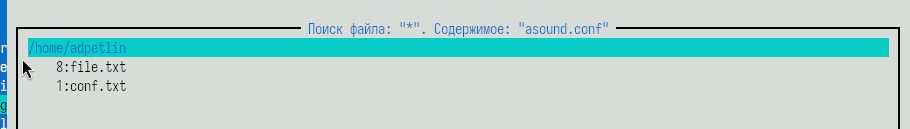{#fig:013 width=100%}

Выбираем и повторяем одну из предыдущих команд.

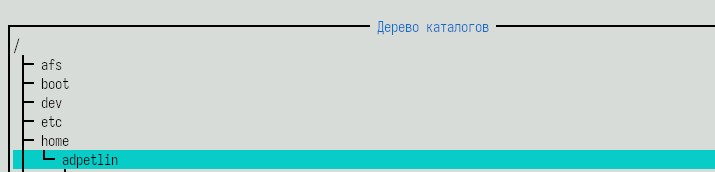{#fig:014 width=100%}

Переходим в домашний каталог. Анализируем файл меню и файл расширений.

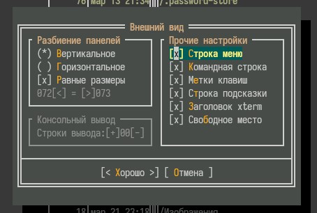{#fig:015 width=100%}

Вызываем подменю Настройки, осваиваем операции, определяющие структуру экрана mc.

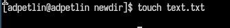{#fig:016 width=100%}

Создаем текстовый файл text.txt.

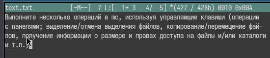{#fig:017 width=100%}

Вставляем в файл небольшой фрагмент текста

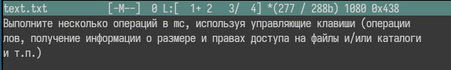{#fig:018 width=100%}

Удаляем строку текста.

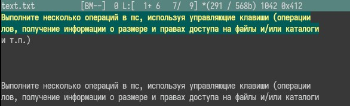{#fig:019 width=100%}

Выделяем фрагмент текста и копируем его на новую строку.

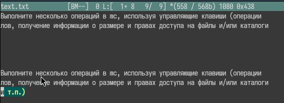{#fig:020 width=100%}

Выделяем фрагмент текста и переносим его на новую строку.

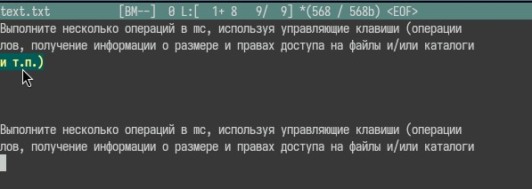{#fig:021 width=100%}

Сохраняем файл. Отменяем последнее действие.

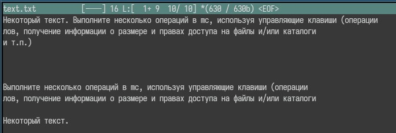{#fig:022 width=100%}

Переходим в конец файла и добавляем текст. Переходим в начало файла и добавляем текст. Сохраняем и закрываем файл.

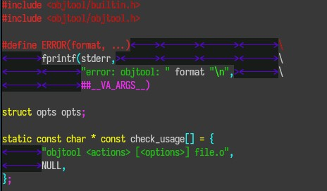{#fig:023 width=100%}

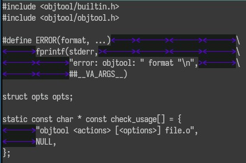{#fig:024 width=100%}

Открываем файл с исходным кодом на языке программирования.
Используя меню редактора, включаем или выключаем подсветку синтаксиса.

# Выводы

Мы освоили основные возможности командной оболочки Midnight Commander. Приобрели навыки практической работы по просмотру каталогов и файлов; манипуляций с ними.

# Список литературы{.unnumbered}

::: {.refs}
1. Dash, P. Getting Started with Oracle VM VirtualBox / P. Dash. – Packt Publishing Ltd, 2013. – 86 сс.
2. Colvin, H. VirtualBox: An Ultimate Guide Book on Virtualization with VirtualBox. VirtualBox / H. Colvin. – CreateSpace Independent Publishing Platform, 2015. – 70 сс.
3. Vugt, S. van. Red Hat RHCSA/RHCE 7 cert guide : Red Hat Enterprise Linux 7 (EX200 and EX300) : Certification Guide. Red Hat RHCSA/RHCE 7 cert guide / S. van Vugt. – Pearson IT Certification, 2016. – 1008 сс.
4. Робачевский, А. Операционная система UNIX / А. Робачевский, С. Немнюгин, О. Стесик. – 2-е изд. – Санкт-Петербург : БХВ-Петербург, 2010. – 656 сс.
5. Немет, Э. Unix и Linux: руководство системного администратора. Unix и Linux / Э. Немет, Г. Снайдер, Т.Р. Хейн, Б. Уэйли. – 4-е изд. – Вильямс, 2014. – 1312 сс.
6. Колисниченко, Д.Н. Самоучитель системного администратора Linux : Системный администратор / Д.Н. Колисниченко. – Санкт-Петербург : БХВ-Петербург, 2011. – 544 сс.
7. Robbins, A. Bash Pocket Reference / A. Robbins. – O’Reilly Media, 2016. – 156 сс.
:::
