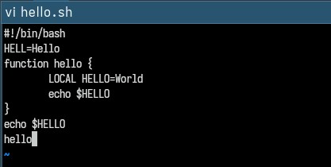
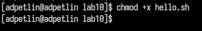
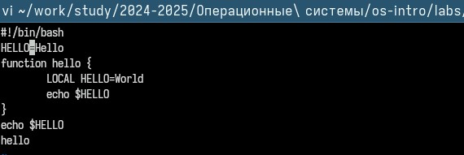
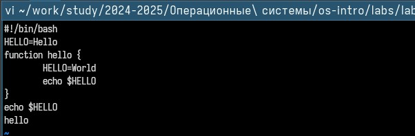
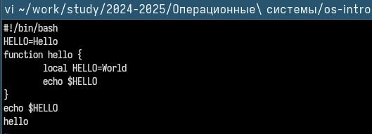
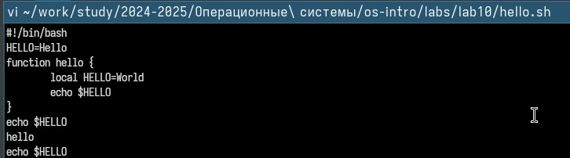
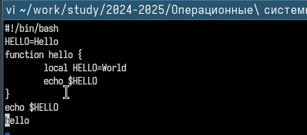
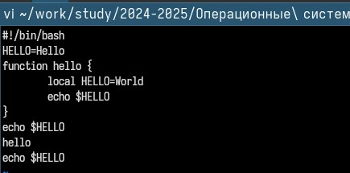

---
## Front matter
lang: ru-RU
title: Лабораторная работа №10
author:
  - Петлин А. Д.
institute:
  - Российский университет дружбы народов, Москва, Россия
date: 14 апреля 2025

## i18n babel
babel-lang: russian
babel-otherlangs: english

## Formatting pdf
toc: false
toc-title: Содержание
slide_level: 2
aspectratio: 169
section-titles: true
theme: metropolis
header-includes:
 - \metroset{progressbar=frametitle,sectionpage=progressbar,numbering=fraction}
---

# Информация

## Докладчик

:::::::::::::: {.columns align=center}
::: {.column width="70%"}

  * Петлин Артём Дмитриевич
  * студент
  * группа НПИбд-02-24
  * Российский университет дружбы народов
  * [1132246846@pfur.ru](mailto:1132246846@pfur.ru)
  * <https://github.com/hikrim/study_2024-2025_os-intro>

:::
::: {.column width="30%"}

:::
::::::::::::::

# Цель работы

Познакомиться с операционной системой Linux. Получить практические навыки работы с редактором vi, установленным по умолчанию практически во всех дистрибутивах.

# Задание

1. Создание нового файла с использованием vi
2. Редактирование существующего файла

# Теоретическое введение

В большинстве дистрибутивов Linux в качестве текстового редактора по умолчанию
устанавливается интерактивный экранный редактор vi (Visual display editor).
Редактор vi имеет три режима работы:  

- командный режим — предназначен для ввода команд редактирования и навигации по редактируемому файлу;
- режим вставки — предназначен для ввода содержания редактируемого файла;
- режим последней (или командной) строки — используется для записи изменений в файл и выхода из редактора.

## Теоретическое введение

Для вызова редактора vi необходимо указать команду vi и имя редактируемого файла:  
       
       vi <имя_файла>

При этом в случае отсутствия файла с указанным именем будет создан такой файл.
Переход в командный режим осуществляется нажатием клавиши Esc . Для выхода из
редактора vi необходимо перейти в режим последней строки: находясь в командном
режиме, нажать Shift-; (по сути символ : — двоеточие), затем:  

- набрать символы wq, если перед выходом из редактора требуется записать изменения в файл;
- набрать символ q (или q!), если требуется выйти из редактора без сохранения.

# Выполнение лабораторной работы

## Ход работы

Перейдем в нужный каталог. Вызовем редактор vi и создадим файл hello.sh. Нажмем клавишу i и введем данный текст. Нажмем клавишу Esc для перехода в командный режим.

## Ход работы

Нажмем : для перехода в режим последней строки. Введем wq и нажмем Enter, чтобы сохранить изменения и выйти из редактора. Сделаем файл исполняемым.

## Ход работы

Откроем файл hello.sh в редакторе vi. Установим курсор в конец слова HELL во второй строке. Перейдем в режим вставки (нажав i), заменим HELL на HELLO и нажмем Esc.

## Ход работы

Переместим курсор на четвертую строку и удалим слово LOCAL (командой dw).

## Ход работы

Перейдем в режим вставки (i), введем local и нажмем Esc.

## Ход работы

Установим курсор на последней строке файла. Вставим после нее строку с текстом echo $HELLO (командой o). Нажмем Esc для возврата в командный режим.

## Ход работы

Удалим последнюю строку (командой dd).

## Ход работы

Отменим последнее действие, нажав u. После чего перейдем в режим последней строки (:), введем wq и нажмем Enter, чтобы сохранить изменения и выйти.

# Выводы

Мы познакомились с операционной системой Linux. Получили практические навыки работы с редактором vi, установленным по умолчанию практически во всех дистрибутивах.

# Список литературы{.unnumbered}

::: {.refs}
1. Dash, P. Getting Started with Oracle VM VirtualBox / P. Dash. – Packt Publishing Ltd, 2013. – 86 сс.
2. Colvin, H. VirtualBox: An Ultimate Guide Book on Virtualization with VirtualBox. VirtualBox / H. Colvin. – CreateSpace Independent Publishing Platform, 2015. – 70 сс.
3. Vugt, S. van. Red Hat RHCSA/RHCE 7 cert guide : Red Hat Enterprise Linux 7 (EX200 and EX300) : Certification Guide. Red Hat RHCSA/RHCE 7 cert guide / S. van Vugt. – Pearson IT Certification, 2016. – 1008 сс.
4. Робачевский, А. Операционная система UNIX / А. Робачевский, С. Немнюгин, О. Стесик. – 2-е изд. – Санкт-Петербург : БХВ-Петербург, 2010. – 656 сс.
5. Немет, Э. Unix и Linux: руководство системного администратора. Unix и Linux / Э. Немет, Г. Снайдер, Т.Р. Хейн, Б. Уэйли. – 4-е изд. – Вильямс, 2014. – 1312 сс.
6. Колисниченко, Д.Н. Самоучитель системного администратора Linux : Системный администратор / Д.Н. Колисниченко. – Санкт-Петербург : БХВ-Петербург, 2011. – 544 сс.
7. Robbins, A. Bash Pocket Reference / A. Robbins. – O’Reilly Media, 2016. – 156 сс.
:::
