---
## Front matter
lang: ru-RU
title: Лабораторная работа №11
author:
  - Петлин А. Д.
institute:
  - Российский университет дружбы народов, Москва, Россия
date: 19 апреля 2025

## i18n babel
babel-lang: russian
babel-otherlangs: english

## Formatting pdf
toc: false
toc-title: Содержание
slide_level: 2
aspectratio: 169
section-titles: true
theme: metropolis
header-includes:
 - \metroset{progressbar=frametitle,sectionpage=progressbar,numbering=fraction}
---

# Информация

## Докладчик

:::::::::::::: {.columns align=center}
::: {.column width="70%"}

  * Петлин Артём Дмитриевич
  * студент
  * группа НПИбд-02-24
  * Российский университет дружбы народов
  * [1132246846@pfur.ru](mailto:1132246846@pfur.ru)
  * <https://github.com/hikrim/study_2024-2025_os-intro>

:::
::: {.column width="30%"}

:::
::::::::::::::

# Цель работы

Познакомиться с операционной системой Linux. Получить практические навыки рабо-
ты с редактором Emacs.

# Задание

1. Ознакомиться с теоретическим материалом.
2. Ознакомиться с редактором emacs.
3. Выполнить упражнения.
4. Ответить на контрольные вопросы.

# Выполнение лабораторной работы

## Ход работы

:::::::::::::: {.columns align=center}
::: {.column width="50%"}

Открываем emacs.

:::
::: {.column width="50%"}

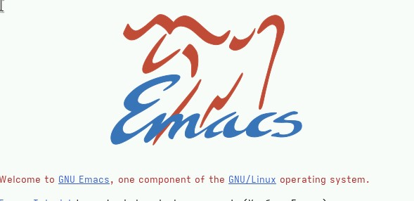

:::
::::::::::::::

## Ход работы

:::::::::::::: {.columns align=center}
::: {.column width="50%"}

Создаём файл lab07.sh с помощью комбинации C-x C-f. Набираем данный в задании текст. Сохраняем файл с помощью комбинации C-x C-s.

:::
::: {.column width="50%"}

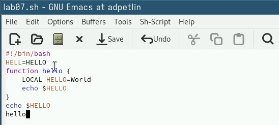

:::
::::::::::::::

## Ход работы

:::::::::::::: {.columns align=center}
::: {.column width="50%"}

Вырезаем одной командой целую строку (C-k). Вставляем эту строку в конец файла (C-y).

:::
::: {.column width="50%"}

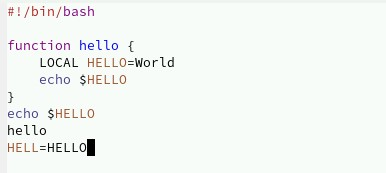

:::
::::::::::::::

## Ход работы

:::::::::::::: {.columns align=center}
::: {.column width="50%"}

Выделяем область текста (C-space). Копируем область в буфер обмена (M-w). Вставляем область в конец файла.

:::
::: {.column width="50%"}

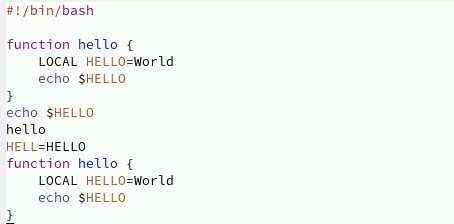

:::
::::::::::::::

## Ход работы

:::::::::::::: {.columns align=center}
::: {.column width="50%"}

Вновь выделяем эту область и вырезаем её (C-w).

:::
::: {.column width="50%"}

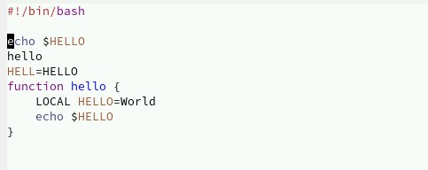

:::
::::::::::::::

## Ход работы

:::::::::::::: {.columns align=center}
::: {.column width="50%"}

Отменяем последнее действие (C-/).

:::
::: {.column width="50%"}

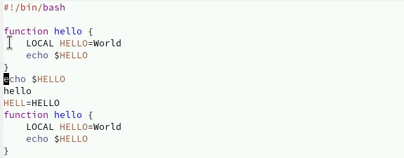

:::
::::::::::::::

## Ход работы

:::::::::::::: {.columns align=center}
::: {.column width="50%"}

Выводим список активных буферов на экран (C-x C-b).

:::
::: {.column width="50%"}

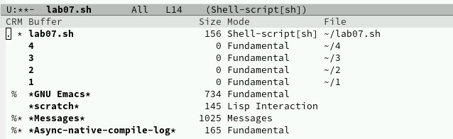

:::
::::::::::::::

## Ход работы

:::::::::::::: {.columns align=center}
::: {.column width="50%"}

Перемещаемся во вновь открытое окно со списком буферов и переключаемся на другой буфер (C-x o). Закрываем это окно (C-x 0).

:::
::: {.column width="50%"}

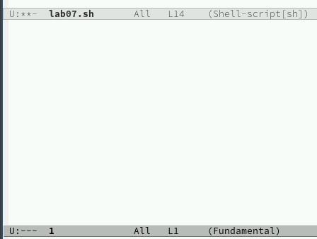

:::
::::::::::::::

## Ход работы

:::::::::::::: {.columns align=center}
::: {.column width="50%"}

Переключаемся между буферами без вывода их списка (C-x b).

:::
::: {.column width="50%"}

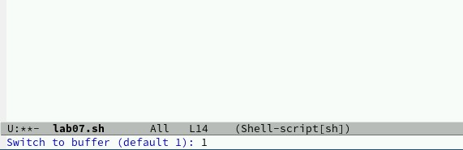

:::
::::::::::::::

## Ход работы

:::::::::::::: {.columns align=center}
::: {.column width="50%"}

Делим фрейм на 4 части: сначала разделяем фрейм на два окна по вертикали (C-x 3), затем каждое из этих окон — на две части по горизонтали (C-x 2).

:::
::: {.column width="50%"}

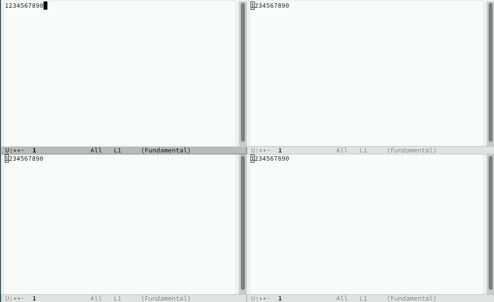

:::
::::::::::::::

## Ход работы

:::::::::::::: {.columns align=center}
::: {.column width="50%"}

В каждом из четырёх окон открываем новый буфер (файл) и вводим несколько строк текста.

:::
::: {.column width="50%"}

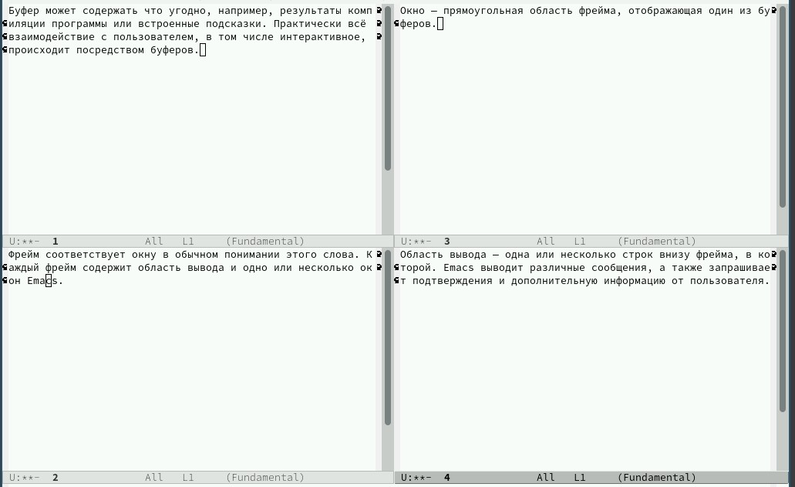

:::
::::::::::::::

## Ход работы

:::::::::::::: {.columns align=center}
::: {.column width="50%"}

Переключаемся в режим поиска (C-s) и находим несколько слов из текста. Переключаемся между результатами поиска, нажимая C-s. Выходим из режима поиска (C-g).

:::
::: {.column width="50%"}

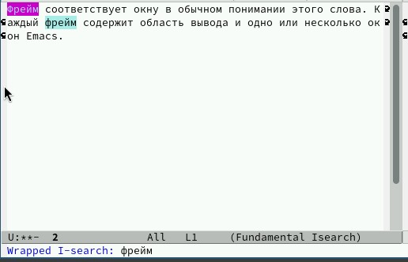

:::
::::::::::::::

## Ход работы

:::::::::::::: {.columns align=center}
::: {.column width="50%"}

Переходим в режим поиска и замены (M-%), вводим текст для поиска и замены, подтверждаем замену нажатием !.

:::
::: {.column width="50%"}

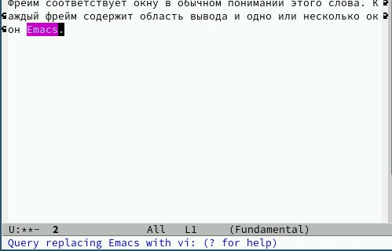

:::
::::::::::::::

## Ход работы

:::::::::::::: {.columns align=center}
::: {.column width="50%"}

Пробуем другой режим поиска (M-s c) и объясняем его отличие от обычного. Он создает отдельное окно с выделенными результатами (поисковым запросом). 

:::
::: {.column width="50%"}

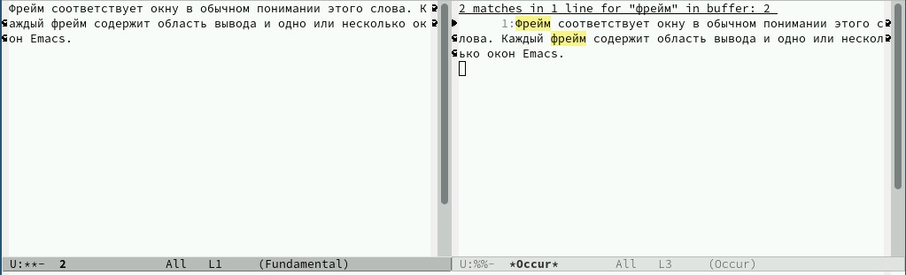

:::
::::::::::::::

# Выводы

Мы познакомились с операционной системой Linux. Получили практические навыки работы с редактором Emacs.

# Список литературы{.unnumbered}

::: {.refs}
1. Dash, P. Getting Started with Oracle VM VirtualBox / P. Dash. – Packt Publishing Ltd, 2013. – 86 сс.
2. Colvin, H. VirtualBox: An Ultimate Guide Book on Virtualization with VirtualBox. VirtualBox / H. Colvin. – CreateSpace Independent Publishing Platform, 2015. – 70 сс.
3. Vugt, S. van. Red Hat RHCSA/RHCE 7 cert guide : Red Hat Enterprise Linux 7 (EX200 and EX300) : Certification Guide. Red Hat RHCSA/RHCE 7 cert guide / S. van Vugt. – Pearson IT Certification, 2016. – 1008 сс.
4. Робачевский, А. Операционная система UNIX / А. Робачевский, С. Немнюгин, О. Стесик. – 2-е изд. – Санкт-Петербург : БХВ-Петербург, 2010. – 656 сс.
5. Немет, Э. Unix и Linux: руководство системного администратора. Unix и Linux / Э. Немет, Г. Снайдер, Т.Р. Хейн, Б. Уэйли. – 4-е изд. – Вильямс, 2014. – 1312 сс.
6. Колисниченко, Д.Н. Самоучитель системного администратора Linux : Системный администратор / Д.Н. Колисниченко. – Санкт-Петербург : БХВ-Петербург, 2011. – 544 сс.
7. Robbins, A. Bash Pocket Reference / A. Robbins. – O’Reilly Media, 2016. – 156 сс.
:::
