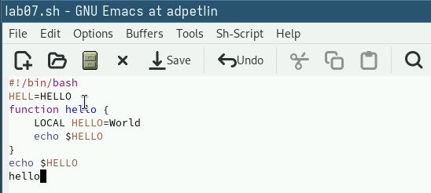

---
## Front matter
title: "Отчёт по лабораторной работе №11"
author: "Петлин Артём Дмитриевич"

## Generic otions
lang: ru-RU
toc-title: "Содержание"

## Bibliography
bibliography: bib/cite.bib
csl: pandoc/csl/gost-r-7-0-5-2008-numeric.csl

## Pdf output format
toc: true # Table of contents
toc-depth: 2
lof: true # List of figures
lot: true # List of tables
fontsize: 12pt
linestretch: 1.5
papersize: a4
documentclass: scrreprt
## I18n polyglossia
polyglossia-lang:
  name: russian
  options:
	- spelling=modern
	- babelshorthands=true
polyglossia-otherlangs:
  name: english
## I18n babel
babel-lang: russian
babel-otherlangs: english
## Fonts
mainfont: IBM Plex Serif
romanfont: IBM Plex Serif
sansfont: IBM Plex Sans
monofont: IBM Plex Mono
mathfont: STIX Two Math
mainfontoptions: Ligatures=Common,Ligatures=TeX,Scale=0.94
romanfontoptions: Ligatures=Common,Ligatures=TeX,Scale=0.94
sansfontoptions: Ligatures=Common,Ligatures=TeX,Scale=MatchLowercase,Scale=0.94
monofontoptions: Scale=MatchLowercase,Scale=0.94,FakeStretch=0.9
mathfontoptions:
## Biblatex
biblatex: true
biblio-style: "gost-numeric"
biblatexoptions:
  - parentracker=true
  - backend=biber
  - hyperref=auto
  - language=auto
  - autolang=other*
  - citestyle=gost-numeric
## Pandoc-crossref LaTeX customization
figureTitle: "Рис."
tableTitle: "Таблица"
listingTitle: "Листинг"
lofTitle: "Список иллюстраций"
lotTitle: "Список таблиц"
lolTitle: "Листинги"
## Misc options
indent: true
header-includes:
  - \usepackage{indentfirst}
  - \usepackage{float} # keep figures where there are in the text
  - \floatplacement{figure}{H} # keep figures where there are in the text
---

# Цель работы

Познакомиться с операционной системой Linux. Получить практические навыки рабо-
ты с редактором Emacs.

# Задание

1. Ознакомиться с теоретическим материалом.
2. Ознакомиться с редактором emacs.
3. Выполнить упражнения.
4. Ответить на контрольные вопросы.

# Выполнение лабораторной работы

{#fig:001 width=100%}

Открываем emacs.

{#fig:002 width=100%}

Создаём файл lab07.sh с помощью комбинации C-x C-f. Набираем данный в задании текст. Сохраняем файл с помощью комбинации C-x C-s.

{#fig:003 width=100%}

Вырезаем одной командой целую строку (C-k). Вставляем эту строку в конец файла (C-y).

{#fig:004 width=100%}

Выделяем область текста (C-space). Копируем область в буфер обмена (M-w). Вставляем область в конец файла.

{#fig:005 width=100%}

Вновь выделяем эту область и вырезаем её (C-w).

{#fig:006 width=100%}

Отменяем последнее действие (C-/).

{#fig:007 width=100%}

Выводим список активных буферов на экран (C-x C-b).

{#fig:008 width=100%}

Перемещаемся во вновь открытое окно со списком буферов и переключаемся на другой буфер (C-x o). Закрываем это окно (C-x 0).

{#fig:009 width=100%}

Переключаемся между буферами без вывода их списка (C-x b).

{#fig:010 width=100%}

Делим фрейм на 4 части: сначала разделяем фрейм на два окна по вертикали (C-x 3), затем каждое из этих окон — на две части по горизонтали (C-x 2).

{#fig:011 width=100%}

В каждом из четырёх окон открываем новый буфер (файл) и вводим несколько строк текста.

{#fig:012 width=100%}

Переключаемся в режим поиска (C-s) и находим несколько слов из текста. Переключаемся между результатами поиска, нажимая C-s. Выходим из режима поиска (C-g).

{#fig:013 width=100%}

Переходим в режим поиска и замены (M-%), вводим текст для поиска и замены, подтверждаем замену нажатием !.

{#fig:014 width=100%}

Пробуем другой режим поиска (M-s c) и объясняем его отличие от обычного. Он создает отдельное окно с выделенными результатами (поисковым запросом). 

# Выводы

Мы познакомились с операционной системой Linux. Получили практические навыки работы с редактором Emacs.

# Список литературы{.unnumbered}

::: {.refs}
1. Dash, P. Getting Started with Oracle VM VirtualBox / P. Dash. – Packt Publishing Ltd, 2013. – 86 сс.
2. Colvin, H. VirtualBox: An Ultimate Guide Book on Virtualization with VirtualBox. VirtualBox / H. Colvin. – CreateSpace Independent Publishing Platform, 2015. – 70 сс.
3. Vugt, S. van. Red Hat RHCSA/RHCE 7 cert guide : Red Hat Enterprise Linux 7 (EX200 and EX300) : Certification Guide. Red Hat RHCSA/RHCE 7 cert guide / S. van Vugt. – Pearson IT Certification, 2016. – 1008 сс.
4. Робачевский, А. Операционная система UNIX / А. Робачевский, С. Немнюгин, О. Стесик. – 2-е изд. – Санкт-Петербург : БХВ-Петербург, 2010. – 656 сс.
5. Немет, Э. Unix и Linux: руководство системного администратора. Unix и Linux / Э. Немет, Г. Снайдер, Т.Р. Хейн, Б. Уэйли. – 4-е изд. – Вильямс, 2014. – 1312 сс.
6. Колисниченко, Д.Н. Самоучитель системного администратора Linux : Системный администратор / Д.Н. Колисниченко. – Санкт-Петербург : БХВ-Петербург, 2011. – 544 сс.
7. Robbins, A. Bash Pocket Reference / A. Robbins. – O’Reilly Media, 2016. – 156 сс.
:::
