---
## Front matter
lang: ru-RU
title: Первый этап индивидуального проекта
author:
  - Петлин А. Д.
institute:
  - Российский университет дружбы народов, Москва, Россия
date: 06 марта 2025

## i18n babel
babel-lang: russian
babel-otherlangs: english

## Formatting pdf
toc: false
toc-title: Содержание
slide_level: 2
aspectratio: 169
section-titles: true
theme: metropolis
header-includes:
 - \metroset{progressbar=frametitle,sectionpage=progressbar,numbering=fraction}
---

# Информация

## Докладчик

:::::::::::::: {.columns align=center}
::: {.column width="70%"}

  * Петлин Артём Дмитриевич
  * студент
  * группа НПИбд-02-24
  * Российский университет дружбы народов
  * [1132246846@pfur.ru](mailto:1132246846@pfur.ru)
  * <https://github.com/hikrim/study_2024-2025_os-intro>

:::
::: {.column width="30%"}

:::
::::::::::::::

# Цель работы

Размещение на Github pages заготовки для персонального сайта.

# Задание

- Установить необходимое программное обеспечение.
- Скачать шаблон темы сайта.
- Разместить его на хостинге git.
- Установить параметр для URLs сайта.
- Разместить заготовку сайта на Github pages.

# Теоретическое введение

https://github.com/wowchemy/wowchemy-hugo-themes

# Выполнение лабораторной работы

## Создание сайта

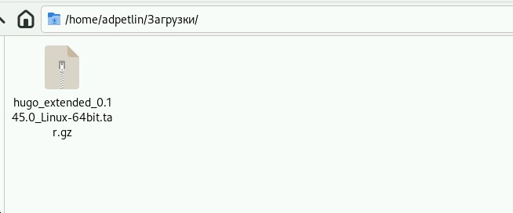

Устанавливаем Hugo.

## Создание сайта

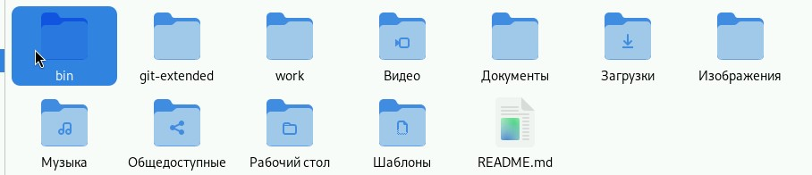

Создаём папку bin в домашнем каталоге.

## Создание сайта

:::::::::::::: {.columns align=center}
::: {.column width="70%"}

Переносим исполняемый файл Hugo в bin.

:::
::: {.column width="70%"}

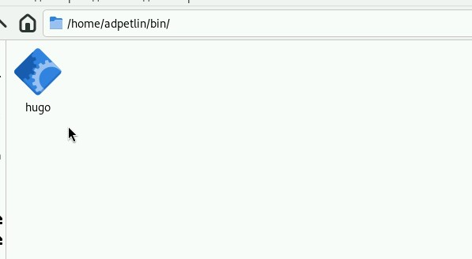

:::
::::::::::::::

## Создание сайта

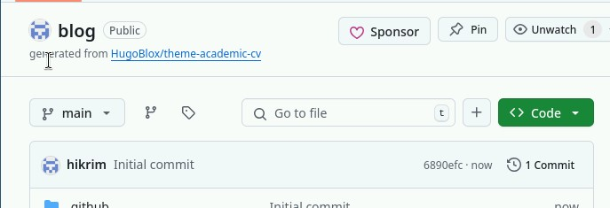

Создаём репозиторий по шаблону.

## Создание сайта

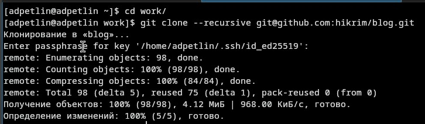

Клонируем его в ~/work.

## Создание сайта

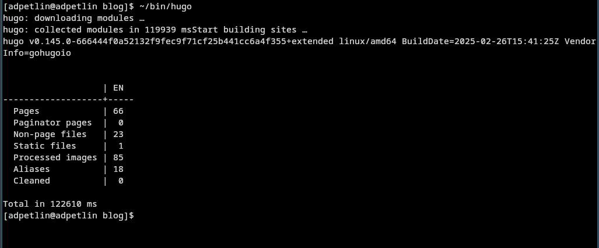

Выполняем ~/bin/hugo, после удаляем public.

## Создание сайта

:::::::::::::: {.columns align=center}
::: {.column width="70%"}

Выполняем ~/bin/hugo server для просмотра локального сайта, видимого только для создателя.

:::
::: {.column width="70%"}

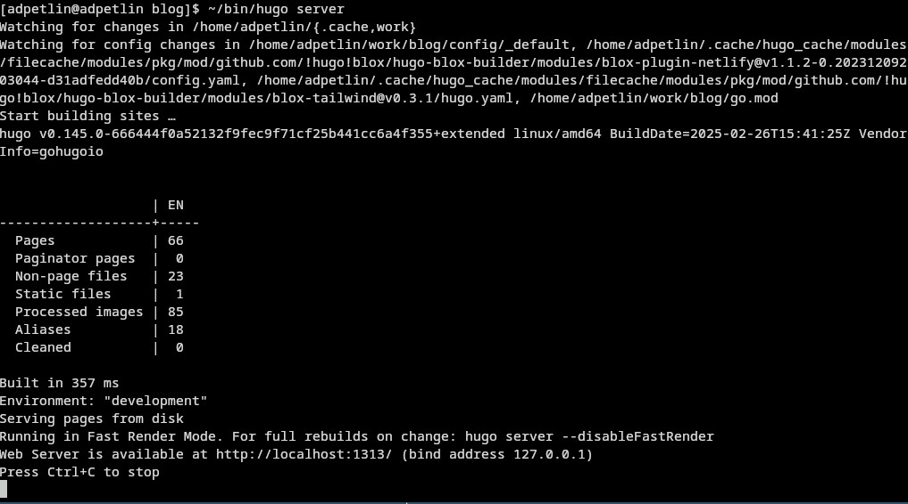

:::
::::::::::::::

## Создание сайта

:::::::::::::: {.columns align=center}
::: {.column width="70%"}

Создаём новый репозиторий с названием типа "username".github.io.

:::
::: {.column width="70%"}

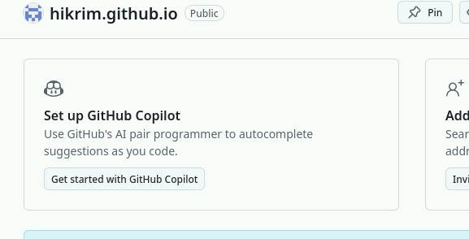

:::
::::::::::::::

## Создание сайта

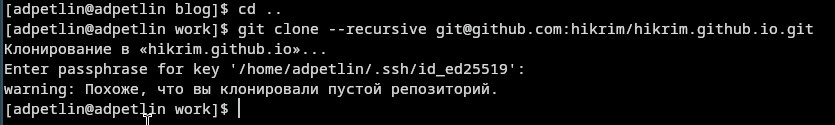

Клонируем его рядом с blog.

## Создание сайта

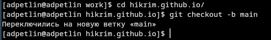

Переходим в него, создаем ветку main.

## Создание сайта

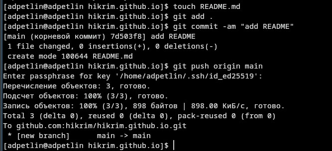

Создаём README и отправляем его на сервер.

## Создание сайта

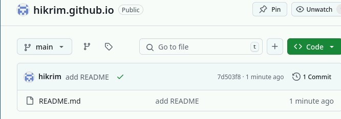

Преобразованный репозиторий.

## Создание сайта

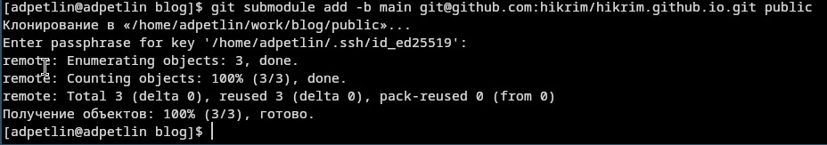

Переходим в blog и подключаем к нему hikrim.github.io

## Создание сайта

:::::::::::::: {.columns align=center}
::: {.column width="70%"}

Снова выполняем ~/bin/hugo.

:::
::: {.column width="70%"}

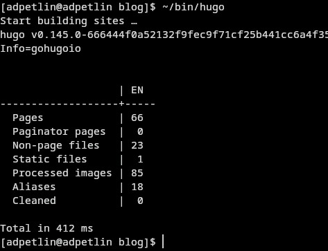

:::
::::::::::::::

## Создание сайта

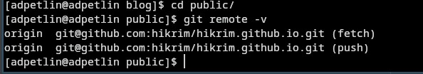

Переходим в public и проверяем что репозитории связаны.

## Создание сайта

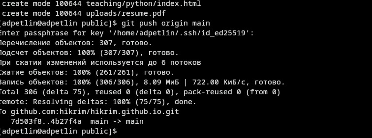

Отправляем файлы на сервер.

## Создание сайта

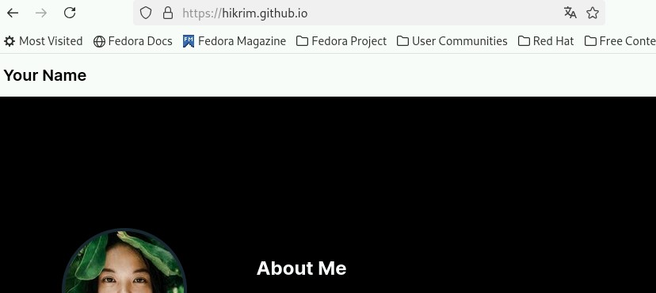

Получившейся сайт, на который могут зайти любые пользователи.

# Выводы

Мы научились создавать сайт Github pages

# Список литературы{.unnumbered}

::: {.refs}
1. Dash, P. Getting Started with Oracle VM VirtualBox / P. Dash. – Packt Publishing Ltd, 2013. – 86 сс.
2. Colvin, H. VirtualBox: An Ultimate Guide Book on Virtualization with VirtualBox. VirtualBox / H. Colvin. – CreateSpace Independent Publishing Platform, 2015. – 70 сс.
3. Vugt, S. van. Red Hat RHCSA/RHCE 7 cert guide : Red Hat Enterprise Linux 7 (EX200 and EX300) : Certification Guide. Red Hat RHCSA/RHCE 7 cert guide / S. van Vugt. – Pearson IT Certification, 2016. – 1008 сс.
4. Робачевский, А. Операционная система UNIX / А. Робачевский, С. Немнюгин, О. Стесик. – 2-е изд. – Санкт-Петербург : БХВ-Петербург, 2010. – 656 сс.
5. Немет, Э. Unix и Linux: руководство системного администратора. Unix и Linux / Э. Немет, Г. Снайдер, Т.Р. Хейн, Б. Уэйли. – 4-е изд. – Вильямс, 2014. – 1312 сс.
6. Колисниченко, Д.Н. Самоучитель системного администратора Linux : Системный администратор / Д.Н. Колисниченко. – Санкт-Петербург : БХВ-Петербург, 2011. – 544 сс.
7. Robbins, A. Bash Pocket Reference / A. Robbins. – O’Reilly Media, 2016. – 156 сс.
:::
