---
## Front matter
lang: ru-RU
title: Шестой этап реализации индивидуального проекта
author:
  - Петлин А. Д.
institute:
  - Российский университет дружбы народов, Москва, Россия
date: 31 мая 2025

## i18n babel
babel-lang: russian
babel-otherlangs: english

## Formatting pdf
toc: false
toc-title: Содержание
slide_level: 2
aspectratio: 169
section-titles: true
theme: metropolis
header-includes:
 - \metroset{progressbar=frametitle,sectionpage=progressbar,numbering=fraction}
---

# Информация

## Докладчик

:::::::::::::: {.columns align=center}
::: {.column width="70%"}

  * Петлин Артём Дмитриевич
  * студент
  * группа НПИбд-02-24
  * Российский университет дружбы народов
  * [1132246846@pfur.ru](mailto:1132246846@pfur.ru)
  * <https://github.com/hikrim/study_2024-2025_os-intro>

:::
::: {.column width="30%"}

:::
::::::::::::::

# Цель работы

Размещение двуязычного сайта на Github.

# Задание

   - Сделать поддержку английского и русского языков.
   - Разместить элементы сайта на обоих языках.
   - Разместить контент на обоих языках.
   - Сделать пост по прошедшей неделе.
   - Добавить пост на тему по выбору (на двух языках).

# Теоретическое введение

https://github.com/wowchemy/wowchemy-hugo-themes

# Выполнение лабораторной работы

## Ход работы

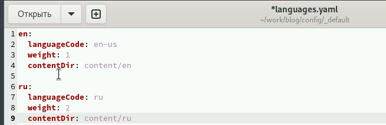

Меняем кофигурационный файл нашего сайта, отвечающий за языки, так, чтобы теперь было два языка.

## Ход работы

Меняю название кнопки в левом верхнем углу на мое имя (осьтальные кнопки верхнего хотбара и эта кнопка представлена только на английском так как не находится в контенте нашего сайта, который можно сделать под два языка).

## Ход работы

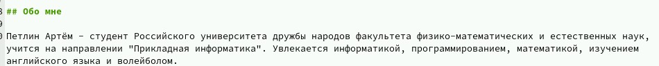

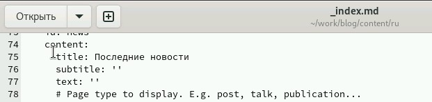

Меняем некоторые заголовки на русские для версия русского языка.

## Ход работы

:::::::::::::: {.columns align=center}
::: {.column width="16%"}

Переводим все с русского на английский.

:::
::: {.column width="42%"}

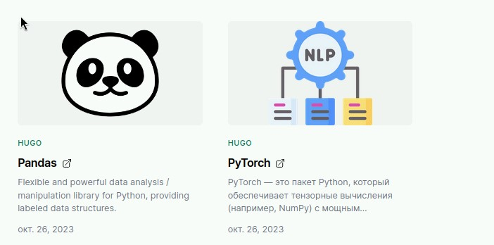

:::
::: {.column width="42%"}

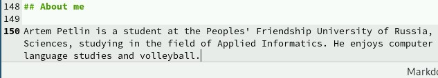

:::
::::::::::::::

## Ход работы

:::::::::::::: {.columns align=center}
::: {.column width="12%"}

Вид сайта на русском языке.

:::
::: {.column width="22%"}

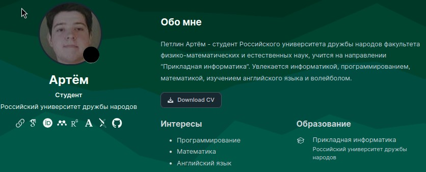

:::
::: {.column width="22%"}

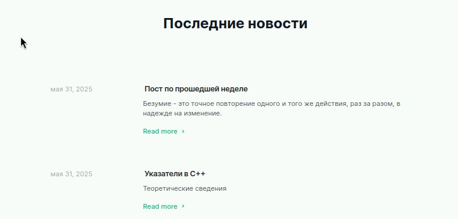

:::
::: {.column width="22%"}

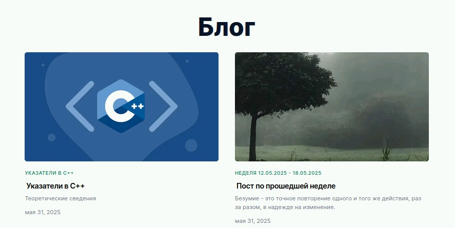

:::
::: {.column width="22%"}

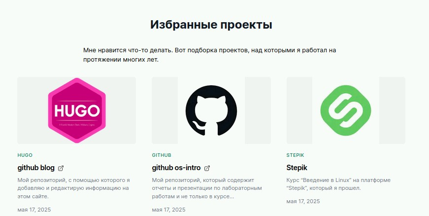

:::
::::::::::::::

## Ход работы

:::::::::::::: {.columns align=center}
::: {.column width="12%"}

Вид сайта на английском языке.

:::
::: {.column width="22%"}

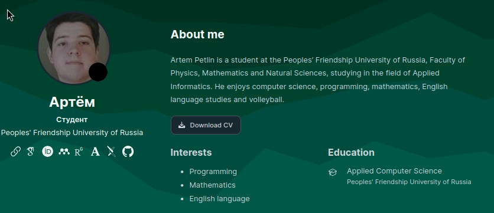

:::
::: {.column width="22%"}

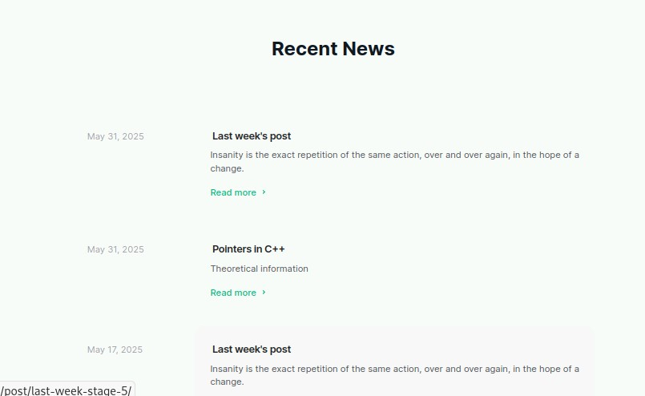

:::
::: {.column width="22%"}

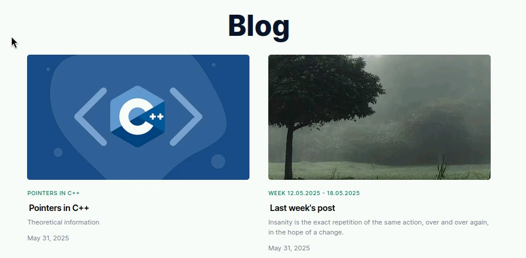

:::
::: {.column width="22%"}

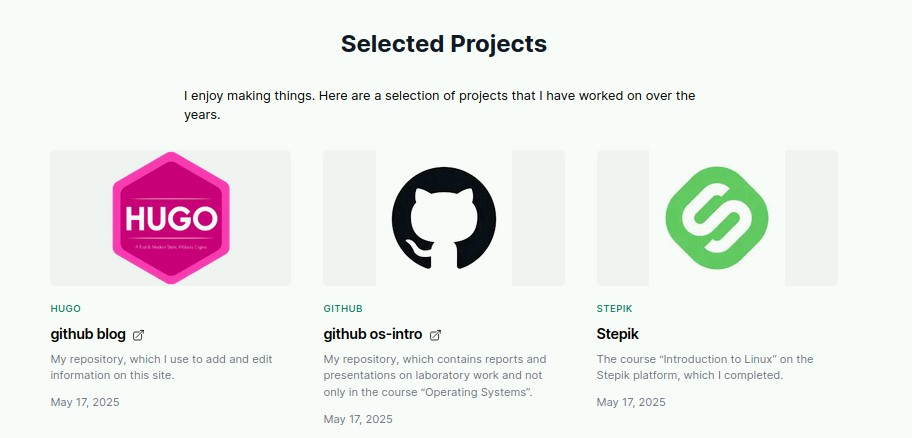

:::
::::::::::::::

# Выводы

Мы разместили двуязычный сайт на Github.

# Список литературы{.unnumbered}

::: {.refs}
1. Dash, P. Getting Started with Oracle VM VirtualBox / P. Dash. – Packt Publishing Ltd, 2013. – 86 сс.
2. Colvin, H. VirtualBox: An Ultimate Guide Book on Virtualization with VirtualBox. VirtualBox / H. Colvin. – CreateSpace Independent Publishing Platform, 2015. – 70 сс.
3. Vugt, S. van. Red Hat RHCSA/RHCE 7 cert guide : Red Hat Enterprise Linux 7 (EX200 and EX300) : Certification Guide. Red Hat RHCSA/RHCE 7 cert guide / S. van Vugt. – Pearson IT Certification, 2016. – 1008 сс.
4. Робачевский, А. Операционная система UNIX / А. Робачевский, С. Немнюгин, О. Стесик. – 2-е изд. – Санкт-Петербург : БХВ-Петербург, 2010. – 656 сс.
5. Немет, Э. Unix и Linux: руководство системного администратора. Unix и Linux / Э. Немет, Г. Снайдер, Т.Р. Хейн, Б. Уэйли. – 4-е изд. – Вильямс, 2014. – 1312 сс.
6. Колисниченко, Д.Н. Самоучитель системного администратора Linux : Системный администратор / Д.Н. Колисниченко. – Санкт-Петербург : БХВ-Петербург, 2011. – 544 сс.
7. Robbins, A. Bash Pocket Reference / A. Robbins. – O’Reilly Media, 2016. – 156 сс.
:::
